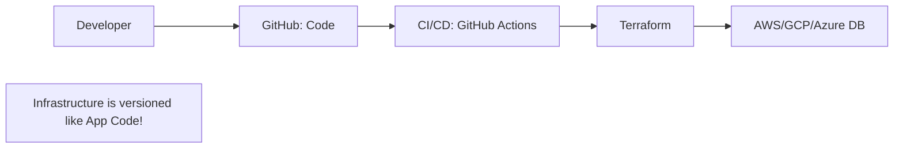

# 📜 Infrastructure as Code (IaC) for DB: Versioning your Data Center
> **Objective:** Master how to provision and manage database infrastructure using code (Terraform, Pulumi) instead of manual clicks | **Language:** Hinglish | **Standard:** 2026 Expert Framework

---

## 🧭 1. Beginner-Friendly Hinglish Explanation
Infrastructure as Code (IaC) for DB ka matlab hai "Database ko 'Code' likhkar setup karna".

- **The Old Way:** Aap AWS console mein jate ho, 50 buttons dabate ho aur database banate ho. Dusre mahine aap bhul jate ho ki aapne kaunsa button dabaya tha.
- **The New Way:** Aap ek file likhte ho (Terraform). 
  - `Resource: "RDS", Size: "10GB", RAM: "4GB"`. 
  - Aap command chalate ho `terraform apply` aur database ban jata hai.
- **The Best Part:** Aap is code ko "Git" par daal sakte ho. Aapko pata hoga ki kab kisne database ka size badhaya tha.
- **Intuition:** Ye "Recipe" jaisa hai. Agar aapke paas recipe (Code) hai, toh aap bilkul waisa hi database duniya ke kisi bhi kone mein 5 minute mein bana sakte ho.

---

## 🧠 2. Deep Technical Explanation
### 1. Declarative vs Imperative:
IaC (like Terraform) is **Declarative**. You tell it the "Final State" (I want a 20GB DB), and it figures out how to make it happen. It doesn't matter if the DB already exists or not.

### 2. State Management:
Terraform keeps a `terraform.tfstate` file. This is the "Truth" about what is currently running in the cloud. NEVER lose this file.

### 3. Drift Detection:
If someone manually changes the DB size in the AWS Console (Manual Click), Terraform will detect this "Drift" and offer to change it back to what's in the code.

---

## 🏗️ 3. Database Diagrams (The IaC Pipeline)


---

## 💻 4. Query Execution Examples (Terraform RDS)
```hcl
# 1. Defining a Postgres DB in Terraform
resource "aws_db_instance" "production_db" {
  allocated_storage    = 20
  engine               = "postgres"
  engine_version       = "15.3"
  instance_class       = "db.t3.micro"
  db_name              = "mydb"
  username             = "admin"
  password             = var.db_password # Never hardcode!
  skip_final_snapshot  = true
  multi_az             = true
}

# 2. Command to create
# terraform init
# terraform apply
```

---

## 🌍 5. Real-World Production Examples
- **Disaster Recovery:** A company's entire AWS account was hacked. Because they had all their database config in Terraform, they setup a new account and recreated 50 databases in just 1 hour.
- **Environment Parity:** Ensuring that "Staging" and "Production" databases are identical, avoiding "It works on my machine" bugs.

---

## ❌ 6. Failure Cases
- **Accidental Deletion:** You delete a line from the code and run `terraform apply`. Terraform might "Delete" your production database to match the code. **Fix: Use 'Prevent Destroy' flags.**
- **Secret Leakage:** Someone committed the database password to GitHub. **Fix: Use AWS Secrets Manager or HashiCorp Vault.**
- **State Lock:** Two people try to run `terraform apply` at the same time, corrupting the state file. **Fix: Use 'Remote State Locking' (S3 + DynamoDB).**

漫
---

## ✅ 11. Best Practices for IaC
- **Never hardcode passwords.** Use variables and secrets managers.
- **Enable 'Deletion Protection'** on production resources.
- **Use Modules** to reuse database configurations across projects.
- **Review every 'terraform plan'** before applying.
- **Keep your State file safe** (S3 with versioning).

---

## ⚠️ 13. Common Mistakes
- **Making manual changes in the AWS Console.**
- **Committing the `.tfstate` file to Git.** (It contains secrets!).

---

## 📝 14. Interview Questions
1. "What is the difference between Terraform and CloudFormation?"
2. "How do you manage secrets in IaC for a database?"
3. "What is 'Drift' and how do you fix it?"

---

## 🚀 15. Latest 2026 Production Database Patterns
- **Pulumi for DB:** Using real programming languages (TypeScript/Python) instead of HCL to define database infrastructure, allowing for complex logic and loops.
- **Crossplane:** Managing databases directly from Kubernetes using standard `kubectl` commands, treating the DB as a first-class K8s object.
漫
