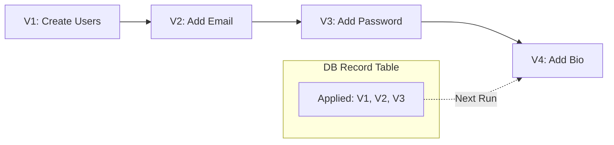

# 🏗️ Database Migrations and Evolution: Version Control for Data
> **Objective:** Master the discipline of database migrations, ensuring safe and reversible schema changes in production environments without data loss | **Language:** Hinglish | **Standard:** 2026 Expert Framework

---

## 🧭 1. Beginner-Friendly Hinglish Explanation
Database Migrations ka matlab hai "Database ke structure ko waise hi handle karna jaise hum apne code (Git) ko karte hain".

- **The Problem:** Agar aapne local pe ek nayi column add ki, toh use Production server par kaise layenge? Manual SQL chalana risky hai.
- **The Solution:** Migrations.
  - Ye dher saari SQL files hain (Version 1, Version 2...). 
  - Har file batati hai ki database mein kya change karna hai (UP) aur use wapas kaise lena hai (DOWN).
- **Intuition:** Ye "Video Game Save Point" jaisa hai. Aap aage badh sakte hain (Migrate), aur agar kuch galat hua toh peeche bhi aa sakte hain (Rollback).

---

## 🧠 2. Deep Technical Explanation

### 1. The Migration Workflow:
1. **Create:** Generate a migration file (e.g., `2024_add_user_bio.sql`).
2. **Review:** Check the SQL to ensure it doesn't do something stupid (like dropping a index).
3. **Apply:** Run the migration on the DB.
4. **Tracking:** The database has a special table (e.g., `_prisma_migrations` or `knex_migrations`) that keeps track of which files have already been run.

### 2. State-based vs Migration-based:
- **Migration-based (Standard):** You write the changes (Step A -> Step B).
- **State-based (Declarative):** You define the final state, and the tool (like **Atlas** or **Prisma**) automatically figures out the SQL to get there.

---

## 🏗️ 3. Database Diagrams (The Migration History)


---

## 💻 4. Query Execution Examples (Migration Files)

### A Typical Migration File (SQL)
```sql
-- UP Migration
ALTER TABLE users ADD COLUMN bio TEXT;

-- DOWN Migration (Rollback)
ALTER TABLE users DROP COLUMN bio;
```

### Running with a Tool (Prisma)
```bash
# Create a migration based on schema.prisma
npx prisma migrate dev --name add_user_bio

# Apply migrations to production
npx prisma migrate deploy
```

---

## 🌍 5. Real-World Production Examples
- **Zero-Downtime Migration:** A company needs to rename a column with 10M rows. 
  - **Step 1:** Add the new column.
  - **Step 2:** Start writing to both columns.
  - **Step 3:** Backfill data from old to new.
  - **Step 4:** Remove the old column.
- **Large SaaS:** Using **Flyway** or **Liquibase** to manage migrations across 100 different database instances.

---

## ❌ 6. Failure Cases
- **The Destructive Rollback:** Rolling back a migration that deleted a column. You get the column back, but the data is gone forever! **Fix: Always backup before a rollback.**
- **Locking the Table:** Running `ALTER TABLE` on a 1TB table. The table will be locked for hours, and your app will be down. **Fix: Use tools like `gh-ost` or `pt-online-schema-change`.**

---

## 🛠️ 7. Debugging Guide
| Problem | Reason | Solution |
| :--- | :--- | :--- |
| **Migration is stuck** | Table lock | Kill the long-running process and use an online schema change tool. |
| **DB is out of sync with code** | Manual changes made to DB | Never make manual changes. Reset the DB and re-run all migrations. |

---

## ⚖️ 8. Tradeoffs
- **Manual SQL (Fastest / Riskiest)** vs **Automated Migrations (Safety / Versioned).**

---

## ✅ 11. Best Practices
- **Never change a migration file** after it has been committed to Git.
- **Always write a Rollback (Down)** script.
- **Run migrations in a CI/CD pipeline.**
- **Use a dedicated migration tool** (Prisma, Flyway, Knex).

漫
---

## 📝 14. Interview Questions
1. "Why do we use migrations instead of manual SQL?"
2. "How do you add a non-nullable column to a table that already has 1 million rows?"
3. "What is a 'Ghost' migration?"

---

## 🚀 15. Latest 2026 Production Database Patterns
- **Safe-by-Default Migrations:** Using **Atlas** to lint your migrations and warn you if you are about to run a command that will lock a table or lose data.
- **Online Schema Evolution:** Databases like **CockroachDB** that can handle schema changes in the background without any performance impact or locking.
漫
