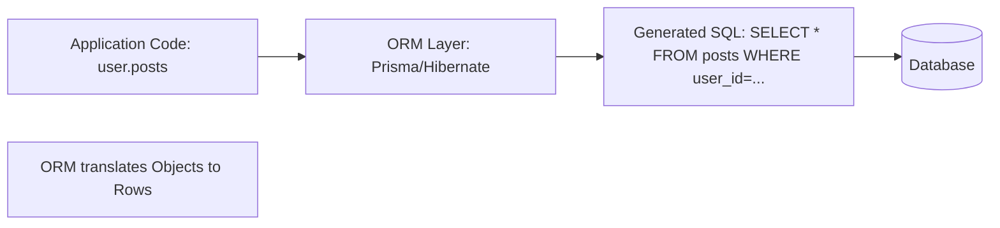

# 🛠️ ORM Fundamentals and Tradeoffs: SQL vs Code
> **Objective:** Master the concept of Object-Relational Mapping (ORM), understanding when to use an abstraction layer like Prisma or Hibernate and when to stick to Raw SQL | **Language:** Hinglish | **Standard:** 2026 Expert Framework

---

## 🧭 1. Beginner-Friendly Hinglish Explanation
ORM Fundamentals ka matlab hai "Database ke data ko Code (Objects) mein bina SQL likhe handle karna".

- **The Problem:** Database tables aur rows mein data save karta hai, par humari App Classes aur Objects (JavaScript/Python/Java) mein kaam karti hai. Dono ki "Bhasha" alag hai.
- **The Solution:** **ORM (Object-Relational Mapping)**.
  - Ye ek "Translator" jaisa hai. 
  - Aap likhte ho `user.save()`, aur ORM background mein `INSERT INTO users...` chala deta hai.
- **Intuition:** Ye ek "Google Translate" jaisa hai. Aap apni bhasha mein bolo, wo database ki bhasha mein samjha dega.

---

## 🧠 2. Deep Technical Explanation

### 1. What does an ORM do?
- **Mapping:** Linking a class (e.g., `User`) to a table (e.g., `users`).
- **CRUD Abstraction:** Providing functions like `find()`, `create()`, `update()`.
- **Migrations:** Automatically creating/updating tables when you change your code.
- **Relationship Handling:** Easily fetching related data (e.g., `user.posts`).

### 2. The Tradeoffs:
- **Pros:** 
  - **Speed of Development:** SQL likhne mein time waste nahi hota.
  - **Security:** SQL Injection se automatically bachata hai (Parameterized queries).
  - **Type Safety:** (In Prisma/TypeScript) Compile-time par hi galti pakad leta hai.
- **Cons:**
  - **Performance:** Kabhi-kabhi ORM bahut gandi aur slow SQL generate karta hai.
  - **The N+1 Problem:** Sabse bada dushman (Joins ki jagah dher saari choti queries chalana).
  - **Abstraction Leak:** Complex queries ke liye end mein Raw SQL likhni hi padti hai.

---

## 🏗️ 3. Database Diagrams (The ORM Layer)


---

## 💻 4. Query Execution Examples (ORM vs SQL)

### Using an ORM (Prisma Example)
```typescript
const userWithPosts = await prisma.user.findUnique({
  where: { id: 1 },
  include: { posts: true }
});
// ORM generates the JOIN for you.
```

### Using Raw SQL
```sql
SELECT u.*, p.* 
FROM users u 
LEFT JOIN posts p ON u.id = p.user_id 
WHERE u.id = 1;
// More control, but more manual work.
```

---

## 🌍 5. Real-World Production Examples
- **Startups:** Use **Prisma** or **Sequelize** to build features fast. Time-to-market is more important than micro-optimization.
- **High-Performance Trading:** Use **Raw SQL** or **Query Builders (Knex/Drizzle)** to ensure every microsecond is saved and the query is perfect.

---

## ❌ 6. Failure Cases
- **The "Heavy" ORM:** Using an ORM to fetch 1 Million rows into memory as Objects. Your RAM will explode. **Fix: Use 'Streams' or 'Paginated' raw queries for big data.**
- **Hidden Queries:** You called `user.posts.length` inside a loop. The ORM might run a new query for every single user! (Classic N+1).

---

## 🛠️ 7. Debugging Guide
| Problem | Reason | Solution |
| :--- | :--- | :--- |
| **App is slow** | Badly generated SQL | Enable 'Query Logging' in your ORM to see what SQL it's actually running. |
| **Memory Leak** | Loading too many relations | Use `select` to only fetch the columns you actually need. |

---

## ⚖️ 8. Tradeoffs
- **Productivity (ORM)** vs **Performance/Control (Raw SQL).**

---

## ✅ 11. Best Practices
- **Use an ORM for 80% of standard CRUD.**
- **Switch to Raw SQL for complex reporting/analytics.**
- **Always monitor the generated SQL.**
- **Use Type-Safe ORMs (like Prisma or Drizzle)** for modern projects.

漫
---

## 📝 14. Interview Questions
1. "What is an ORM and why do we use it?"
2. "What is the N+1 problem and how do you fix it?"
3. "Can an ORM replace the need for knowing SQL?" (Ans: NO!).

---

## 🚀 15. Latest 2026 Production Database Patterns
- **Edge ORMs:** Lightweight ORMs designed to run on Edge workers (Cloudflare) with zero-latency connections to databases like Neon.
- **SQL-First ORMs:** Tools like **Drizzle** that feel like SQL but give you all the benefits of TypeScript objects.
漫
