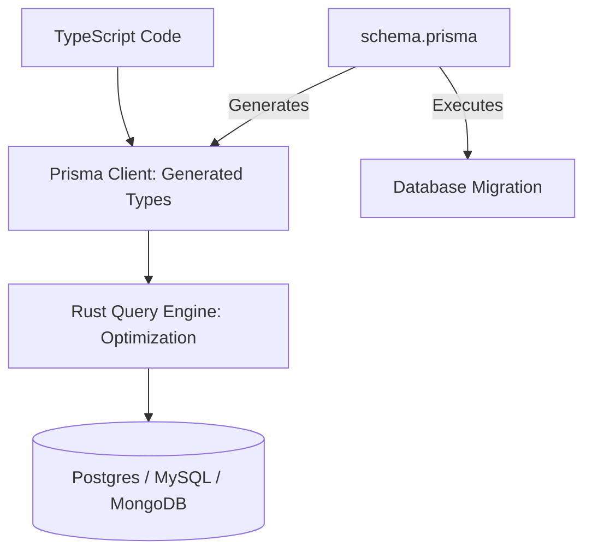

# 💎 Prisma and Modern Data Access: The 2026 Way
> **Objective:** Master Prisma as the gold standard for modern database access, focusing on type safety, migrations, and performance optimization in the Node.js ecosystem | **Language:** Hinglish | **Standard:** 2026 Expert Framework

---

## 🧭 1. Beginner-Friendly Hinglish Explanation
Prisma and Modern Data Access ka matlab hai "Database ke saath kaam karne ka sabse naya aur aasaan tareeka".

- **The Philosophy:** Purane ORMs (like Sequelize) mein aapko queries likhte waqt bahut galti hone ka darr rehta tha.
- **The Prisma Solution:** 
  - **Type Safety:** Agar aapne `user.email` ki jagah `user.mail` likha, toh code run hone se pehle hi error dikha dega.
  - **The Schema:** Ek single `schema.prisma` file jisme aapka pura database structure likha hota hai.
- **Intuition:** Ye "Auto-complete" jaisa hai. Database ke har table aur field ke liye aapko code likhte waqt hints milti hain.

---

## 🧠 2. Deep Technical Explanation

### 1. The Prisma Architecture:
- **Prisma Schema:** Your single source of truth (`.prisma`).
- **Prisma Client:** The auto-generated, type-safe query builder.
- **Prisma Migrate:** Tool to manage database schema changes.
- **Prisma Studio:** A GUI to view and edit your data.

### 2. The Engine:
Prisma uses a high-performance **Query Engine** (written in Rust) that sits between your Node.js code and the DB. It optimizes your queries before sending them to the database.

---

## 🏗️ 3. Database Diagrams (The Prisma Stack)


---

## 💻 4. Query Execution Examples (The Prisma Way)
```typescript
// 1. A Type-Safe Query
// Prisma knows exactly which fields exist!
const users = await prisma.user.findMany({
  where: { 
    email: { contains: "@gmail.com" } 
  },
  select: { name: true, email: true } // Selective fetching
});

// 2. Transaction Management
await prisma.$transaction([
  prisma.user.update({ where: { id: 1 }, data: { balance: { decrement: 100 } } }),
  prisma.order.create({ data: { userId: 1, amount: 100 } })
]);
```

---

## 🌍 5. Real-World Production Examples
- **SaaS Platforms:** Using Prisma with **TypeScript** to ensure that frontend developers don't break the backend by asking for fields that don't exist.
- **Serverless Apps:** Using **Prisma Data Proxy** (Accelerate) to handle database connection pooling in serverless functions (like Vercel/AWS Lambda).

---

## ❌ 6. Failure Cases
- **Over-Migration:** Changing the schema file and running `migrate dev` without reviewing the SQL. You might accidentally drop a table with millions of rows. **Fix: Always check the generated SQL in the `migrations` folder.**
- **Cold Starts:** The Rust engine can be heavy for some serverless environments. **Fix: Use the 'JSON' protocol or Prisma Accelerate.**

---

## 🛠️ 7. Debugging Guide
| Problem | Reason | Solution |
| :--- | :--- | :--- |
| **"Client is out of sync"** | Schema changed but client not regenerated | Run `npx prisma generate`. |
| **Slow queries** | Missing Indexes | Add `@@index` or `@unique` in your `schema.prisma`. |

---

## ⚖️ 8. Tradeoffs
- **Prisma (Type Safety / Productivity / Excellent Docs)** vs **Drizzle (Lighter / Faster / SQL-like syntax).**

---

## ✅ 11. Best Practices
- **Define unique constraints** in the schema.
- **Use `select`** to avoid fetching heavy columns.
- **Keep your `schema.prisma` clean** and documented.
- **Use Prisma Accelerate** for serverless scaling.

漫
---

## 📝 14. Interview Questions
1. "How does Prisma achieve type safety without manually writing types?"
2. "What is the difference between `npx prisma db push` and `npx prisma migrate dev`?"
3. "What are the performance benefits of Prisma's Rust engine?"

---

## 🚀 15. Latest 2026 Production Database Patterns
- **Edge Queries:** Running Prisma directly on edge locations (Sub-10ms response times) using **Neon's** serverless driver.
- **Prisma Pulse:** Real-time database events. When a row is inserted in Postgres, Prisma Pulse notifies your frontend instantly.
漫
