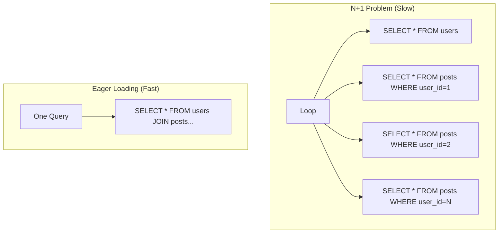

# 🕷️ The N+1 Query Problem: The Silent Killer
> **Objective:** Master the identification and resolution of the N+1 query problem, a common performance pitfall in ORMs and API design | **Language:** Hinglish | **Standard:** 2026 Expert Framework

---

## 🧭 1. Beginner-Friendly Hinglish Explanation
N+1 Query Problem ka matlab hai "Ek kaam ke liye database ke 100 चक्कर kaatna, jabki 1 चक्कर mein kaam ho sakta tha".

- **The Problem:** Maan lo aapko 10 Users dikhane hain aur har user ke Posts bhi dikhane hain.
  - **The "N+1" Way:** Pehle aapne 1 query ki users ke liye (**The 1**). Phir har user ke liye aapne alag se query ki posts ke liye (**The N**).
  - Agar 100 users hain, toh aapne **101 queries** ki! Ye database ko thaka dega.
- **The Solution:** Eager Loading.
  - Saare users aur unke posts ek hi "JOIN" query mein mangwa lo.
- **Intuition:** Ye "Kirana dukan" jaisa hai. Ek hi baar mein list lekar jao, har ek item ke liye alag se dukan mat jao.

---

## 🧠 2. Deep Technical Explanation

### 1. Why does it happen?
Most ORMs use **Lazy Loading** by default. They only fetch the 'User' data. When your code accesses `user.posts`, the ORM realizes it doesn't have that data and triggers a NEW query. If you do this in a loop, it's a disaster.

### 2. How to detect it?
- **Logs:** Looking at your database logs and seeing 50 identical queries with different IDs.
- **APIs:** Slow response times for lists of data.

### 3. How to fix it?
- **Eager Loading:** Telling the ORM to fetch relations upfront using `JOIN` or `IN` queries.
- **Batching:** Collecting all IDs and running one `WHERE id IN (...)` query.

---

## 🏗️ 3. Database Diagrams (101 Queries vs 1 Query)


---

## 💻 4. Query Execution Examples (Prisma & SQL)

### The BAD Way (N+1)
```typescript
const users = await prisma.user.findMany(); // 1 Query
for (const user of users) {
  const posts = await prisma.post.findMany({ where: { userId: user.id } }); // N Queries!
  console.log(user.name, posts.length);
}
```

### The GOOD Way (Eager Loading)
```typescript
const usersWithPosts = await prisma.user.findMany({
  include: { posts: true } // 1 (or 2) Query total!
});
// Prisma does a JOIN or a smart IN query in the background.
```

---

## 🌍 5. Real-World Production Examples
- **Feed Rendering:** Instagram-like feeds where you show a list of posts and their comments. Without Eager Loading, the feed would take 10 seconds to load.
- **Reports:** Exporting a CSV of orders with customer details. N+1 can make the export fail due to database timeouts.

---

## ❌ 6. Failure Cases
- **Over-Eager Loading:** Joining 10 tables together in one query. This creates a massive "Cartesian Product" that kills RAM. **Fix: Only fetch what you need.**
- **GraphQL N+1:** If you use GraphQL, every resolver might run its own query. **Fix: Use 'Dataloader' to batch these queries.**

---

## 🛠️ 7. Debugging Guide
| Problem | Reason | Solution |
| :--- | :--- | :--- |
| **Too many SQL logs** | Lazy Loading in a loop | Use `.include()` or `.populate()` in your ORM. |
| **JOIN query is very slow** | Cartesian Product / No Index | Check your indexes or split the query into two simple ones with an `IN` clause. |

---

## ⚖️ 8. Tradeoffs
- **Lazy Loading (Saves memory if relation is not used)** vs **Eager Loading (Saves database trips / High memory).**

---

## ✅ 11. Best Practices
- **Always use Eager Loading** for lists/collections.
- **Enable SQL Query Logging** in development to catch N+1 early.
- **Use 'Select' to limit columns** when eager loading.
- **Use 'Dataloader'** if working with GraphQL.

漫
---

## 📝 14. Interview Questions
1. "Explain the N+1 query problem in plain English."
2. "How do you fix N+1 in your favorite ORM?"
3. "Is a JOIN always better than multiple queries? Why or why not?"

---

## 🚀 15. Latest 2026 Production Database Patterns
- **Auto-Eager Loading:** Modern ORMs that use AI to analyze your code and automatically add `include` statements where they detect a potential N+1 loop.
- **JSON Aggregation:** Using Postgres `json_agg` to fetch a parent and all its children as a single JSON object in one query, avoiding the Cartesian product problem.
漫
