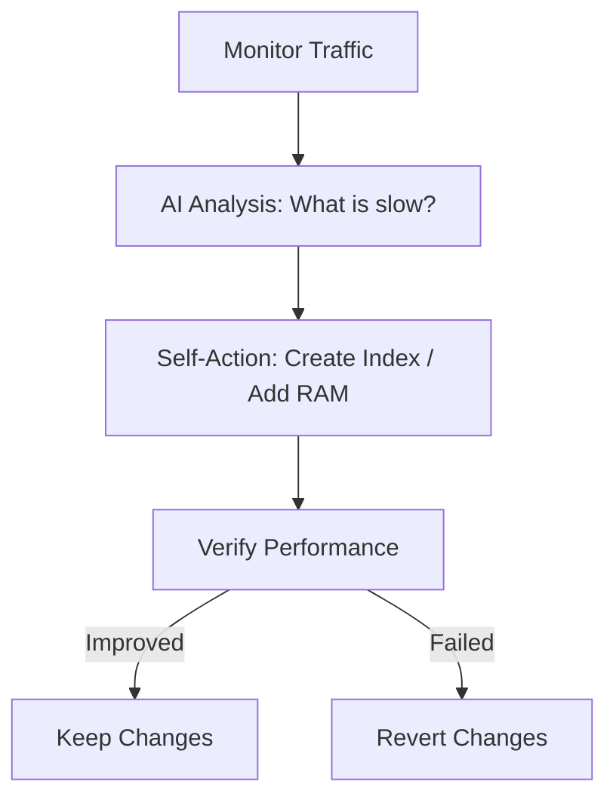

# 🤖 Autonomous Databases: The Self-Driving DB
> **Objective:** Master the concept of Autonomous Databases that use AI to self-provision, self-secure, and self-repair without human intervention | **Language:** Hinglish | **Standard:** 2026 Expert Framework

---

## 🧭 1. Beginner-Friendly Hinglish Explanation
Autonomous Databases ka matlab hai "Self-Driving Database".

- **The Problem:** Database ko manage karna ek full-time job hai (DBA - Database Administrator). Aapko index banane padte hain, backup lena padta hai, security patches lagane padte hain. Ek galti aur system down.
- **The Solution:** Autonomous Database. 
  - Ye AI use karta hai apne aap ko manage karne ke liye.
  - **Self-Patching:** Security update aate hi wo bina kisi ko bataye apne aap patch ho jayega.
  - **Self-Tuning:** Agar koi query slow hai, toh wo apne aap sahi index bana lega.
  - **Self-Repairing:** Agar koi hardware fail hota hai, toh wo apne aap dusre server par shift ho jayega.
- **Intuition:** Ye "Tesla Autopilot" jaisa hai. Aap sirf rasta (Data) batao, car (DB) apne aap chalti rahegi.

---

## 🧠 2. Deep Technical Explanation
### 1. ML-Based Query Optimization:
Instead of static rules, the database uses Machine Learning to predict the best query path based on years of historical traffic patterns.

### 2. Automated Indexing:
The DB monitors which queries are slow and "Experiments" with new indexes in a hidden area. If the index helps, it keeps it. If not, it deletes it.

### 3. Key Examples:
- **Oracle Autonomous Database:** The pioneer in this field.
- **AWS Aurora (v2 Serverless):** Scales itself based on real-time load.
- **Google Cloud AlloyDB:** Uses AI for intelligent caching and storage management.

---

## 🏗️ 3. Database Diagrams (The Autonomous Loop)


---

## 💻 4. Query Execution Examples (AI-Driven SQL)
```sql
-- In an Autonomous DB, you don't write:
-- CREATE INDEX idx_name ON users(name);

-- You just run your queries. 
-- The DB sees you often run:
SELECT * FROM users WHERE city = 'Delhi';

-- Internally, the AI logs: "Query frequency: High. Index gain: 90%. Action: Building Index..."
```

---

## 🌍 5. Real-World Vision
- **No-Ops Development:** A 2-person startup can handle 100 million users because they don't need a DBA team. The database manages itself.
- **Zero-Downtime Enterprises:** Companies like banks never go down for "Maintenance" because the DB patches itself while running.

---

## ❌ 6. Failure Cases
- **The "Black Box" Problem:** If the AI makes a mistake (e.g., creates 1000 useless indexes and fills up the disk), it's hard for a human to understand why it did that.
- **Loss of Control:** In critical systems, engineers are often scared to let a "Machine" decide when to delete or change data.
- **Cost:** Autonomous databases are much more expensive because you are paying for the "Intelligence" and the high-end cloud infra.

漫
---

## ✅ 11. Key Takeaways for Engineers
- **The role of DBA is changing** to "Data Architect".
- **Trust the machine, but monitor it.**
- **Autonomous DBs are best for 'Generic' apps** where you don't want to waste time on low-level tuning.

---

## 📝 14. Interview Questions
1. "What makes a database 'Autonomous'?"
2. "Explain the 'Self-Tuning' feature of modern cloud databases."
3. "Would you use an autonomous database for a high-security banking system? Why?"

---

## 🚀 15. Latest 2027 Predictions
- **Natural Language Administration:** You tell the DB in Slack: "Hey, optimize our reporting queries for the Q4 sale", and it does it.
- **Self-Scaling Storage:** Databases that move "Old" data to cheaper storage (Archive) automatically based on when a user last looked at it.
漫
