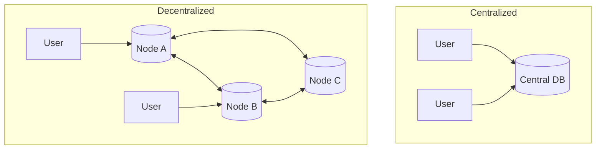

# 🔗 Blockchain and Databases: Decentralized Data
> **Objective:** Explore the intersection of traditional databases and blockchain technology, focusing on decentralized storage, immutability, and trustless data sharing | **Language:** Hinglish | **Standard:** 2026 Expert Framework

---

## 🧭 1. Beginner-Friendly Hinglish Explanation
Blockchain and Databases ka matlab hai "Database ko 'Sach' aur 'Bharosa' (Trust) ka sourse banana".

- **The Problem:** Ek normal database ka ek "Maalik" (Owner) hota hai. Agar wo maalik data badal de, toh humein kabhi pata nahi chalega.
- **The Solution:** Blockchain.
  - Data "Decentralized" hota hai (Sabke paas ek copy hai).
  - Data "Immutable" hota hai (Ek baar likha toh kabhi nahi badal sakta).
  - **The Intersection:** Aaj kal humein aise databases chahiye jo SQL ki tarah fast hon par Blockchain ki tarah "Sacche" (Verifiable).
- **Intuition:** Ye ek "Public Notice Board" jaisa hai. Sab dekh sakte hain ki kisne kya likha, aur koi use mita nahi sakta bina sabke pakde gaye.

---

## 🧠 2. Deep Technical Explanation
### 1. Decentralized Databases (DeDB):
Systems like **GunDB**, **OrbitDB**, or **BigChainDB**. They use a Peer-to-Peer (P2P) network to store data instead of a central server.
- **No Single Point of Failure.**
- **No Single Point of Control.**

### 2. Proof of Data:
Using Merkle Trees and Cryptographic Hashes to ensure that the data you read from a database is exactly what was written by the authorized user.

### 3. Key Examples:
- **Amazon QLDB:** A central ledger database with blockchain-like immutability.
- **BigChainDB:** A database with blockchain characteristics (High throughput + Decentralization).
- **IPFS:** A decentralized file system often used as the "Storage Layer" for blockchains.

---

## 🏗️ 3. Database Diagrams (Centralized vs Decentralized)


---

## 💻 4. Query Execution Examples (Smart Contract Style)
```javascript
// Instead of SQL, you often interact via 'Transactions'
async function recordTransfer(from, to, amount) {
    const tx = await blockchain.signTransaction({
        action: 'TRANSFER',
        from: from,
        to: to,
        amount: amount
    });
    // This is recorded forever in the decentralized log.
}
```

---

## 🌍 5. Real-World Vision
- **Supply Chain:** Tracking the exact origin of a organic fruit from the farm to your table. No middleman can fake the data.
- **Digital Identity:** Storing your degrees and certificates in a decentralized DB so you can prove them to any employer without needing the university to verify them every time.

---

## ❌ 6. Failure Cases
- **Speed:** Decentralized databases are much slower than SQL because they need to reach "Consensus" across many servers.
- **Cost:** Storing data on a public blockchain (like Ethereum) is incredibly expensive ($100 to store a small file).
- **The "Right to be Forgotten":** If data is immutable, you can't delete it. This clashes with privacy laws like GDPR.

漫
---

## ✅ 11. Key Takeaways for Engineers
- **Use Blockchain only when 'Trust' is the main problem.**
- **Use Ledger Databases (QLDB)** for internal immutable audits.
- **Don't store large files on-chain**; store the "Hash" on-chain and the file on a normal DB.

---

## 📝 14. Interview Questions
1. "Difference between a Ledger Database and a Blockchain?"
2. "Why are decentralized databases slower than centralized ones?"
3. "What is a Merkle Tree and how is it used in databases?"

---

## 🚀 15. Latest 2027 Predictions
- **Web3 Databases:** Databases where the user "Owns" their data in their own private encrypted vault and gives "Permissions" to apps to read it temporarily.
- **SQL on Blockchain:** New layers that allow you to run standard SQL queries against decentralized data stored on blockchains like Solana or Ethereum.
漫
