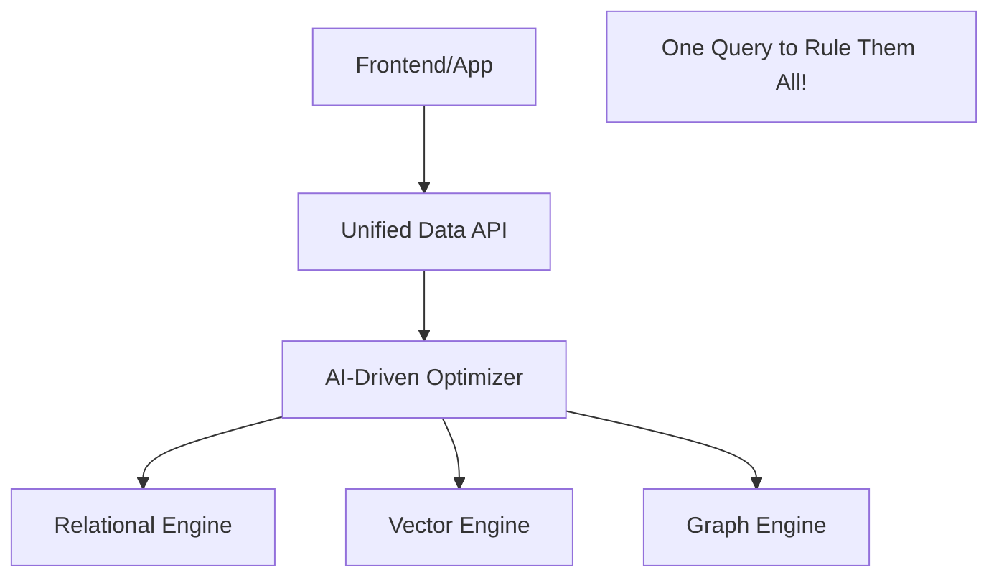

# 🚀 The Post-Relational Era: Beyond Tables and Rows
> **Objective:** Explore the radical shifts in data management where the boundaries between SQL, NoSQL, and AI-native data are disappearing | **Language:** Hinglish | **Standard:** 2026 Expert Framework

---

## 🧭 1. Beginner-Friendly Hinglish Explanation
Post-Relational Era ka matlab hai "Database ka wo bhavishya jahan hum tables aur rows se aage badh chuke hain".

- **The Past:** Humein choose karna padta tha—SQL lo ya NoSQL.
- **The Future:** Database ek "Data Layer" ban jayega jo sab kuch handle karega.
  - Aap data table mein dalo, wo use automatically **Vector** (AI) mein bhi badal dega.
  - Wo automatically **Graph** relationships bhi dhoondh lega.
  - Wo automatically **Edge** par sync bhi ho jayega.
- **Intuition:** Ye ek "Smart Assistant" jaisa hai. Aapko use ye nahi batana ki "A1 column mein data dalo". Aap use sirf "Data" dete ho, aur wo apne aap decide karta hai ki use kaise store aur optimize karna hai.

---

## 🧠 2. Deep Technical Explanation
### 1. Converged Databases:
The death of "Single-purpose" databases. Modern engines like **SurrealDB** and **DuckDB** are multi-modal and run anywhere (Edge, Browser, Server).

### 2. Schema-on-Read Evolution:
Moving away from rigid schemas. We store raw data and the database "Infers" the schema when you query it, using AI to map fields dynamically.

### 3. Data as a Service (DaaS):
Databases moving away from "Instances" to "APIs". You don't manage a DB; you just call an endpoint.

---

## 🏗️ 3. Database Diagrams (The Future Architecture)


---

## 💻 4. Query Execution Examples (Post-Relational Style)
```sql
-- 1. Hybrid Semantic Query (The 2026 way)
SELECT * FROM products 
WHERE category = 'Electronics' 
AND LOOKS_LIKE(image_blob) -- AI-native vector search
USING MODEL 'clip-v2';

-- 2. Real-time Subscriptions (Native to the DB)
-- Instead of polling, the DB pushes changes to the frontend.
LIVE SELECT * FROM chat_messages WHERE room_id = '123';
```

---

## 🌍 5. Real-World Vision
- **Autonomous Apps:** An app where the database understands that a user is "Angry" based on their comments and automatically flags them for a human agent.
- **Self-Healing Systems:** A database that detects it's being "DDoS" attacked and automatically moves itself to a new IP and scales up its CPU in 2 seconds.

---

## ❌ 6. Failure Cases
- **The Complexity Trap:** By trying to do "Everything", the database becomes a massive, buggy piece of software that is hard to debug.
- **Privacy at Scale:** If the database is "Too Smart", it might accidentally reveal sensitive patterns in the data that were supposed to be hidden.

漫
---

## ✅ 11. Key Takeaways for Future-Proof Engineers
- **Don't tie yourself to one database type.**
- **Learn how to work with Vector Embeddings.**
- **Focus on 'Data Architecture' rather than 'SQL Syntax'.**
- **Understand 'Edge Computing'.**

---

## 📝 14. Interview Questions (Future Focus)
1. "What is a Multi-Modal database and why is it the future?"
2. "How will AI change the role of a Database Administrator (DBA)?"
3. "What is 'Data Disaggregation'?"

---

## 🚀 15. Latest 2027 Predictions
- **Wasm-Native Databases:** Databases that are written in Rust/Zig and run at near-native speed directly inside your browser or on the edge worker.
- **Natural Language DBs:** Talking to your database in plain English: "Hey DB, show me all users who bought a laptop last week but haven't used their coupon yet."
漫
