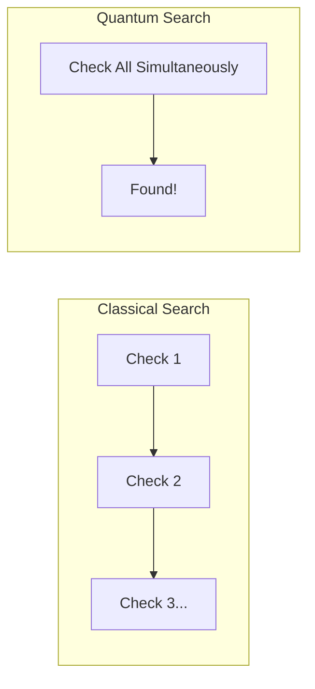

# ⚛️ Quantum Computing and Databases: The Next Frontier
> **Objective:** Explore how Quantum Computing will revolutionize database search, cryptography, and complex optimization problems | **Language:** Hinglish | **Standard:** 2026 Expert Framework

---

## 🧭 1. Beginner-Friendly Hinglish Explanation
Quantum Computing and Databases ka matlab hai "Computer science ki sabse advanced technology ka databases par asar".

- **The Idea:** Aaj ke computers (Classical) `0` aur `1` (Bits) use karte hain. Quantum computers `Qubits` use karte hain jo ek saath `0` aur `1` dono ho sakte hain.
- **The Impact on DBs:**
  1. **Super-fast Search:** Jo search aaj 1 ghanta leti hai, Quantum use 1 second mein kar sakta hai (**Grover's Algorithm**).
  2. **Security Crisis:** Aaj ki sabse strong "Encryption" (RSA) ko Quantum computer kuch seconds mein tod sakta hai.
  3. **Complex Joins:** 100 tables ko join karna aur best rasta dhoondhna Quantum ke liye bacho ka khel hai.
- **Intuition:** Ye ek "Normal Bulb" vs "Laser Beam" jaisa hai. Dono light dete hain, par laser ki power aur precision bilkul alag level ki hoti hai.

---

## 🧠 2. Deep Technical Explanation
### 1. Grover's Algorithm:
For an unsorted database of $N$ items, a classical computer needs $N/2$ operations to find an item. A quantum computer only needs $\sqrt{N}$ operations. 
- For 1 Trillion items, classical needs 500 Billion operations. Quantum needs only 1 Million!

### 2. Post-Quantum Cryptography (PQC):
Since quantum computers can break current encryption, we need to design new "Quantum-resistant" algorithms to protect our database data.

### 3. Query Optimization:
Finding the absolute "Optimal" join order for 50 tables is a "Hard" problem (NP-Hard). Quantum computers can solve these optimization problems almost instantly using **Quantum Annealing**.

---

## 🏗️ 3. Database Diagrams (The Quantum Jump)


---

## 💻 4. Visionary Query Logic (2030 Style)
```sql
-- This is hypothetical, but shows the power of Quantum search
SELECT * FROM global_genome_database 
WHERE DNA_SEQUENCE SIMILAR_TO '...AGCT...'
WITH QUANTUM_PROBABILITY > 0.99;
-- Searching across trillions of DNA sequences in milliseconds.
```

---

## 🌍 5. Real-World Vision
- **Drug Discovery:** Searching through billions of chemical combinations in a database to find a cure for a new virus in hours instead of years.
- **Supply Chain:** Optimizing the path of 1 million delivery trucks globally in real-time, considering traffic, weather, and fuel.

---

## ❌ 6. The Challenges
- **Stability:** Quantum computers are currently very unstable (Need extreme cold temperature -273°C).
- **Errors:** "Quantum Noise" causes many mistakes in calculations.
- **Programming:** You can't write standard SQL for a quantum computer yet; you need complex math and specialized languages like **Q#**.

漫
---

## ✅ 11. Key Takeaways for Engineers
- **Quantum computing won't replace SQL tomorrow**, but it will change how we think about "Hard" problems.
- **Keep an eye on 'Post-Quantum Cryptography'** to keep your data safe in the next 10 years.
- **Mathematical skills** will become more important than syntax skills.

---

## 📝 14. Interview Questions (Future Focus)
1. "How does Grover's Algorithm affect database search speed?"
2. "Why is Quantum Computing a threat to database security?"
3. "What is a Qubit?"

---

## 🚀 15. Latest 2027 Predictions
- **Quantum-safe Cloud DBs:** AWS and Google starting to offer "Post-Quantum Encryption" for their RDS and Spanner instances.
- **Hybrid Quantum-Classical DBs:** Databases that use a normal server for storage but send complex "Optimization" tasks to a Quantum processor in the cloud.
漫
