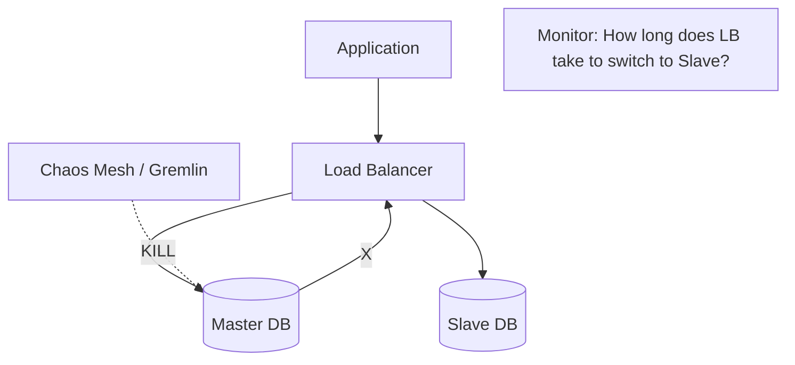

# 🧪 Chaos Engineering for Databases: Testing the Breaking Point
> **Objective:** Master the practice of intentionally injecting failures into database systems to verify resilience, failover mechanisms, and disaster recovery plans | **Language:** Hinglish | **Standard:** 2026 Expert Framework

---

## 🧭 1. Beginner-Friendly Hinglish Explanation
Chaos Engineering for Databases ka matlab hai "Apne database ko jaan-bujhkar todna (Controlled way mein) takki aap dekh sakein ki wo kitna majboot hai".

- **The Problem:** Hum assume karte hain ki "Failover" kaam karega, par jab real mein server down hota hai toh system crash ho jata hai.
- **The Solution:** Chaos Engineering. 
  - Live system mein galti se "Kill" button dabana (Planned way mein).
  - Network slow karna.
  - Disk full kar dena.
- **Intuition:** Ye ek "Fire Drill" jaisa hai. Building mein aag lagne se pehle hum check karte hain ki alarm baj raha hai ya nahi.

---

## 🧠 2. Deep Technical Explanation

### 1. Types of Database Chaos:
- **Process Kill:** Killing the Master DB process. (Tests Failover).
- **Network Latency:** Adding 500ms delay between App and DB. (Tests Timeout settings).
- **Disk Pressure:** Filling up the disk to $99\%$. (Tests Monitoring and Auto-scaling).
- **Network Partition:** Cutting the link between Master and Replicas. (Tests Split-brain protection).

### 2. The Chaos Cycle:
1. **Define 'Steady State':** Normal system kaise chalta hai? (e.g., Latency < 50ms).
2. **Hypothesis:** "Agar main Master ko kill karu, toh 30 seconds mein Slave Master ban jayega aur app chalti rahegi."
3. **Experiment:** Inject the failure.
4. **Verify:** Kya 30s mein failover hua?
5. **Learn:** Agar fail hua, toh fix karo.

---

## 🏗️ 3. Database Diagrams (The Chaos Experiment)


---

## 💻 4. Query Execution Examples (Using Chaos Tools)

### Using Chaos Mesh (Kubernetes)
```yaml
# Kill a Postgres Pod every 5 minutes
apiVersion: chaos-mesh.org/v1alpha1
kind: PodChaos
metadata:
  name: kill-postgres
spec:
  action: pod-kill
  mode: one
  selector:
    labelSelectors:
      app: postgres
  scheduler:
    cron: "@every 5m"
```

### Simulating Network Latency (Linux tc)
```bash
# Add 200ms latency to the database port 5432
sudo tc qdisc add dev eth0 root netem delay 200ms
```

---

## 🌍 5. Real-World Production Examples
- **Netflix:** Famous for **Chaos Monkey**, which randomly kills production servers to ensure the whole system is resilient.
- **Uber:** Uses chaos to test their global "Cellular" database architecture. They "Shut down" a whole city's data center to see if users are automatically routed to the next city.

---

## ❌ 6. Failure Cases
- **Uncontrolled Chaos:** Running a test without a "Kill Switch". The system crashes and you can't bring it back. **Fix: Always have a way to stop the experiment instantly.**
- **Testing without Monitoring:** You killed the DB, but you don't have logs to see what happened. The test was useless.

---

## 🛠️ 7. Debugging Guide
| Problem | Reason | Solution |
| :--- | :--- | :--- |
| **Failover took 10 minutes** | Health check timeout is too high | Reduce the 'Heartbeat' and 'Timeout' settings in your Cluster manager. |
| **Data Loss after chaos** | Async replication | Switch to 'Semi-Synchronous' replication for critical data. |

---

## ⚖️ 8. Tradeoffs
- **High Resilience (Planned Chaos / Constant Testing)** vs **System Stability (No testing / Risk of massive unexpected outage).**

---

## ✅ 11. Best Practices
- **Start in a Staging environment.** Never go to Prod on day one.
- **Define a 'Stop' signal** (e.g., If 5% of users see errors, stop the chaos).
- **Inform the team** before starting an experiment.
- **Automate the tests** to run weekly.

漫
---

## 📝 14. Interview Questions
1. "Why should you intentionally break your production database?"
2. "What is a 'Steady State' in chaos engineering?"
3. "How do you simulate a Network Partition in a database cluster?"

---

## 🚀 15. Latest 2026 Production Database Patterns
- **AI-Generated Chaos:** AI tools that scan your infrastructure, find the weakest point (e.g., a single replica that is overloaded), and suggest a chaos experiment to test it.
- **Ebb-and-Flow Testing:** Automatically reducing database capacity during low-traffic hours (like 3 AM) to see if the auto-scaling and failover mechanisms handle the pressure correctly.
漫
