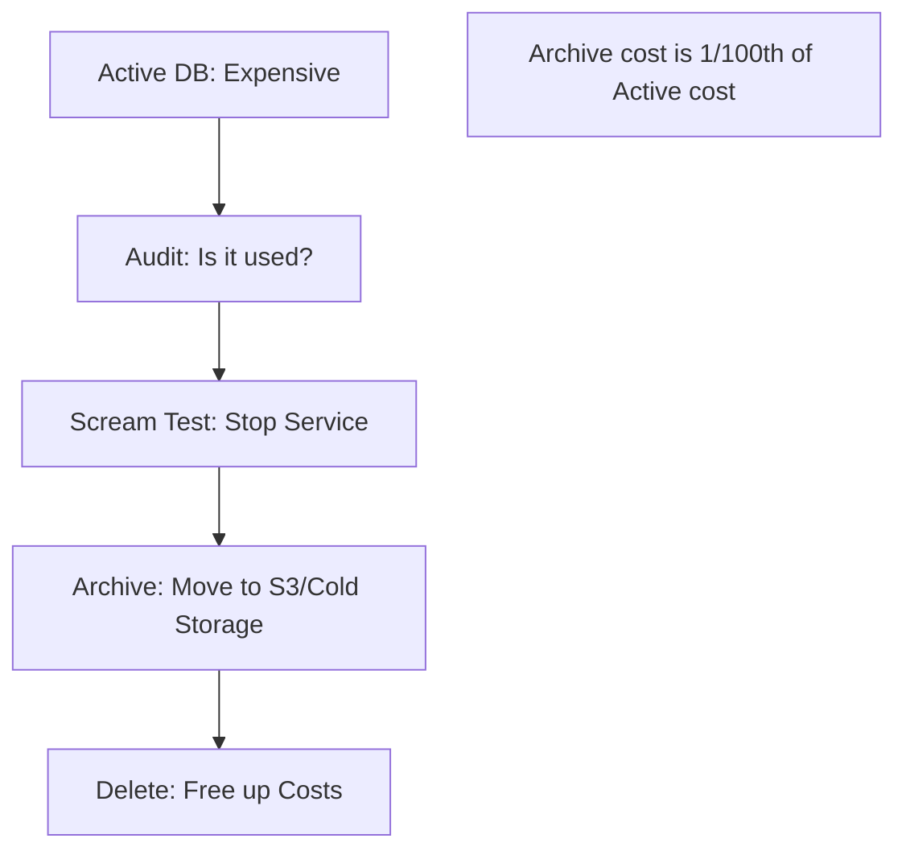

# ⚰️ Database Decommissioning Guide: Ending the Lifecycle
> **Objective:** Master the professional process of shutting down and removing old or unused databases while ensuring data archival, security compliance, and zero impact on legacy systems | **Language:** Hinglish | **Standard:** 2026 Expert Framework

---

## 🧭 1. Beginner-Friendly Hinglish Explanation
Database Decommissioning ka matlab hai "Ek purane database ko ijjat ke saath retire karna".

- **The Problem:** Aksar log purane databases ko chalu chhod dete hain (High Cost!) ya phir bina backup ke delete kar dete hain (Data Loss!).
- **The Solution:** Ek systematic "Sunset" process.
  - Pehle check karo ki koi use toh nahi kar raha.
  - Phir data ko saste storage (Archive) mein dalo.
  - Aur end mein server ko delete karo.
- **Intuition:** Ye "Ghar khali karne" jaisa hai. Sab saaman pack karo (Backup), light band karo (Shutdown), aur chabi wapas kar do (Delete).

---

## 🧠 2. Deep Technical Explanation

### 1. The Decommissioning Workflow:
1. **Discovery:** Use network logs to see if there are any active connections.
2. **Notification:** Inform all teams that "DB X will be deleted in 30 days".
3. **The "Scream Test":** Turn off the database for 24 hours. If no one "Screams" (complains), it's safe to delete.
4. **Final Backup:** Take a full snapshot and store it in a different region/account.
5. **Archival:** Convert data to Parquet/CSV and store in S3 Glacier (Very cheap).
6. **Deletion:** Remove the servers, storage, and DNS records.

### 2. Legal and Compliance:
Some laws (like HIPAA or GDPR) require you to keep data for 7 years even if the app is dead. You cannot just delete it.

---

## 🏗️ 3. Database Diagrams (The Decommissioning Funnel)


---

## 💻 4. Execution Examples (Cleanup Tasks)
```sql
-- 1. Checking for last used time
-- (Postgres example: Check last manual vacuum or scan)
SELECT relname, last_vacuum, last_analyze 
FROM pg_stat_user_tables;

-- 2. Finding active connections before shutdown
SELECT count(*), client_addr, application_name 
FROM pg_stat_activity 
GROUP BY client_addr, application_name;
```

---

## 🌍 5. Real-World Production Examples
- **Migration to Cloud:** A company moves from Oracle to AWS Aurora. They keep the old Oracle DB in "Read-only" mode for 3 months, then archive it and shut it down.
- **Product Sunset:** A startup kills a failed feature. They archive the feature's database to save $500/month in cloud costs.

---

## ❌ 6. Failure Cases
- **The Ghost Connection:** You deleted the DB, but an old Cron Job on a hidden server tries to connect and crashes every night, filling up your error logs. **Fix: Run the 'Scream Test' for at least a week.**
- **Lost Archive Keys:** You encrypted the final backup but lost the key. 5 years later, a tax auditor asks for the data and you can't open it. **Fix: Store the Archival Key in a Corporate Password Manager.**

---

## 🛠️ 7. Debugging Guide
| Problem | Reason | Solution |
| :--- | :--- | :--- |
| **"Cannot delete DB: In Use"** | Active session | Use `pg_terminate_backend` to kill all connections before deletion. |
| **Costs are still high** | Disks not deleted | In AWS, deleting an RDS instance doesn't always delete the snapshots. Manually clean up old snapshots. |

---

## ⚖️ 8. Tradeoffs
- **Keeping the DB (Safe / Expensive)** vs **Deleting/Archiving (Risky / Cheap).**

---

## ✅ 11. Best Practices
- **Never delete without a Final Snapshot.**
- **Document the Archival Location** in the company wiki.
- **Run the 'Scream Test'** during a weekday (not Friday evening!).
- **Revoke all user access** 1 week before shutdown to see who complains.

漫
---

## 📝 14. Interview Questions
1. "What is a 'Scream Test' in the context of decommissioning?"
2. "Why is data archival important before deleting a database?"
3. "How do you ensure a database is truly unused?"

---

## 🚀 15. Latest 2026 Production Database Patterns
- **Automated Sunsetting:** Scripts that detect a database has had zero queries for 90 days and automatically send a Slack notification to the owner to decommission it.
- **S3 Select:** Archiving data in Parquet format to S3 and using "S3 Select" or **AWS Athena** to query the old data without ever needing a database server again.
漫
