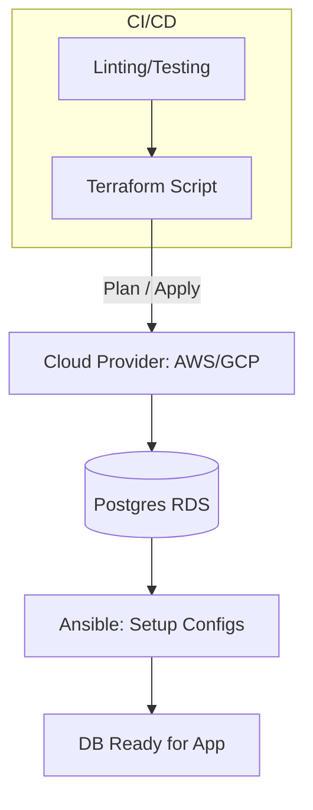

# 🤖 Database Provisioning and Automation: Infrastructure as Code
> **Objective:** Master the automation of database lifecycle management—from creation and configuration to patching and scaling—using modern Infrastructure as Code (IaC) tools | **Language:** Hinglish | **Standard:** 2026 Expert Framework

---

## 🧭 1. Beginner-Friendly Hinglish Explanation
Database Provisioning aur Automation ka matlab hai "Database ko button dabakar ya code likhkar turant chalu karna, bajaye manually server setup karne ke".

- **The Problem:** Ek naya database setup karne mein ghanto lag sakte hain (Install, Config, Security, Backups). Insaan galti kar sakta hai.
- **The Solution:** Automation.
  - **IaC (Infrastructure as Code):** Ek file likho jo bataye ki "Muje ek 16GB RAM wala Postgres chahiye".
  - **Automation:** Tools like Terraform aur Ansible sara kaam khud kar denge.
- **Intuition:** Ye ek "Vending Machine" jaisa hai. Aapne code (Paisa) dala aur database (Coke) bahar aa gaya.

---

## 🧠 2. Deep Technical Explanation

### 1. Provisioning vs Configuration:
- **Provisioning (Terraform/CloudFormation):** Building the "House". Creating the VM, the RDS instance, the Disk, and the Network.
- **Configuration (Ansible/Chef):** Setting up the "Furniture". Editing `postgresql.conf`, creating users, and installing extensions.

### 2. The Benefits of IaC:
- **Reproducibility:** Ek hi script se aap exact waisa hi DB Test, Stage, aur Prod mein bana sakte hain.
- **Version Control:** Aap database changes ko Git mein dekh sakte hain (Who changed the RAM from 8GB to 16GB?).
- **Speed:** 100 databases setup karna utna hi aasaan hai jitna 1.

---

## 🏗️ 3. Database Diagrams (The Automation Pipeline)


---

## 💻 4. Query Execution Examples (Terraform & Ansible)

### Terraform Snippet (Creating a Postgres DB)
```hcl
resource "aws_db_instance" "default" {
  allocated_storage    = 20
  db_name              = "mydb"
  engine               = "postgres"
  engine_version       = "15.4"
  instance_class       = "db.t3.micro"
  username             = "admin"
  password             = var.db_password
  publicly_accessible  = false
  skip_final_snapshot  = true
}
```

### Ansible Snippet (Configuring Settings)
```yaml
- name: Set Postgres Shared Buffers
  postgresql_set:
    name: shared_buffers
    value: 4GB
  become: yes
  become_user: postgres
```

---

## 🌍 5. Real-World Production Examples
- **SaaS Platform:** Automatically spinning up a new, isolated database for every new customer who signs up (Multi-tenant isolation).
- **Chaos Testing:** Automatically creating a "Clone" of the production database for developers to test destructive queries without touching real data.

---

## ❌ 6. Failure Cases
- **The "State File" Disaster:** Deleting your Terraform state file. Now the tool doesn't know which DB it created and might try to create it again (or delete it). **Fix: Always store state files in a secure, remote location like S3 with Versioning.**
- **Hardcoding Secrets:** Putting the database password inside the Terraform script. **Fix: Use AWS Secrets Manager or HashiCorp Vault.**

---

## 🛠️ 7. Debugging Guide
| Problem | Reason | Solution |
| :--- | :--- | :--- |
| **"Resource already exists"** | State mismatch | Use `terraform import` to bring the existing DB into your code control. |
| **Provisioning is slow** | Cloud provider limits | Check your 'Service Quotas' in AWS/GCP console. |

---

## ⚖️ 8. Tradeoffs
- **Full Automation (Consistency / Speed)** vs **Manual Control (Fast for 1-off tests / Risky for Prod).**

---

## ✅ 11. Best Practices
- **Use Terraform for Infrastructure.**
- **Use Ansible for Configuration.**
- **Never store passwords in code.**
- **Run `terraform plan`** before applying changes to see what will happen.
- **Keep your DB in a Private Subnet.**

漫
---

## 📝 14. Interview Questions
1. "What is Infrastructure as Code (IaC) and how does it help database reliability?"
2. "Difference between Terraform and Ansible?"
3. "How do you handle database passwords in an automated setup?"

---

## 🚀 15. Latest 2026 Production Database Patterns
- **Database Operators:** Using **Kubernetes Operators** (like CloudNativePG) to manage the entire lifecycle (Backups, Failover, Upgrades) of a Postgres cluster automatically.
- **Self-Healing Infrastructure:** Scripts that detect a disk is $90\%$ full and automatically increase the database volume size without any human intervention.
漫
