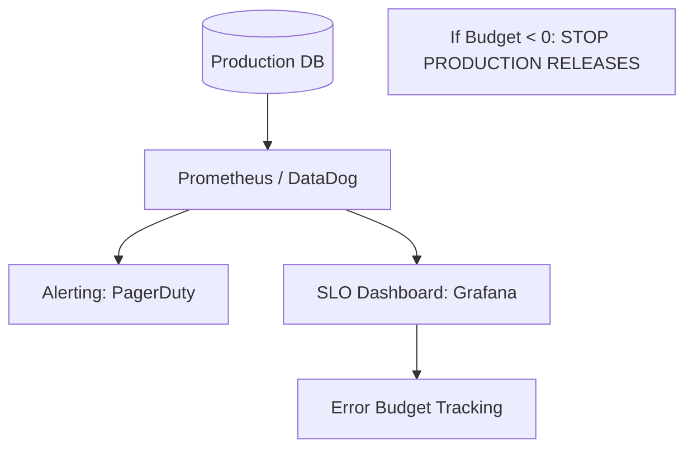

# 📈 SRE for Databases: SLOs and SLIs
> **Objective:** Master the Site Reliability Engineering (SRE) approach to database management, focusing on defining Service Level Indicators (SLIs) and Objectives (SLOs) to ensure predictable reliability | **Language:** Hinglish | **Standard:** 2026 Expert Framework

---

## 🧭 1. Beginner-Friendly Hinglish Explanation
SRE for Databases ka matlab hai "Database ko sirf 'Chalu' nahi rakhna, balki use 'Reliable' banana".

- **The Problem:** Sirf ye kehna ki "Database down nahi hona chahiye" kaafi nahi hai. Kitni der tak? Kitna slow? Ye sab numbers mein hona chahiye.
- **The Core Concepts:**
  - **SLI (Indicator):** Ek measurement. (e.g., Average Query Time).
  - **SLO (Objective):** Ek target. (e.g., $99\%$ queries 100ms se kam honi chahiye).
  - **Error Budget:** Jitni "Galti" aapko allow hai. (e.g., Mahine mein 43 minutes ka downtime).
- **Intuition:** Ye ek "School Report Card" jaisa hai. Sirf pass hona (Up) kaafi nahi hai, 90% marks (Reliability) aane chahiye.

---

## 🧠 2. Deep Technical Explanation

### 1. Key Database SLIs (The "Golden Signals"):
- **Latency:** Time taken to execute a query.
- **Traffic:** Queries per second (QPS).
- **Errors:** Failed queries (e.g., Timeouts, 500 errors).
- **Saturation:** How full is your CPU/RAM/Disk?

### 2. Defining an SLO:
"We want $99.9\%$ of successful reads to return within $50ms$ over a 30-day window."
- If you hit this, you are good.
- If you fail, you stop building new features and focus on database stability.

---

## 🏗️ 3. Database Diagrams (The SRE Monitoring Stack)


---

## 💻 4. Query Execution Examples (Measuring SLIs)
```sql
-- 1. Measuring P99 Latency (Postgres)
SELECT 
    percentile_cont(0.99) WITHIN GROUP (ORDER BY total_exec_time / calls) as p99_latency 
FROM pg_stat_statements;

-- 2. Measuring Error Rate
SELECT 
    (SUM(CASE WHEN status_code = 'ERROR' THEN 1 ELSE 0 END) * 100.0 / COUNT(*)) as error_percentage 
FROM query_logs;
```

---

## 🌍 5. Real-World Production Examples
- **Google Search:** If their latency SLO is breached, engineers don't sleep until the database performance is restored. Reliability is more important than a new UI button.
- **E-commerce (Amazon):** $100ms$ of extra latency costs them millions in sales. Their SLOs are extremely strict ($<50ms$ for product pages).

---

## ❌ 6. Failure Cases
- **Monitoring the wrong thing:** Measuring "Average Latency" instead of "P99 Latency". Averages hide the $1\%$ of users who are having a terrible experience. **Fix: Always use Percentiles (P95, P99).**
- **No Error Budget Policy:** Failing the SLO but continuing to deploy new code. The database eventually crashes.

---

## 🛠️ 7. Debugging Guide
| Problem | Reason | Solution |
| :--- | :--- | :--- |
| **SLO is red** | Heavy background tasks / Bad queries | Identify the "Top 5" slow queries and optimize them immediately. |
| **Alert fatigue** | Thresholds are too low | Adjust your SLIs so they only alert when the user experience is actually affected. |

---

## ⚖️ 8. Tradeoffs
- **High Reliability (Slower Innovation / High Cost)** vs **Fast Innovation (Lower Reliability / Higher Risk).**

---

## ✅ 11. Best Practices
- **Use SLO-based Alerting** (Only alert if the Error Budget is burning too fast).
- **Focus on the User Journey** (e.g., "Add to Cart" query is more important than "Change Profile Pic").
- **Automate everything.**
- **Post-Mortems:** Always write a report after every major incident to learn why it happened.

漫
---

## 📝 14. Interview Questions
1. "Difference between SLI, SLO, and SLA?"
2. "Why is P99 latency better than Average latency for database monitoring?"
3. "What is an Error Budget and how do you use it?"

---

## 🚀 15. Latest 2026 Production Database Patterns
- **AI-Driven SLOs:** Using machine learning to predict when an SLO will be breached 2 hours before it actually happens.
- **SLO-as-Code:** Defining your reliability targets in YAML files alongside your application code using tools like **Sloth**.
漫
