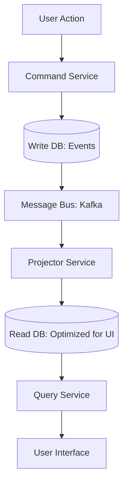

# 🏗️ CQRS and Event Sourcing: The Ultimate Decoupling
> **Objective:** Master the advanced architectural patterns of Command Query Responsibility Segregation (CQRS) and Event Sourcing to build highly scalable, auditable, and performant distributed systems | **Language:** Hinglish | **Standard:** 2026 Expert Framework

---

## 🧭 1. Beginner-Friendly Hinglish Explanation
CQRS and Event Sourcing ka matlab hai "Database ke kaam karne ke dhang ko poori tarah badal dena".

- **The Problem:** Ek hi database table par "Likhna" (Command) aur "Padhna" (Query) karna kabhi-kabhi slow ho jata hai. Saath hi, humein ye nahi pata chalta ki data "Aisa kyu hai" (History missing).
- **The Solution:** 
  - **CQRS:** Likhne ke liye alag database (Write DB) aur Padhne ke liye alag database (Read DB) use karna.
  - **Event Sourcing:** Sirf "Final state" save karne ki bajaye, har "Badlav" (Event) ko save karna.
- **Intuition:** 
  - **CQRS** ek dukan jaisa hai jahan "Saman lene" ki line alag hai aur "Saman dikhane" ki line alag.
  - **Event Sourcing** ek "Bank Passbook" jaisa hai jahan har transaction (+100, -50) likha hota hai, sirf final balance nahi.

---

## 🧠 2. Deep Technical Explanation

### 1. CQRS (Segregation):
- **Command Side:** Optimized for writes. (e.g., Postgres/MySQL). Focus on validation and consistency.
- **Query Side:** Optimized for reads. (e.g., Elasticsearch/Redis). Focus on speed and UI-ready data.
- **Sync:** A background process (Event Bus) syncs data from Write DB to Read DB.

### 2. Event Sourcing (The Source of Truth):
- You don't store `User { status: 'Active' }`.
- You store: 
  1. `UserCreatedEvent`
  2. `EmailVerifiedEvent`
  3. `SubscriptionPaidEvent`
- **Replay:** You can calculate the final state by "Replaying" these events.

---

## 🏗️ 3. Database Diagrams (The CQRS Flow)


---

## 💻 4. Execution Examples (Code Logic)

### Event Sourcing (Pseudo-code)
```javascript
// Instead of updating a row
db.events.insert({
    type: "MONEY_DEPOSITED",
    amount: 100,
    timestamp: Date.now(),
    user_id: 1
});

// To get final balance
let balance = 0;
const events = db.events.find({ user_id: 1 });
events.forEach(e => {
    if (e.type === "MONEY_DEPOSITED") balance += e.amount;
    if (e.type === "MONEY_WITHDRAWN") balance -= e.amount;
});
```

---

## 🌍 5. Real-World Production Examples
- **Banking/Fintech:** Every transaction is an event. They need a perfect audit trail (Event Sourcing).
- **E-commerce (Amazon):** When you search for products, you are hitting a **Read DB** (Elasticsearch). When you click "Buy", you are hitting a **Write DB** (Postgres).

---

## ❌ 6. Failure Cases
- **Eventual Consistency:** In CQRS, you might update your profile but see the old name for 2 seconds because the sync hasn't happened. **Fix: Inform the user or use 'Local State' in the frontend.**
- **Version Hell:** You changed the event format in Version 2. Now Version 1 events are hard to "Replay". **Fix: Use 'Event Versioning' or 'Upcasters'.**

---

## 🛠️ 7. Debugging Guide
| Problem | Reason | Solution |
| :--- | :--- | :--- |
| **Read DB is out of sync** | Message bus lag / Sync service down | Check your Kafka/RabbitMQ lag and restart the projector service. |
| **Replay is too slow** | Too many events | Use **Snapshots**. Save the state every 100 events so you don't have to replay from the beginning of time. |

---

## ⚖️ 8. Tradeoffs
- **High Scalability/Auditability (CQRS/ES)** vs **Extreme Complexity (Double the databases / Event sync logic).**

---

## ✅ 11. Best Practices
- **Only use CQRS if your read/write loads are very different.**
- **Use Snapshots** in Event Sourcing to speed up state calculation.
- **Use a reliable message bus** (Kafka/NATS).
- **Don't use Event Sourcing for everything.** Use it only for critical parts (e.g., Payments).

漫
---

## 📝 14. Interview Questions
1. "Difference between CQRS and Standard CRUD?"
2. "How do you handle 'Replay' performance in Event Sourcing?"
3. "What is a 'Projector' in CQRS architecture?"

---

## 🚀 15. Latest 2026 Production Database Patterns
- **Functional Databases:** Databases like **Datomic** that are built from the ground up for Event Sourcing, treating data as an immutable stream of facts.
- **Serverless CQRS:** Using AWS Lambda and DynamoDB Streams to build a fully serverless CQRS pipeline with zero infrastructure management.
漫
