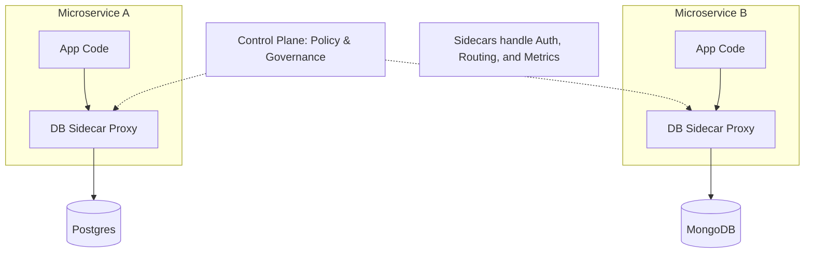

# 🕸️ Database Mesh Architecture: The Next Generation
> **Objective:** Master the concept of Database Mesh, an emerging pattern that brings Service Mesh principles (Sidecars, Proxies, Decentralization) to the database layer for microservices | **Language:** Hinglish | **Standard:** 2026 Expert Framework

---

## 🧭 1. Beginner-Friendly Hinglish Explanation
Database Mesh Architecture ka matlab hai "Database management ko microservices ke level par le jana".

- **The Problem:** Har microservice ka apna database hai. Par un sabka Access, Security, aur Monitoring alag-alag manage karna ek nightmare hai.
- **The Solution:** Database Mesh. 
  - Har app ke saath ek chota "Proxy" (Sidecar) hota hai.
  - Wo proxy handle karta hai: Kaunsa DB use karna hai? Encryption kaise hogi? Query limit kya hogi?
- **Intuition:** Ye ek "Smart Assistant" jaisa hai jo har developer ke paas hai. Developer ko sirf query likhni hai, assistant khud sahi database dhoond lega aur use secure tareeke se connect kar dega.

---

## 🧠 2. Deep Technical Explanation

### 1. The Core Components:
- **Database Sidecar:** A small process (e.g., **ProxySQL** or **PgBouncer**) running alongside the application.
- **Control Plane:** A central dashboard where you define policies (e.g., "Service A can only read from Database B").
- **Data Plane:** The actual flow of SQL queries through the sidecars.

### 2. Why use it?
- **Global Visibility:** See every query from every service in one place.
- **Dynamic Routing:** Automatically switch from a failing Master to a Slave without changing app code.
- **Zero-Trust Security:** Every connection is automatically encrypted (mTLS) by the mesh.

---

## 🏗️ 3. Database Diagrams (The Mesh Layout)


---

## 💻 4. Implementation Example (Policy Definition)
```yaml
# Pseudo-policy for a Database Mesh
kind: DatabasePolicy
metadata:
  name: limit-service-a
spec:
  source: Service_A
  target: Production_Postgres
  rules:
    - action: ALLOW
      query_types: [SELECT]
    - action: BLOCK
      query_types: [DROP, TRUNCATE]
    - rate_limit: 100_queries_per_second
```

---

## 🌍 5. Real-World Production Examples
- **Fintech (Robinhood):** Uses a mesh-like architecture to manage thousands of database connections across hundreds of Go/Python services, ensuring that no single service can overwhelm the database.
- **Netflix:** Uses advanced proxies to handle global traffic routing between Cassandra clusters in different AWS regions.

---

## ❌ 6. Failure Cases
- **Proxy Latency:** Adding a proxy adds 1-2ms to every query. If your app does 100 queries per page, that's $200ms$ delay. **Fix: Use high-performance proxies written in Rust or C++.**
- **Control Plane Outage:** If the central control plane dies, sidecars might not get new security updates. **Fix: Ensure the control plane is highly available and sidecars can work in 'Offline Mode'.**

---

## 🛠️ 7. Debugging Guide
| Problem | Reason | Solution |
| :--- | :--- | :--- |
| **"Query Timeout"** | Proxy is overloaded | Check the sidecar CPU/RAM and increase its connection limits. |
| **"Access Denied"** | Mesh Policy violation | Check the Control Plane logs to see which policy blocked the query. |

---

## ⚖️ 8. Tradeoffs
- **Unified Governance (Mesh)** vs **Operational Complexity (More moving parts).**

---

## ✅ 11. Best Practices
- **Use a Mesh for large microservices environments (50+ services).**
- **Keep the proxy as light as possible.**
- **Implement 'Observability'** from day one.
- **Gradually roll out policies** to avoid breaking apps.

漫
---

## 📝 14. Interview Questions
1. "What is a Database Mesh and how is it different from a standard DB Proxy?"
2. "How does a sidecar pattern help in database scaling?"
3. "Explain the role of the Control Plane in a Database Mesh."

---

## 🚀 15. Latest 2026 Production Database Patterns
- **eBPF-based Meshing:** Using Linux kernel technology (**eBPF**) to monitor and route database traffic without needing a sidecar proxy, reducing latency to near zero.
- **Self-Optimizing Mesh:** A mesh that detects a "Slow Query" and automatically suggests an index or rewrites the query using AI.
漫
