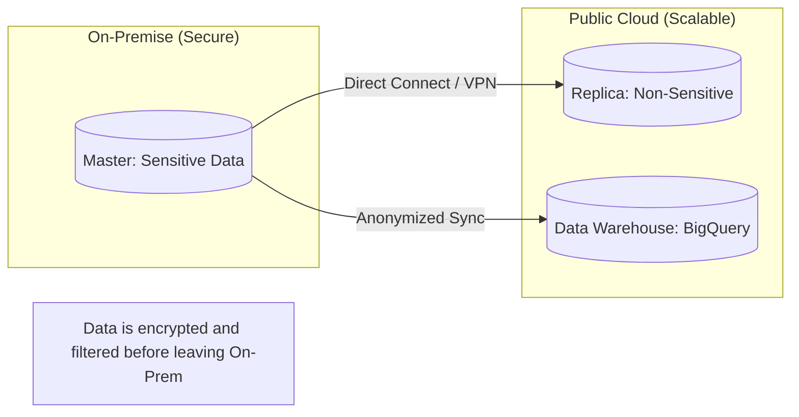

# ☁️ Hybrid Cloud Database Patterns: The Best of Both Worlds
> **Objective:** Master the architectural patterns for spanning databases across on-premise data centers and public clouds, focusing on data sovereignty, migration, and disaster recovery | **Language:** Hinglish | **Standard:** 2026 Expert Framework

---

## 🧭 1. Beginner-Friendly Hinglish Explanation
Hybrid Cloud Database Patterns ka matlab hai "Database ka aadha hissa apne office ke server (On-Prem) par aur aadha hissa Internet (Cloud) par rakhna".

- **The Problem:** Kuch companies (Banks/Healthcare) ko apna data cloud par rakhne ki permission nahi hoti, par wo cloud ki scalability use karna chahti hain.
- **The Solution:** Hybrid Cloud. 
  - Sensitive data "On-Premise" (Office) mein rakho.
  - Analytics aur Public facing data "Cloud" (AWS/Azure) par rakho.
- **Intuition:** Ye ek "Ghar ke locker" aur "Bank ke locker" jaisa hai. Roz ka paisa ghar par rakho, par badi saving bank mein.

---

## 🧠 2. Deep Technical Explanation

### 1. Pattern 1: Cloud Bursting
- **Concept:** Use your local database for normal traffic. When a massive sale (like Diwali sale) happens, the database automatically starts using cloud replicas to handle the extra load.

### 2. Pattern 2: Cloud Disaster Recovery (DR)
- **Concept:** Your main database is in your office. Every second, it syncs to a cloud database. If your office loses power, the cloud takes over.

### 3. Pattern 3: Edge-to-Cloud
- **Concept:** Collect data on "Edge" devices (like smart cameras). Process them locally, and then send only the important "Aggregated" data to the central Cloud Warehouse.

---

## 🏗️ 3. Database Diagrams (Hybrid Sync)


---

## 💻 4. Implementation Logic (Data Filtering)
```python
# Pseudo-code for Hybrid Sync
def sync_to_cloud(record):
    # 1. Anonymize sensitive fields
    record['user_name'] = "REDACTED"
    record['ssn'] = "REDACTED"
    
    # 2. Sync to Cloud Analytics
    cloud_db.insert(record)
    print("Sync Successful - Data Sovereignty Maintained")
```

---

## 🌍 5. Real-World Production Examples
- **European Banks:** Keep all personal details of EU citizens on-premise (GDPR) but use **AWS Redshift** for global market analysis by stripping out names.
- **Manufacturing:** IoT sensors on the factory floor store data in a local **InfluxDB**, which then pushes summary reports to a central **Snowflake** warehouse every hour.

---

## ❌ 6. Failure Cases
- **Latency over VPN:** The link between your office and the cloud is slow. A query that takes 1ms locally takes 100ms in the cloud. **Fix: Use AWS Direct Connect or Azure ExpressRoute for a dedicated physical fiber link.**
- **Sync Failure:** The internet goes down. Your cloud database is now 5 hours behind. **Fix: Implement a 'Queue-based Sync' (e.g., Kafka) that buffers data during outages.**

---

## 🛠️ 7. Debugging Guide
| Problem | Reason | Solution |
| :--- | :--- | :--- |
| **High Egress Costs** | Too much data being sent to cloud | Compress data or only send 'Summaries' instead of raw logs. |
| **Database connection drops** | Unstable VPN tunnel | Monitor the tunnel health and implement automatic reconnects. |

---

## ⚖️ 8. Tradeoffs
- **Hybrid (Safety / Flexibility)** vs **Pure Cloud (Lower Cost / Easier to Manage).**

---

## ✅ 11. Best Practices
- **Encrypt data in transit** using TLS/VPN.
- **Anonymize sensitive data** before it leaves the on-premise environment.
- **Use a dedicated network link** for database replication.
- **Implement a monitoring dashboard** that shows both On-Prem and Cloud health.

漫
---

## 📝 14. Interview Questions
1. "Why would a company choose a Hybrid Cloud database architecture?"
2. "What are the biggest challenges of syncing data between On-Prem and Cloud?"
3. "What is 'Data Egress' and how does it affect database cost?"

---

## 🚀 15. Latest 2026 Production Database Patterns
- **Cloud-Native Proxies:** Tools like **CockroachDB Dedicated** that allow you to pick exactly which country/region every specific row of data should live in (Localities).
- **Outposts/Stack:** Using **AWS Outposts** to bring actual AWS hardware into your own office so the "Cloud" and "On-Prem" are exactly the same environment.
漫
