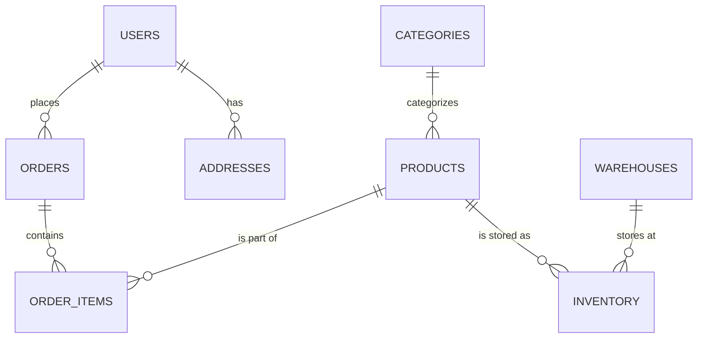

# 🛠️ Project 1: E-Commerce Schema Design
> **Objective:** Design and implement a production-grade relational schema for a modern e-commerce platform | **Difficulty:** Intermediate | **Target:** Database Architects

---

## 🎯 1. The Challenge
Aapko ek "Amazon-lite" platform ka database design karna hai. Isme thousands of products, millions of users, aur real-time orders honge.

### Requirements:
1. **User Management:** Login, addresses, aur roles.
2. **Product Catalog:** Categories, brands, price history, aur variants (size/color).
3. **Orders & Payments:** Order tracking, line items, aur transaction logs.
4. **Inventory:** Stock levels across multiple warehouses.

---

## 📐 2. The Architecture (ER Diagram)


---

## 💻 3. Implementation Steps

### Step 1: Core Tables
```sql
CREATE TABLE users (
    id UUID PRIMARY KEY DEFAULT gen_random_uuid(),
    email VARCHAR(255) UNIQUE NOT NULL,
    full_name VARCHAR(255),
    created_at TIMESTAMP DEFAULT NOW()
);

CREATE TABLE products (
    id UUID PRIMARY KEY DEFAULT gen_random_uuid(),
    name VARCHAR(255) NOT NULL,
    description TEXT,
    price DECIMAL(12, 2) NOT NULL,
    stock_quantity INT DEFAULT 0,
    category_id INT REFERENCES categories(id)
);
```

### Step 2: The Complex Part (Orders)
```sql
CREATE TABLE orders (
    id UUID PRIMARY KEY DEFAULT gen_random_uuid(),
    user_id UUID REFERENCES users(id),
    total_amount DECIMAL(12, 2),
    status VARCHAR(50) DEFAULT 'pending', -- pending, paid, shipped, delivered
    created_at TIMESTAMP DEFAULT NOW()
);

CREATE TABLE order_items (
    id SERIAL PRIMARY KEY,
    order_id UUID REFERENCES orders(id),
    product_id UUID REFERENCES products(id),
    quantity INT NOT NULL,
    unit_price DECIMAL(12, 2) NOT NULL
);
```

---

## ⚡ 4. Advanced Tasks (Level Up)
1. **Soft Deletes:** Add `is_active` or `deleted_at` to all tables.
2. **Indexing:** Add indexes for `orders(user_id)` and `products(category_id)`.
3. **Inventory Trigger:** Write a SQL Trigger that automatically reduces `stock_quantity` in the `products` table whenever a new `order_item` is inserted.

---

## ❌ 5. Testing the Design
- **Query 1:** Find all orders placed by user 'Sameer' in the last 30 days.
- **Query 2:** List the top 5 best-selling products by revenue.
- **Query 3:** Check which products are out of stock in 'Warehouse-1'.

---

## ✅ 6. Evaluation Criteria
- [ ] Is the schema in 3rd Normal Form (3NF)?
- [ ] Are Foreign Keys correctly defined for data integrity?
- [ ] Are the Data Types optimized for storage?
- [ ] Is the inventory logic sound?

漫
---

## 🚀 7. Bonus: 2026 Production Twist
"Add a **JSONB** column to the `products` table called `metadata` to store dynamic attributes like 'Screen Size' for electronics or 'Fabric' for clothes without changing the schema."
漫
