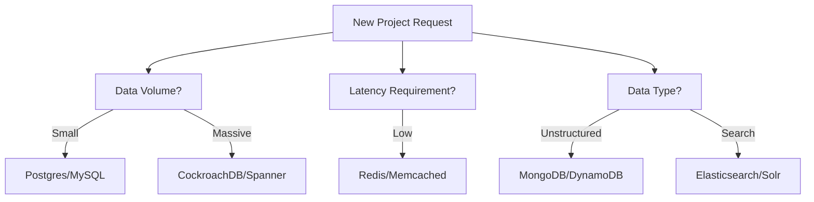

# 🏛️ DB Architect Role Prep: Leading the Data Strategy
> **Objective:** Prepare for senior-level Database Architect and Staff Engineer roles, focusing on high-level strategy, data governance, and cross-team collaboration | **Language:** Hinglish | **Standard:** 2026 Expert Framework

---

## 🧭 1. Beginner-Friendly Hinglish Explanation
DB Architect Role Prep ka matlab hai "Database ke sirf 'Query' likhne wala nahi, balki poori company ke 'Data Architecture' ka decision maker banana".

- **The Responsibility:** Ek architect ye decide karta hai ki "Kon sa DB use hoga?", "Data safe kaise rahega?", aur "5 saal baad data kitna badhega?".
- **The Core Focus:** 
  - **Scalability:** System ko 100x traffic ke liye taiyar karna.
  - **Governance:** Privacy aur Compliance (GDPR) handle karna.
  - **Cost:** Cloud bills ko control mein rakhna.
- **Intuition:** Ye "City Planner" jaisa hai. Engineer ek building (Table) banata hai, Architect poori city ka roadmap (Data Strategy) banata hai.

---

## 🧠 2. Deep Technical Explanation

### 1. The Multi-Model Strategy:
A modern architect doesn't just use Postgres for everything. 
- **Relational:** For Finance/Orders.
- **NoSQL:** For Product Catalog/User Metadata.
- **Graph:** For Social relationships/Fraud detection.
- **Vector:** For AI/Search.

### 2. Data Sovereignty and Compliance:
Designing for global operations.
- How to store India's data in Mumbai and USA's data in Virginia?
- Implementing **Data Masking** and **Tokenization** for security.

---

## 🏗️ 3. Diagram (The Architect's Decision Matrix)

---

## 💻 4. Strategic Discussion: The Migration Plan
**Scenario:** "We are moving from a monolithic MySQL database to a microservices architecture. How do we split the database?"
- **The Architect's Answer:** 
  1. **Identify Bounded Contexts:** Group tables by business domain (e.g., Users, Payments).
  2. **API First:** Create APIs for data access so services don't touch each other's DBs.
  3. **Strangler Pattern:** Move one domain at a time. Use **CDC (Change Data Capture)** to keep the old and new DBs in sync during the transition.

---

## 🌍 5. Real-World Production Examples
- **Stripe:** Architects decided to build a custom distributed database layer on top of Postgres to handle global financial consistency.
- **LinkedIn:** Created **Databus** (an open-source CDC tool) because their architects realized that standard replication wasn't enough for their scale.

---

## ❌ 6. Failure Cases
- **Over-Engineering:** Choosing a distributed database like Spanner for a small blog site. **Result:** Massive cost and complexity for no reason.
- **Data Silos:** Every team chooses a different DB. **Result:** Data can't be joined for company-wide analytics. **Fix: Create a 'Unified Data Lake' strategy.**

---

## 🛠️ 7. The Architect's Toolkit
| Tool Category | Standard Tools |
| :--- | :--- |
| **Monitoring** | Prometheus, Grafana, Datadog |
| **IaC** | Terraform, Ansible, Pulumi |
| **Governance** | Apache Atlas, Collibra |
| **Modeling** | dbdiagram.io, Lucidchart |

---

## ⚖️ 8. Tradeoffs
- **Innovation (New DB technologies)** vs **Stability (Proven old technologies).**
- **Consistency (ACID)** vs **Scale (BASE).**

---

## ✅ 11. Best Practices
- **Document your 'ADRs' (Architecture Decision Records).**
- **Focus on 'Cost-to-Serve'.**
- **Always have a 'Rollback' strategy.**
- **Mentor junior engineers** on database best practices.

漫
---

## 📝 14. Interview Questions
1. "How do you decide when to move from a Monolith DB to Microservices?"
2. "What is your strategy for handling PII data in a cloud environment?"
3. "How do you handle technical debt in a legacy database?"

---

## 🚀 15. Latest 2026 Production Database Patterns
- **Database-as-a-Service (DBaaS) Governance:** Using automated policies to ensure that any developer-created database is automatically encrypted and backed up.
- **AI Infrastructure Planning:** Using AI to simulate database load for the next 3 years and suggesting hardware upgrades before they are needed.
漫
