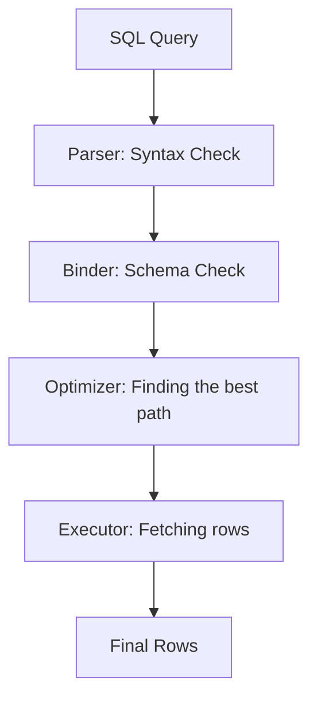

# 💻 Live SQL Coding Challenges: Zero to Hero
> **Objective:** Practice solving high-pressure SQL coding challenges often asked in interviews for Senior Backend and Data Engineering roles | **Language:** Hinglish | **Standard:** 2026 Expert Framework

---

## 🧭 1. Beginner-Friendly Hinglish Explanation
Live SQL Coding Challenges ka matlab hai "Computer par live SQL queries likhkar complex problems solve karna".

- **The Problem:** Interviewer aapko ek schema dega aur kahega "Humein wo users chahiye jinhone pichle mahine mein 3 baar order kiya par aaj tak koi review nahi diya".
- **The Solution:** Concepts like **Joins**, **Window Functions**, aur **CTEs** ko mix karke query banana.
- **Intuition:** Ye "Maths Problem" jaisa hai. Aapko pata hona chahiye ki kab `GROUP BY` use karna hai aur kab `PARTITION BY`.

---

## 🧠 2. Deep Technical Explanation

### Challenge 1: The "Churn" Analysis
**Task:** Find users who were active in January 2026 but did NOT perform any action in February 2026.
```sql
-- Using EXCEPT or NOT EXISTS
SELECT user_id FROM activities WHERE month = '2026-01'
EXCEPT
SELECT user_id FROM activities WHERE month = '2026-02';
```

### Challenge 2: The "Running Total" (Window Function)
**Task:** Calculate the daily cumulative revenue for a store.
```sql
SELECT 
    date, 
    amount, 
    SUM(amount) OVER (ORDER BY date) as running_total
FROM sales;
```

### Challenge 3: The "Second Highest" Problem
**Task:** Find the second highest salary in a department without using `OFFSET`.
```sql
SELECT MAX(salary) 
FROM employees 
WHERE salary < (SELECT MAX(salary) FROM employees);
```

---

## 🏗️ 3. Diagram (SQL Execution Logic)


---

## 💻 4. Advanced Challenge: The "Gap and Island"
**Task:** Identify consecutive days where a user logged in.
```sql
WITH Grps AS (
  SELECT 
    user_id, 
    login_date,
    login_date - (ROW_NUMBER() OVER (PARTITION BY user_id ORDER BY login_date) * INTERVAL '1 day') as grp
  FROM logins
)
SELECT user_id, MIN(login_date), MAX(login_date), COUNT(*) 
FROM Grps
GROUP BY user_id, grp
HAVING COUNT(*) >= 3;
```

---

## 🌍 5. Real-World Production Examples
- **Fraud Detection:** Using SQL to find accounts that have made 5+ transactions from different IPs in under 10 minutes.
- **Recommendation Engines:** Using SQL to find "Users who bought X also bought Y" using self-joins.

---

## ❌ 6. Failure Cases
- **Non-SARGable Queries:** Using `WHERE YEAR(date) = 2026`. This prevents index usage. **Fix: Use `WHERE date >= '2026-01-01' AND date < '2027-01-01'`.**
- **N+1 in SQL:** Joining a massive table without a limit or filter, causing the database to run out of memory.

---

## 🛠️ 7. Debugging Guide
| Problem | Reason | Solution |
| :--- | :--- | :--- |
| **Query is taking too long** | No Index / Full Table Scan | Run `EXPLAIN ANALYZE` and look for 'Seq Scan'. |
| **Wrong results with NULLs** | `COUNT(*)` vs `COUNT(col)` | Remember that `COUNT(col)` ignores NULLs, `COUNT(*)` doesn't. |

---

## ⚖️ 8. Tradeoffs
- **Complex SQL (Fast / Single Trip)** vs **Application Logic (Easy to test / Multiple DB trips).**

---

## ✅ 11. Best Practices
- **Format your SQL.** Use uppercase for keywords.
- **Use CTEs (`WITH` clauses)** for readability.
- **Test with NULL values.** They are the biggest source of bugs.
- **Understand 'Join Types' (Inner vs Left vs Outer) perfectly.**

漫
---

## 📝 14. Practice Questions
1. "How do you find duplicate rows in a table?"
2. "Explain the difference between `RANK()` and `DENSE_RANK()`."
3. "What is a Correlated Subquery?"

---

## 🚀 15. Latest 2026 Production Database Patterns
- **SQL Generative AI:** Using AI assistants to convert natural language ("Show me users who spent $100 last week") into perfect SQL.
- **Vector Search in SQL:** Using standard SQL to perform similarity searches on AI embeddings (e.g., `ORDER BY vector <=> '[...]'`).
漫
