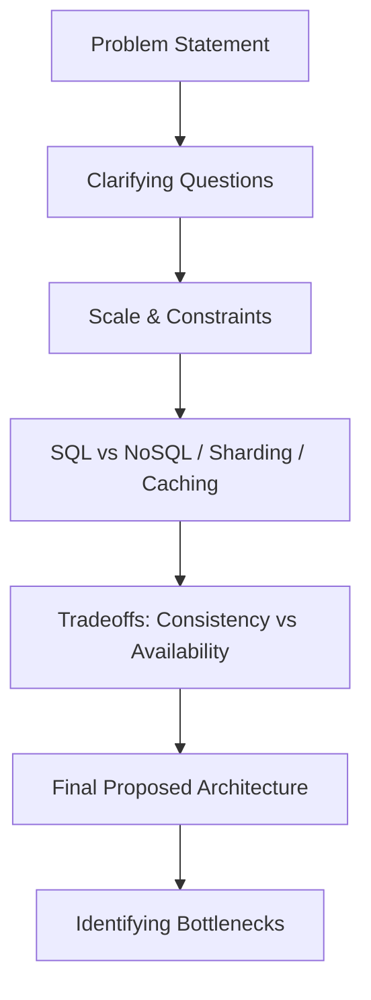

# 🎤 Mock Interview Scenarios: The Reality Check
> **Objective:** Practice solving complex, real-world database engineering problems in an interview setting, focusing on system tradeoffs, scalability, and recovery | **Language:** Hinglish | **Standard:** 2026 Expert Framework

---

## 🧭 1. Beginner-Friendly Hinglish Explanation
Mock Interview Scenarios ka matlab hai "Interviewer ke mushkil sawalon ka live solution dena".

- **The Goal:** Sirf definitions yaad karna kaafi nahi hai. Interviewer aapko ek "Situation" dega (e.g., "Site crash ho rahi hai, kya karoge?").
- **How to handle?** 
  - Pehle "Clarifying Questions" pucho (Traffic kitna hai? Data kaisa hai?).
  - Phir "Tradeoffs" discuss karo (SQL vs NoSQL).
  - Aur end mein "Final Architecture" draw karo.
- **Intuition:** Ye ek "Doctor" jaisa hai jo patient ke symptoms dekhkar bimari dhoondta hai aur ilaaj batata hai.

---

## 🧠 2. Deep Technical Explanation

### Scenario 1: The E-commerce Flash Sale
**Problem:** "Aapki site par 1 minute mein 1 Million log aane wale hain iPhone sale ke liye. Database handles only 10,000 writes/sec. How do you scale?"
- **The SRE Approach:** 
  - Use **Redis** for inventory counting (In-memory is faster).
  - Use **Message Queues (Kafka)** to buffer the orders. Don't write directly to the DB.
  - Implement **Database Sharding** by `user_id`.

### Scenario 2: The Data Loss Nightmare
**Problem:** "Ek intern ne galti se `DROP TABLE orders` production mein chala diya. Backups are 12 hours old. How do you recover the most recent data?"
- **The Internals Approach:** 
  - Check **WAL (Write Ahead Logs)**. Even if the table is gone, the logs might still have the transactions.
  - Perform **Point-in-Time Recovery (PITR)** using the last backup + archived logs.

---

## 🏗️ 3. Diagram (Interview Problem-Solving Flow)


---

## 💻 4. Live Coding: SQL Scenario
**Task:** "Find the top 3 users who spent the most money in the last 30 days, but only if they have made at least 5 orders."
```sql
SELECT 
    user_id, 
    SUM(amount) as total_spent, 
    COUNT(order_id) as order_count
FROM orders
WHERE order_date >= CURRENT_DATE - INTERVAL '30 days'
GROUP BY user_id
HAVING COUNT(order_id) >= 5
ORDER BY total_spent DESC
LIMIT 3;
```

---

## 🌍 5. Real-World Failure Cases (Interview Gold)
- **The "Deadlock" Story:** "Once in my project, two services were updating the same row in different orders. We solved it by sorting the IDs before updating."
- **The "Unindexed Search":** "We had a query taking 10s. Adding a composite index on `(user_id, status)` brought it down to 5ms."

---

## ❌ 6. Mistakes to Avoid in Interviews
- **Jumping to Sharding too fast:** Sharding is complex. Always suggest **Vertical Scaling** or **Read Replicas** first.
- **Ignoring Consistency:** For a bank app, you can't say "Eventual Consistency". You must use **ACID Transactions**.

---

## 🛠️ 7. Debugging Checklist (The "Live" Part)
| Symptom | Your Response |
| :--- | :--- |
| **High CPU** | Check for missing indexes or heavy aggregation queries. |
| **Connection Timeout** | Check connection pool size or network latency between App and DB. |

---

## ⚖️ 8. Tradeoffs
- **Consistency (Strong)** vs **Performance (High).**
- **Normalized (Clean)** vs **Denormalized (Fast).**

---

## ✅ 11. Best Practices
- **Think Out Loud.** The interviewer wants to see your "Thought Process".
- **Ask about 'Write vs Read' ratio.**
- **Mention Monitoring** (Prometheus/Grafana).
- **Be honest** about what you don't know.

漫
---

## 📝 14. Practice Questions
1. "How would you design a database for a real-time Chat app like WhatsApp?"
2. "How do you handle schema changes in a table with 500 Million rows?"
3. "SQL vs NoSQL: When to choose what?"

---

## 🚀 15. Latest 2026 Production Database Patterns
- **AI-Augmented DBE:** Using AI to generate optimal indexes and query rewrites during the interview.
- **Global Data Planes:** Designing for multi-region active-active clusters in high-stakes system design interviews.
漫
