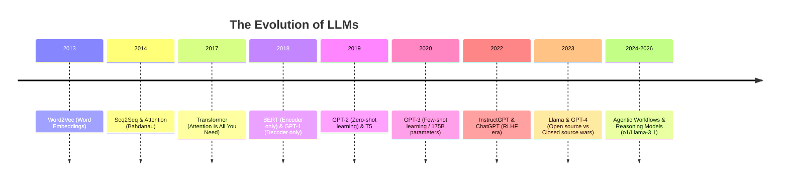

# LLMs ka Itihaas (History of Large Language Models)

## 1. Beginner-friendly Hinglish Explanation 🇮🇳
Bhai, LLMs raato-raat nahi aaye. Iski ek lambi kahani hai. 

Pehle hote the **RNNs** (Recurrent Neural Networks) jo ek-ek karke words padhte the aur purane words bhool jaate the. Phir aaya **Attention** ka concept 2014-15 mein, jisne models ko sikhaaya ki "poore sentence mein kahan focus karna hai". 

Lekin asli revolution aaya 2017 mein jab Google ne **"Attention Is All You Need"** paper release kiya aur **Transformers** ka janam hua. Uske baad GPT-1, GPT-2, GPT-3 aur ab GPT-4/Llama-3 ne duniya badal di. Yeh bilkul waise hi hai jaise pehle hum chithiyaan bhejte the, phir phone aaya aur ab seedha video call!

---

## 2. Deep Technical Explanation
LLMs ke evolution ko chaar major eras mein baat sakte hain:
1.  **Pre-RNN Era**: N-grams aur Statistical Language Models (SLMs).
2.  **The Sequential Era**: RNNs, LSTMs, aur GRUs. Yeh models data ko sequentially process karte the, jiski wajah se "Vanishing Gradient" problem aati thi aur training slow hoti thi.
3.  **The Attention Revolution (2014-2017)**: Seq2Seq models mein Bahdanau Attention ka introduction. Isne models ko input sequence ke saare parts ko ek saath dekhne ki ability di.
4.  **The Transformer Era (2017-Present)**: Recurrence ko hata kar Multi-Head Self-Attention ko laana. Isne GPUs par massive parallelization ko possible banaya.

---

## 3. Mathematical Intuition
Core shift yeh tha ki $O(N)$ sequential processing se $O(N^2)$ parallel processing (attention ke terms mein) par aana.

LSTMs mein, state $h_t$ $h_{t-1}$ par depend karti thi:
$$h_t = f(x_t, h_{t-1})$$

Transformers mein, har token $x_i$ ek single operation mein har doosre token $x_j$ par attend karta hai:
$$\text{Output}_i = \sum_{j=1}^n \alpha_{ij} V_j$$
jahan $\alpha_{ij}$ token $i$ aur $j$ ke beech ka attention score hai.

---

## 4. Architecture Diagrams


---

## 5. Production-ready Examples
Historical context usually "code" nahi hota, lekin "Legacy" models vs Modern models ke use ko samajhna sabse zaroori hai. 
Example purane BERT model vs modern Causal LLM ke use ka:

```python
# Legacy: BERT for Classification (Encoder)
from transformers import pipeline
classifier = pipeline("sentiment-analysis", model="bert-base-uncased")
print(classifier("This history is amazing!"))

# Modern: Llama-3 for Reasoning (Decoder)
# (Dekho What_are_LLMs.md for implementation)
```

---

## 6. Real-world Use Cases
- **Legacy NLP**: LSTMs ka use karke Named Entity Recognition (NER).
- **Modern NLP**: Zero-shot translation, creative reasoning, aur complex coding.
- **Scientific Research**: Future bottlenecks predict karne ke liye AI ki trajectory ko samajhna.

---

## 7. Failure Cases
- **Long-term Dependency (RNNs)**: LSTMs ko abhi bhi bahut lambi sequences (>500 tokens) handle karne mein problem hoti thi.
- **Compute Bottlenecks**: Transformers ko specialized hardware (GPUs/TPUs) ki zaroorat thi jo pehle easily accessible nahi the.
- **Scaling Laws**: Pehle log sochte the ki bada hamesha accha hota hai, lekin baad mein pata chala ki data quality zyada matter karti hai.

---

## 8. Debugging Guide
History padhte waqt, papers mein "Ablation Studies" dhyan se dekho.
1. **RNNs kyun hataye?** Kyunki yeh parallelize nahi kar sakte.
2. **Positional Encoding kyun add karein?** Kyunki Attention permutation-invariant hai (isse word order ka pata nahi hota).
3. **LayerNorm kyun?** Deep networks mein training ko stabilize karne ke liye.

---

## 9. Tradeoffs (Fayde aur Nuksaan)
| Model Type | Parallelization | Long-range Dependencies | Compute Efficiency |
|------------|-----------------|-------------------------|-------------------|
| RNN/LSTM   | No (Sequential) | Poor                    | High (Low VRAM)   |
| Transformer| Yes             | Excellent               | Medium (High VRAM)|
| SSM (Mamba)| Yes             | Good                    | Very High         |

---

## 10. Security Concerns (Suraksha Chintaein)
- **Historical Bias**: Early models (jaise BERT) aise datasets par train kiye gaye jinmein significant gender aur racial biases the.
- **Lack of Guardrails**: Early GPT models bina kisi hesitation ke toxic content generate kar dete the (Pre-RLHF era).

---

## 11. Scaling Challenges (Bada Banane ki Chunautiyaan)
- **The Chinchilla Scaling Law**: Research ne dikhaya ki zyadaatar models apne size ke hisaab se actually "under-trained" the.
- **Communication Overhead**: Haatho'n GPU tak scale karne ke liye specialized interconnects jaise NVLink ki zaroorat hoti hai.

---

## 12. Cost Considerations (Kharcha)
- **Training Cost Evolution**: GPT-3 ko train karne ka kharcha ~$4.6M tha. Modern frontier models ka kharcha $100M+ hai.
- **Inference Cost**: Tiktoken (OAI) aur Llama tokenizer jaise tokenizers affect karte hain ki aapko har "word" ke liye kitna pay karna padta hai.

---

## 13. Best Practices (Acchi Practices)
- **Stay Updated**: "Attention Is All You Need" paper ko kam se kam 3 baar padho.
- **Understand Fundamentals**: Sirf APIs mat seekho; yeh samjho ki hum *kyun* Encoders se Decoders par gaye.
- **Benchmark History**: Apne modern RAG system ko ek simple BERT baseline se compare karo yeh dekhne ke liye ki complexity worth it hai ya nahi.

---

## 14. Interview Questions (Interview Mein Puche Jane Wale Sawal)
1. RNNs mein "Vanishing Gradient" problem kya thi?
2. Transformer sequential processing bottleneck ko kaise solve karta hai?
3. Architecture aur training ke terms mein BERT aur GPT mein kya difference hai?
4. Translation ke context mein "Attention" mechanism ka kya significance hai?

---

## 15. Latest 2026 LLM Engineering Patterns (2026 ke Naye Patterns)
- **Post-Transformer Architectures**: Hybrid models jo Transformers ko Mamba (SSMs) ke saath combine karte hain infinite context ke liye.
- **Mixture of Depths**: Compute save karne ke liye specific query ke liye dynamically decide karna ki kitni layers use karni hain.
- **Data-Centric History**: Yeh recognize karna ki LLMs ka "History" asal mein high-quality data curation ka history hai.