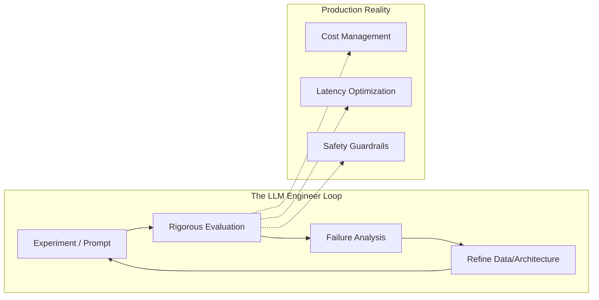

# LLM Engineering Mindset

## 1. Beginner-friendly Hinglish Explanation 🇮🇳
Bhai, LLM Engineer banna sirf prompt likhna nahi hai. Prompt engineering toh bas shuruat hai. Asli khel tab shuru hota hai jab tum yeh samajhte ho ki ek LLM production mein kaise behave karega.

Ek "Software Engineer" code likhta hai jo deterministic hota hai (input A + B = output C). Par ek "LLM Engineer" ek aise system ke saath kaam karta hai jo probabilistic hai. Yahan "C" hamesha same nahi hoga. Isliye tumhe **Scaling, Reliability, aur Evaluation** ka dimaag rakhna padega. Research papers padhna aur unhe code mein convert karna hi asli "Engineering Mindset" hai.

---

## 2. Gehri Technical Vyakhya
Ek standard Software Engineer se LLM Engineer mein transition karna ek paradigm shift maangta hai:
- **Deterministic vs. Probabilistic**: Guardrails aur robust evaluation ke through non-deterministic outputs ko handle karna.
- **Latency-Critical vs. Throughput-Critical**: Time-to-first-token (TTFT) ko overall tokens-per-second (TPS) ke saath balance karna.
- **Data Engineering as Core**: High-quality data curation hi fine-tuning ya RAG mein 80% kaam hota hai.
- **Hardware Awareness**: VRAM constraints, Quantization, aur GPU utilization ko samajhna.

---

## 3. Ganiteeya Samajh (Mathematical Intuition)
LLMs ke liye engineering mein **Compute-Optimal Frontier** ko optimize karna shamil hai.

Chinchilla Scaling Laws ke anusaar, model size $N$ aur data size $D$ ke beech yeh sambandh hai:
$$C \approx 6ND$$
jahan $C$ total compute hai. Ek LLM Engineer samajhta hai ki $D$ badhaye bina $N$ badhane se diminishing returns milte hain. Aapko **Token Efficiency** ke terms mein sochna hoga.

---

## 4. Architecture Diagrams


---

## 5. Production-ready Examples
Code mein "Mindset" build karna matlab hai **Observability** ko day one se implement karna.

```python
import time
from loguru import logger

def production_llm_call(prompt):
    start_time = time.time()
    try:
        # Simulate LLM Call
        response = "The result" 
        tokens_generated = 100
        
        latency = time.time() - start_time
        tps = tokens_generated / latency
        
        # Log metadata for evaluation later
        logger.info({
            "event": "llm_inference",
            "latency": latency,
            "tps": tps,
            "tokens": tokens_generated,
            "status": "success"
        })
        return response
    except Exception as e:
        logger.error(f"LLM Failed: {e}")
        return None
```

---

## 6. Vastavik Use Cases
- **A/B Testing Prompts**: Sirf "try karna" nahi, balki prompt versions pe statistical significance tests run karna.
- **Red Teaming**: Security mechanism mein weaknesses dhundhne ke liye apne model ko actively break karna.
- **Synthetic Data Generation**: Ek bade model ka upyog karke chhote, tez model ke liye training data banana.

---

## 7. Asafalta ke Mamle (Failure Cases)
- **Over-Optimization**: Prompt ko itna complex banana ki agle model update par woh hookh ho jaaye (Fragility).
- **Cost Ignore Karna**: Aisa system banana jo kaam karta hai lekin $10 per query kharch hota hai.
- **Evaluation Nahi Karna**: Automated benchmarks ki jagah "vibe check" (manual testing) par rely karna.

---

## 8. Debugging Margdarshika
1. **Traceability**: Agent ke har step ko trace karne ke liye LangSmith ya Arize Phoenix jaise tools ka upyog karein.
2. **Input Sensitivity**: Check karein ki system prompt mein ek shabd badalne se output dramatically change hota hai ya nahi.
3. **Logit Lens**: Agar model kisi loop mein phas gaya hai toh internal layer activations dekhein.

---

## 9. Vyapar (Tradeoffs)
| Factor | Fast Iteration (Prompts) | Long-term Stability (Fine-tuning) |
|--------|--------------------------|-----------------------------------|
| Speed (Gati)  | Minutes                  | Days/Weeks                        |
| Cost (Kharche)   | Low                      | High (Compute)                    |
| Control (Niyantran)| Limited                  | Extensive                         |
| Expertise (Kushalta) | Low                    | High                              |

---

## 10. Suraksha Sambandhit Chintayein
- **System Prompt Leakage**: Users ka "apne instructions repeat karo" poochna.
- **Prompt Injection**: User-uploaded documents mein malicious commands chhupa dena.
- **PII Leakage**: Galti se user ke private data ko 3rd party LLM provider ko bhej dena.

---

## 11. Scaling ki Chunautiyan
- **Cold Starts**: Bade models ko VRAM mein load karne mein time lagta hai.
- **GPU Orchestration**: Distributed training ke liye H100s ke clusters ka prabandhan karna.
- **Data Quality at Scale**: Pre-training ke liye trillions of tokens ko filter karna.

---

## 12. Cost Vikalpe (Cost Considerations)
- **Build vs Buy**: Kab OpenAI use karein aur kab apna Llama-3 host karein.
- **Token Compression**: Paisa bachane ke liye input tokens kam karne wali techniques ka upyog karna.
- **Cache Hit Rate**: Baar-baar mahngi calls se bachne ke liye semantic caching implement karna.

---

## 13. Best Practices (Shreshth Abhyas)
- **Version Everything**: Prompts, datasets, aur model weights.
- **Automated Evals**: 100+ test cases ka suite chalaye bina kabhi bhi change ship na karein.
- **Modular Design**: "Retrieval" ko "Generation" se alag rakhein taaki aap unhe independently upgrade kar sakein.

---

## 14. Interview Prashna
1. Aap production system mein non-deterministic outputs kaise handle karte hain?
2. LLM inference mein Latency aur Throughput ke beech antar samjhaayein.
3. Aap RAG-based chatbot ke liye evaluation framework kaise design karenge?
4. Scaling laws kya hain, aur engineering ke liye yeh kyun mahatvpurn hain?

---

## 15. 2026 ke LLM Engineering Patterns
- **LLM-as-a-Judge**: Frontier models ka upyog karke chhote models ko automatically evaluate karna.
- **Test-Time Compute**: Model ko mushkil sawaalon ke liye zyada "sochne" dena (inference par compute ko scale karna).
- **Agentic Iteration**: "Single Prompt" se "Iterative Loops" ki aur badhna jahan model apne hi kaam ki samiksha karta hai.