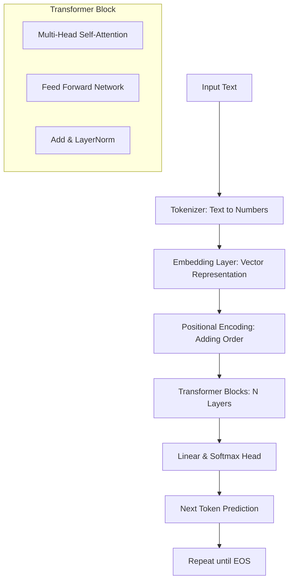

# Large Language Models (LLMs) Kya Hain?

## 1. Shuruaati Hinglish Explanation 🇮🇳
Bhai, simple words mein bataun toh LLM ek aisa "Smart Auto-complete" system hai jo internet ki saari books, articles aur code ko padh kar train hua hai. 

Socho ek aisa dimaag jisne duniya ka sara text padh liya hai. Jab tum use kuch poochte ho, toh woh bas yeh predict karta hai ki "agla word kya hona chahiye?" par woh itna smart hai ki woh agla word predict karte-karte tumhare liye poora essay likh deta hai, code generate kar deta hai aur complex problems solve kar deta hai. 

Yeh koi magic nahi hai, bas bohot saara data aur bohot saari mathematics ka khel hai. Isse hum "Generative AI" isliye kehte hain kyunki yeh naya content generate karta hai.

---

## 2. Gehra Technical Explanation
LLMs deep learning models hain jo **Transformer architecture** par based hote hain, jo specifically sequential data ko long-range dependencies ke saath handle karne ke liye design kiye gaye hain.

Key technical components:
- **Neural Network Type**: Usually Decoder-only (like GPT) ya Encoder-Decoder (like T5) hota hai.
- **Parameter Scale**: 1B (Small Language Models) se lekar 1.8T+ (like GPT-4) tak hota hai.
- **Training Objective**: Usually **Next Token Prediction** (Causal Language Modeling) hota hai jahan model token $t_i$ predict karta hai sequence $t_{1...i-1}$ ko dekhkar.
- **Weights & Biases**: Ye model ke "knowledge" ko represent karte hain jo billions of floating-point numbers mein store hota hai.

---

## 3. Ganitiya Intuition
Mathematically, ek LLM sequence of tokens ke upar probability distribution seekhta hai.

Agar humare paas sequence $S = (w_1, w_2, ..., w_n)$ hai, toh model likelihood ko maximize karne ki koshish karta hai:
$$P(S) = \prod_{i=1}^n P(w_i | w_1, ..., w_{i-1}; \theta)$$

Jahan $\theta$ model parameters ko represent karta hai. 
Transformer ka core **Self-Attention** use karta hai:
$$\text{Attention}(Q, K, V) = \text{softmax}\left(\frac{QK^T}{\sqrt{d_k}}\right)V$$
Yeh model ko allow karta hai ki sentence mein different words ki importance ko weigh kar sake, chahe unki distance kuch bhi ho.

---

## 4. Architecture Diagrams


---

## 5. Production-ready Udaaharan
`transformers` library ka use karke model ko production mein load karna (optimally):

```python
import torch
from transformers import AutoModelForCausalLM, AutoTokenizer

model_id = "meta-llama/Llama-3-8B-Instruct"

# Production settings: FP16/BF16, device_map="auto"
tokenizer = AutoTokenizer.from_pretrained(model_id)
model = AutoModelForCausalLM.from_pretrained(
    model_id,
    torch_dtype=torch.bfloat16,
    device_map="auto",
    attn_implementation="flash_attention_2" # 2026 standard for speed
)

def generate_response(prompt):
    inputs = tokenizer(prompt, return_tensors="pt").to(model.device)
    with torch.no_grad():
        output = model.generate(
            **inputs, 
            max_new_tokens=512, 
            temperature=0.7,
            do_sample=True
        )
    return tokenizer.decode(output[0], skip_special_tokens=True)

print(generate_response("Explain quantum computing in one sentence."))
```

---

## 6. Real-world Use Cases
- **Content Generation**: Blogs, Emails, Creative writing.
- **Coding Assistants**: GitHub Copilot, Cursor (Writing/Refactoring code).
- **Customer Support**: AI Agents complex queries handle karte hain.
- **Knowledge Synthesis**: Research papers ya legal documents ko summarize karna.
- **Function Calling**: LLMs software tools ke brain ki tarah act karte hain (Agents).

---

## 7. Viphata Ke Mamle
- **Hallucinations**: Model confidently false facts batata hai (e.g., "The capital of Mars is Elon Musk City").
- **Catastrophic Forgetting**: Fine-tuning ke dauran, previous knowledge kho dena.
- **Context Window Overflow**: Lambi conversation ka beginning bhool jana.
- **Data Leakage**: Training data mein PII ya private code hona.

---

## 8. Debugging Guide
1. **Check Tokens**: Tokenizer visualizer ka use karke dekho ki words weirdly split toh nahi ho rahe.
2. **Log Logits**: Agar output repetitive hai, toh probability distribution check karo.
3. **Temperature Tuning**: High temperature = creative par random; Low temperature = factual par boring.
4. **Inspect Attention Maps**: Dekho ki jab model galati karta hai toh woh kya "dekh raha hai".

---

## 9. Tradeoffs
| Feature | Small Model (e.g., 1B) | Large Model (e.g., 70B+) |
|---------|-------------------------|--------------------------|
| Latency | Bahut Kam (Real-time)  | Zyada                    |
| Reasoning| Basic                  | Complex / Nuanced        |
| Cost    | Sasta (Local run)       | Mahanga (GPU cluster)    |
| Accuracy| Kam                     | Zyada                    |

---

## 10. Security Concerns
- **Prompt Injection**: User system instructions ko bypass kar deta hai (e.g., "Ignore all previous instructions...").
- **Insecure Output**: Model malicious shell commands generate karta hai.
- **Model Inversion**: Attacker training data nikalne ki koshish karta hai.

---

## 11. Scaling Challenges
- **VRAM Requirements**: Ek 70B model ko load karne ke liye ~140GB VRAM chahiye FP16 mein.
- **Throughput vs Latency**: Bina huge GPU clusters ke bahut saare users ko ek saath serve karna mushkil hai.
- **Context Length Scaling**: Attention ke liye long contexts mein $O(n^2)$ memory growth.

---

## 12. Cost Considerations
- **API Costs**: Token-based pricing (Input vs Output).
- **Hosting Costs**: H100/A100 instances $2-4/hr per GPU hote hain.
- **Optimization**: Quantization (4-bit/8-bit) costs ko 2-4x tak reduce kar sakta hai.

---

## 13. Best Practices
- **Use System Prompts**: Model ke persona ko clearly define karo.
- **Few-shot Prompting**: Accuracy improve karne ke liye examples do.
- **RAG over Long Context**: Poori library prompt mein mat daalo; sirf wahi retrieve karo jo zaroori hai.
- **Evaluate with LLM-as-a-judge**: Llama-3 outputs ko grade karne ke liye GPT-4o ka use karo.

---

## 14. Interview Questions
1. Tokenizer aur Embedding mein kya antar hai?
2. Attention formula mein $QK^T$ ko $\sqrt{d_k}$ se kyun divide karte hain?
3. Flash Attention transformer block ko kaise optimize karta hai?
4. "Next Token Prediction" objective ko explain karo.

---

## 15. 2026 ke Latest LLM Engineering Patterns
- **Active Reasoning (o1-style)**: Models jo "sochte" hain aur jawab dene se pehle hidden Chain-of-Thought use karte hain.
- **Speculative Decoding**: Chhote model ka use tokens predict karne ke liye aur bade model ka unhe verify karne ke liye.
- **In-Context Learning (ICL)**: Weight updates ki jagah pure context ke through models ko tune karna.
- **Direct Preference Optimization (DPO)**: Complex RLHF ko simpler alignment techniques se replace karna.