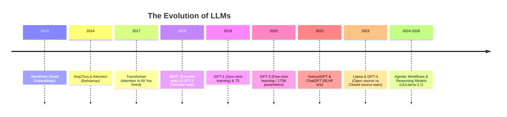

# History of Large Language Models (LLMs)

## 1. Beginner-friendly Hinglish Explanation 🇮🇳
Bhai, LLMs raato-raat nahi aaye. Iski ek lambi kahani hai. 

Pehle hote the **RNNs** (Recurrent Neural Networks) jo ek-ek karke words padhte the aur purane words bhool jaate the. Phir aaya **Attention** ka concept 2014-15 mein, jisne models ko sikhaaya ki "poore sentence mein kahan focus karna hai". 

Lekin asli revolution aaya 2017 mein jab Google ne **"Attention Is All You Need"** paper release kiya aur **Transformers** ka janam hua. Uske baad GPT-1, GPT-2, GPT-3 aur ab GPT-4/Llama-3 ne duniya badal di. Yeh bilkul waise hi hai jaise pehle hum chithiyaan bhejte the, phir phone aaya aur ab seedha video call!

---

## 2. Deep Technical Explanation
The evolution of LLMs can be categorized into four major eras:
1.  **Pre-RNN Era**: N-grams and Statistical Language Models (SLMs).
2.  **The Sequential Era**: RNNs, LSTMs, and GRUs. These models processed data sequentially, leading to the "Vanishing Gradient" problem and slow training.
3.  **The Attention Revolution (2014-2017)**: Introduction of Bahdanau Attention in Seq2Seq models. This allowed models to look at all parts of the input sequence simultaneously.
4.  **The Transformer Era (2017-Present)**: Removal of recurrence entirely in favor of Multi-Head Self-Attention. This allowed for massive parallelization on GPUs.

---

## 3. Mathematical Intuition
The core shift was from $O(N)$ sequential processing to $O(N^2)$ parallel processing (in terms of attention).

In LSTMs, the state $h_t$ depended on $h_{t-1}$:
$$h_t = f(x_t, h_{t-1})$$

In Transformers, every token $x_i$ attends to every other token $x_j$ in a single operation:
$$\text{Output}_i = \sum_{j=1}^n \alpha_{ij} V_j$$
where $\alpha_{ij}$ is the attention score between token $i$ and $j$.

---

## 4. Architecture Diagrams


---

## 5. Production-ready Examples
Historical context isn't usually "code", but understanding how to use "Legacy" models vs Modern ones is key. 
Example of using an older BERT model vs a modern Causal LLM:

```python
# Legacy: BERT for Classification (Encoder)
from transformers import pipeline
classifier = pipeline("sentiment-analysis", model="bert-base-uncased")
print(classifier("This history is amazing!"))

# Modern: Llama-3 for Reasoning (Decoder)
# (See What_are_LLMs.md for implementation)
```

---

## 6. Real-world Use Cases
- **Legacy NLP**: Named Entity Recognition (NER) using LSTMs.
- **Modern NLP**: Zero-shot translation, creative reasoning, and complex coding.
- **Scientific Research**: Understanding the trajectory of AI to predict future bottlenecks.

---

## 7. Failure Cases
- **Long-term Dependency (RNNs)**: LSTMs still struggled with very long sequences (>500 tokens).
- **Compute Bottlenecks**: Transformers required specialized hardware (GPUs/TPUs) which weren't as accessible in the early days.
- **Scaling Laws**: Initially, people thought bigger is always better, but we later found data quality matters more.

---

## 8. Debugging Guide
When studying history, look at "Ablation Studies" in papers.
1. **Why remove RNNs?** Because they can't parallelize.
2. **Why add Positional Encoding?** Because Attention is permutation-invariant (doesn't know word order).
3. **Why LayerNorm?** To stabilize training in deep networks.

---

## 9. Tradeoffs
| Model Type | Parallelization | Long-range Dependencies | Compute Efficiency |
|------------|-----------------|-------------------------|-------------------|
| RNN/LSTM   | No (Sequential) | Poor                    | High (Low VRAM)   |
| Transformer| Yes             | Excellent               | Medium (High VRAM)|
| SSM (Mamba)| Yes             | Good                    | Very High         |

---

## 10. Security Concerns
- **Historical Bias**: Early models (like BERT) were trained on datasets that had significant gender and racial biases.
- **Lack of Guardrails**: Early GPT models would generate toxic content without hesitation (Pre-RLHF era).

---

## 11. Scaling Challenges
- **The Chinchilla Scaling Law**: Research showed that most models were actually "under-trained" for their size.
- **Communication Overhead**: Scaling to thousands of GPUs requires specialized interconnects like NVLink.

---

## 12. Cost Considerations
- **Training Cost Evolution**: GPT-3 cost ~$4.6M to train. Modern frontier models cost $100M+.
- **Inference Cost**: Tokenizers like Tiktoken (OAI) vs Llama tokenizer affect how much you pay per "word".

---

## 13. Best Practices
- **Stay Updated**: Read the "Attention Is All You Need" paper at least 3 times.
- **Understand Fundamentals**: Don't just learn APIs; understand *why* we moved from Encoders to Decoders.
- **Benchmark History**: Compare your modern RAG system against a simple BERT baseline to see if the complexity is worth it.

---

## 14. Interview Questions
1. What was the "Vanishing Gradient" problem in RNNs?
2. How does the Transformer solve the sequential processing bottleneck?
3. What is the difference between BERT and GPT in terms of architecture and training?
4. Explain the significance of the "Attention" mechanism in the context of translation.

---

## 15. Latest 2026 LLM Engineering Patterns
- **Post-Transformer Architectures**: Hybrid models combining Transformers with Mamba (SSMs) for infinite context.
- **Mixture of Depths**: Dynamically deciding how many layers to use for a specific query to save compute.
- **Data-Centric History**: Recognizing that the "History" of LLMs is actually the history of high-quality data curation.
