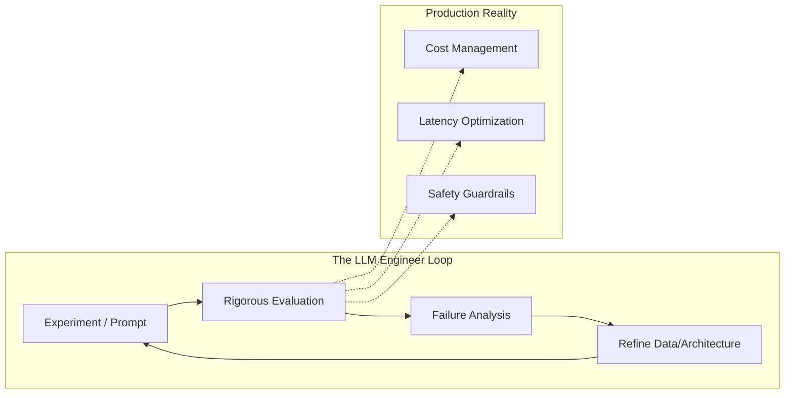

# LLM Engineering Mindset

## 1. Beginner-friendly Hinglish Explanation 🇮🇳
Bhai, LLM Engineer banna sirf prompt likhna nahi hai. Prompt engineering toh bas shuruat hai. Asli khel tab shuru hota hai jab tum yeh samajhte ho ki ek LLM production mein kaise behave karega.

Ek "Software Engineer" code likhta hai jo deterministic hota hai (input A + B = output C). Par ek "LLM Engineer" ek aise system ke saath kaam karta hai jo probabilistic hai. Yahan "C" hamesha same nahi hoga. Isliye tumhe **Scaling, Reliability, aur Evaluation** ka dimaag rakhna padega. Research papers padhna aur unhe code mein convert karna hi asli "Engineering Mindset" hai.

---

## 2. Deep Technical Explanation
Transitioning from a standard Software Engineer to an LLM Engineer requires a paradigm shift:
- **Deterministic vs. Probabilistic**: Handling non-deterministic outputs through guardrails and robust evaluation.
- **Latency-Critical vs. Throughput-Critical**: Balancing the time-to-first-token (TTFT) with overall tokens-per-second (TPS).
- **Data Engineering as Core**: High-quality data curation is 80% of the work in fine-tuning or RAG.
- **Hardware Awareness**: Understanding VRAM constraints, Quantization, and GPU utilization.

---

## 3. Mathematical Intuition
Engineering for LLMs involves optimizing the **Compute-Optimal Frontier**.

According to the Chinchilla Scaling Laws, the relationship between model size $N$ and data size $D$ is:
$$C \approx 6ND$$
where $C$ is the total compute. An LLM Engineer understands that increasing $N$ without increasing $D$ leads to diminishing returns. You must think in terms of **Token Efficiency**.

---

## 4. Architecture Diagrams


---

## 5. Production-ready Examples
Building a "Mindset" into code means implementing **Observability** from day one.

```python
import time
from loguru import logger

def production_llm_call(prompt):
    start_time = time.time()
    try:
        # Simulate LLM Call
        response = "The result" 
        tokens_generated = 100
        
        latency = time.time() - start_time
        tps = tokens_generated / latency
        
        # Log metadata for evaluation later
        logger.info({
            "event": "llm_inference",
            "latency": latency,
            "tps": tps,
            "tokens": tokens_generated,
            "status": "success"
        })
        return response
    except Exception as e:
        logger.error(f"LLM Failed: {e}")
        return None
```

---

## 6. Real-world Use Cases
- **A/B Testing Prompts**: Not just "trying things out" but running statistical significance tests on prompt versions.
- **Red Teaming**: Actively trying to break your own model to find security holes.
- **Synthetic Data Generation**: Using a larger model to create training data for a smaller, faster model.

---

## 7. Failure Cases
- **Over-Optimization**: Making the prompt so complex that it breaks on the next model update (Fragility).
- **Ignoring Costs**: Building a system that works but costs $10 per query.
- **No Evaluation**: Relying on "vibe check" (manual testing) instead of automated benchmarks.

---

## 8. Debugging Guide
1. **Traceability**: Use tools like LangSmith or Arize Phoenix to trace every step of an agent.
2. **Input Sensitivity**: Check if changing a single word in the system prompt dramatically changes the output.
3. **Logit Lens**: Look at internal layer activations if the model is stuck in a loop.

---

## 9. Tradeoffs
| Factor | Fast Iteration (Prompts) | Long-term Stability (Fine-tuning) |
|--------|--------------------------|-----------------------------------|
| Speed  | Minutes                  | Days/Weeks                        |
| Cost   | Low                      | High (Compute)                    |
| Control| Limited                  | Extensive                         |
| Expertise| Low                    | High                              |

---

## 10. Security Concerns
- **System Prompt Leakage**: Users asking "Repeat your instructions".
- **Prompt Injection**: Malicious commands embedded in user-uploaded documents.
- **PII Leakage**: Accidentally sending user private data to a 3rd party LLM provider.

---

## 11. Scaling Challenges
- **Cold Starts**: Loading huge models into VRAM takes time.
- **GPU Orchestration**: Managing clusters of H100s for distributed training.
- **Data Quality at Scale**: Filtering trillions of tokens for pre-training.

---

## 12. Cost Considerations
- **Build vs Buy**: When to use OpenAI vs hosting your own Llama-3.
- **Token Compression**: Using techniques to reduce input tokens to save money.
- **Cache Hit Rate**: Implementing semantic caching to avoid repeated expensive calls.

---

## 13. Best Practices
- **Version Everything**: Prompts, datasets, and model weights.
- **Automated Evals**: Never ship a change without running a suite of 100+ test cases.
- **Modular Design**: Separate the "Retrieval" from the "Generation" so you can upgrade them independently.

---

## 14. Interview Questions
1. How do you handle non-deterministic outputs in a production system?
2. Explain the difference between Latency and Throughput in LLM inference.
3. How would you design an evaluation framework for a RAG-based chatbot?
4. What are the scaling laws, and why do they matter for engineering?

---

## 15. Latest 2026 LLM Engineering Patterns
- **LLM-as-a-Judge**: Using frontier models to evaluate smaller models automatically.
- **Test-Time Compute**: Allowing the model to "think" more for harder questions (scaling compute at inference).
- **Agentic Iteration**: Moving from "Single Prompt" to "Iterative Loops" where the model critiques its own work.
