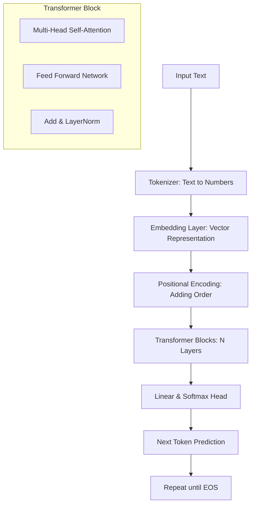

# What are Large Language Models (LLMs)?

## 1. Beginner-friendly Hinglish Explanation 🇮🇳
Bhai, simple words mein bataun toh LLM ek aisa "Smart Auto-complete" system hai jo internet ki saari books, articles aur code ko padh kar train hua hai. 

Socho ek aisa dimaag jisne duniya ka sara text padha liya hai. Jab tum use kuch poochte ho, toh woh bas yeh predict karta hai ki "agla word kya hona chahiye?" par woh itna smart hai ki woh agla word predict karte-karte tumhare liye poora essay likh deta hai, code generate kar deta hai aur complex problems solve kar deta hai. 

Yeh koi magic nahi hai, bas bohot saara data aur bohot saari mathematics ka khel hai. Isse hum "Generative AI" isliye kehte hain kyunki yeh naya content generate karta hai.

---

## 2. Deep Technical Explanation
LLMs are deep learning models based on the **Transformer architecture**, specifically designed to handle sequential data with long-range dependencies. 

Key technical components:
- **Neural Network Type**: Usually Decoder-only (like GPT) or Encoder-Decoder (like T5).
- **Parameter Scale**: Ranging from 1B (Small Language Models) to 1.8T+ (like GPT-4).
- **Training Objective**: Usually **Next Token Prediction** (Causal Language Modeling) where the model predicts token $t_i$ given sequence $t_{1...i-1}$.
- **Weights & Biases**: These represent the "knowledge" of the model stored in billions of floating-point numbers.

---

## 3. Mathematical Intuition
Mathematically, an LLM learns a probability distribution over a sequence of tokens.

If we have a sequence $S = (w_1, w_2, ..., w_n)$, the model tries to maximize the likelihood:
$$P(S) = \prod_{i=1}^n P(w_i | w_1, ..., w_{i-1}; \theta)$$

Where $\theta$ represents the model parameters. 
The core of the transformer uses **Self-Attention**:
$$\text{Attention}(Q, K, V) = \text{softmax}\left(\frac{QK^T}{\sqrt{d_k}}\right)V$$
This allows the model to weigh the importance of different words in a sentence regardless of their distance.

---

## 4. Architecture Diagrams


---

## 5. Production-ready Examples
Using `transformers` library to load a model in production (optimally):

```python
import torch
from transformers import AutoModelForCausalLM, AutoTokenizer

model_id = "meta-llama/Llama-3-8B-Instruct"

# Production settings: FP16/BF16, device_map="auto"
tokenizer = AutoTokenizer.from_pretrained(model_id)
model = AutoModelForCausalLM.from_pretrained(
    model_id,
    torch_dtype=torch.bfloat16,
    device_map="auto",
    attn_implementation="flash_attention_2" # 2026 standard for speed
)

def generate_response(prompt):
    inputs = tokenizer(prompt, return_tensors="pt").to(model.device)
    with torch.no_grad():
        output = model.generate(
            **inputs, 
            max_new_tokens=512, 
            temperature=0.7,
            do_sample=True
        )
    return tokenizer.decode(output[0], skip_special_tokens=True)

print(generate_response("Explain quantum computing in one sentence."))
```

---

## 6. Real-world Use Cases
- **Content Generation**: Blogs, Emails, Creative writing.
- **Coding Assistants**: GitHub Copilot, Cursor (Writing/Refactoring code).
- **Customer Support**: AI Agents handling complex queries.
- **Knowledge Synthesis**: Summarizing research papers or legal docs.
- **Function Calling**: LLMs acting as a brain for software tools (Agents).

---

## 7. Failure Cases
- **Hallucinations**: Model confidently stating false facts (e.g., "The capital of Mars is Elon Musk City").
- **Catastrophic Forgetting**: During fine-tuning, losing previous knowledge.
- **Context Window Overflow**: Forgetting the beginning of a long conversation.
- **Data Leakage**: Training data contains PII or private code.

---

## 8. Debugging Guide
1. **Check Tokens**: Use a tokenizer visualizer to see if words are split weirdly.
2. **Log Logits**: If the output is repetitive, check the probability distribution.
3. **Temperature Tuning**: High temp = creative but random; Low temp = factual but boring.
4. **Inspect Attention Maps**: See what the model is "looking at" when it makes a mistake.

---

## 9. Tradeoffs
| Feature | Small Model (e.g., 1B) | Large Model (e.g., 70B+) |
|---------|-------------------------|--------------------------|
| Latency | Very Low (Real-time)    | High                     |
| Reasoning| Basic                  | Complex / Nuanced        |
| Cost    | Cheap (Local run)       | Expensive (GPU cluster)  |
| Accuracy| Lower                  | Higher                   |

---

## 10. Security Concerns
- **Prompt Injection**: User bypassing system instructions (e.g., "Ignore all previous instructions...").
- **Insecure Output**: Model generating malicious shell commands.
- **Model Inversion**: Attacker trying to extract training data.

---

## 11. Scaling Challenges
- **VRAM Requirements**: A 70B model needs ~140GB VRAM just to load in FP16.
- **Throughput vs Latency**: Hard to serve many users simultaneously without huge GPU clusters.
- **Context Length Scaling**: $O(n^2)$ memory growth for attention in long contexts.

---

## 12. Cost Considerations
- **API Costs**: Token-based pricing (Input vs Output).
- **Hosting Costs**: H100/A100 instances are $2-4/hr per GPU.
- **Optimization**: Quantization (4-bit/8-bit) can reduce costs by 2-4x.

---

## 13. Best Practices
- **Use System Prompts**: Clearly define the model's persona.
- **Few-shot Prompting**: Give examples to improve accuracy.
- **RAG over Long Context**: Don't put a whole library in the prompt; retrieve only what's needed.
- **Evaluate with LLM-as-a-judge**: Use GPT-4o to grade Llama-3 outputs.

---

## 14. Interview Questions
1. What is the difference between a Tokenizer and an Embedding?
2. Why do we divide $QK^T$ by $\sqrt{d_k}$ in the attention formula?
3. How does Flash Attention optimize the transformer block?
4. Explain the "Next Token Prediction" objective.

---

## 15. Latest 2026 LLM Engineering Patterns
- **Active Reasoning (o1-style)**: Models that "think" and use hidden Chain-of-Thought before answering.
- **Speculative Decoding**: Using a small model to predict tokens and a large model to verify them.
- **In-Context Learning (ICL)**: Tuning models purely through massive context instead of weight updates.
- **Direct Preference Optimization (DPO)**: Replacing complex RLHF with simpler alignment techniques.
