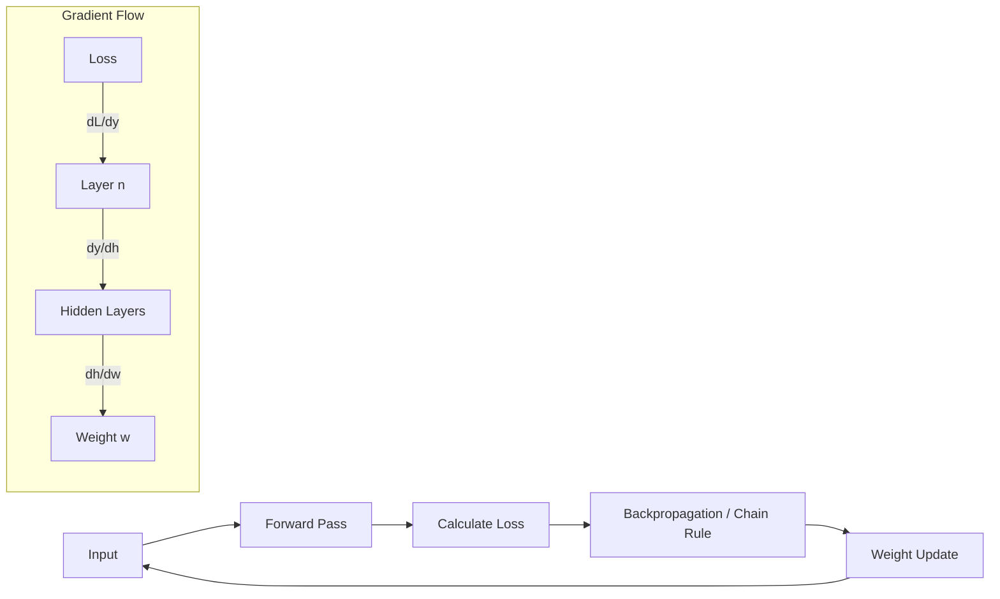

# Deep Learning ke liye Calculus

## 1. Shuruaat ke liye Hinglish Samjhaaiye 🇮🇳
Bhai, agar Linear Algebra "Language" hai, toh Calculus woh "Engine" hai jo model ko sikhata hai.

Socho tum ek pahad ki choti par ho aur tumhe niche utarna hai andhere mein. Tum har kadam par check karte ho ki dhalan (slope) kis taraf hai. Calculus humein wahi "Slope" ya **Gradient** nikal kar deta hai. Jab model galti karta hai, toh Calculus humein batata hai ki har ek Weight ko kitna "thoda sa" badalna hai taaki agli baar galti kam ho. Isi ko hum **Backpropagation** kehte hain.

---

## 2. Gehri Technical Samjhaaiye
Deep Learning, loss functions ko optimize karne ke liye **Differential Calculus** par rely karta hai:
- **Partial Derivatives**: Loss kaise ek weight ke saath badalta hai jab doosre weights constant hain, ye calculate karna.
- **The Chain Rule**: Error gradient ko output layer se wapas thousands layers ke through first layer tak propagate karna.
- **Gradient Descent**: Weights ko negative gradient ki disha mein update karna: $w = w - \eta \nabla L$.
- **Automatic Differentiation**: Engine jo PyTorch aur JAX ke peeche hai jo automatically ye derivatives calculate karta hai.

---

## 3. Mathematical Samjhaaiye
Training ka core ek Loss Function $J(\theta)$ ko minimize karna hai, gradient $\nabla J(\theta)$ ka use karke.

**Chain Rule** ke hisaab se, ek nested function $L(y(x))$ ke liye:
$$\frac{dL}{dx} = \frac{dL}{dy} \cdot \frac{dy}{dx}$$

Transformer mein, agar $L$ loss hai aur $w$ weight hai layer 1 mein:
$$\frac{\partial L}{\partial w} = \frac{\partial L}{\partial a_n} \cdot \frac{\partial a_n}{\partial a_{n-1}} \cdots \frac{\partial a_2}{\partial a_1} \cdot \frac{\partial a_1}{\partial w}$$

---

## 4. Architecture Diagrams


---

## 5. Production-ready Udaaharan
`PyTorch` mein gradients ko samajhna:

```python
import torch

# Create a weight matrix with gradient tracking
W = torch.randn(10, 10, requires_grad=True)
x = torch.randn(1, 10)

# Forward pass
output = torch.matmul(x, W)
loss = output.sum() # Simple loss

# Backward pass (Calculus in action!)
loss.backward()

# View the gradient calculated via Chain Rule
print(f"Gradient of W: {W.grad}")

# Optimizer step
with torch.no_grad():
    W -= 0.01 * W.grad # Stochastic Gradient Descent step
```

---

## 6. Asli Duniya ke Use Cases
- **Training LLMs**: Massive text corpora ke basis par billions of parameters ko update karna.
- **Adversarial Training**: Gradients ka use karke "vulnerable" inputs dhondhna.
- **Neural Architecture Search**: Calculus ka use karke architecture ko optimize karna.

---

## 7. Failure Cases
- **Vanishing Gradients**: Bahut deep networks mein, gradient itna chhota (0 ke kareeb) ho jata hai ki layers sikhna band kar dete hain.
- **Exploding Gradients**: Gradient itna bada (Inf) ho jata hai ki weights khatam ho jate hain.
- **Local Minima/Saddle Points**: Loss landscape ke aise hisse mein phas jana jo best solution nahi hai.

---

## 8. Debugging Guide
1. **Gradient Clipping**: Agar gradients explode karein, toh unhe max value par "clip" karein.
2. **Check for Infs/NaNs**: `torch.autograd.set_detect_anomaly(True)` ka use karke pata lagayein ki math kahan toot rahi hai.
3. **Activation Scaling**: Gradients ko bahut tez shrink hone se bachane ke liye LayerNorm ka use karein.

---

## 9. Tradeoffs
| Takneek | Samikta | Gati |
|-----------|-----------|-------|
| Full Batch Gradient | Zyaada | Bohot Dheere |
| Stochastic Gradient | Kam | Bohot Tez |
| Mini-batch Gradient | Madhyam | Anukool |

---

## 10. Security Chintayein
- **Gradient Leakage**: Federated Learning mein, attacker kabhi kabhi shared gradients dekhkar hi private data reconstruct kar sakta hai.
- **Poisoning**: Data ko thoda sa badalkar "stealthy" gradients banana jo model ko misalign kare.

---

## 11. Scaling ki Chunautiyaan
- **Memory for Gradients**: "Backward" state ko store karne ke liye model se 2-3x zyaada VRAM chahiye.
- **Communication Latency**: Distributed training mein, thousands GPUs ke beech gradients sync karna main bottleneck hai.

---

## 12. Kharcha ke Vichaar
- **Optimizer Memory**: Adam use karne ke liye "momentum" aur "variance" (4 bytes per parameter each) store karna padta hai, jo mehnga hai.
- **Gradient Accumulation**: Chhoti GPUs par large batch sizes simulate karne ka trick hai, multiple steps mein gradients sum karke.

---

## 13. Best Practices
- **Use Modern Optimizers**: AdamW 2026 mein LLMs ke liye gold standard hai.
- **Monitor Gradient Norms**: WandB mein plot karein taaki training healthy ho.
- **Learning Rate Scheduling**: Learning rate ko Cosine schedule se decay karein better convergence ke liye.

---

## 14. Interview Questions
1. 3-layer neural network ke context mein Chain Rule ko samjhaaiye.
2. Gradient Descent aur Stochastic Gradient Descent mein kya farak hai?
3. Residual Connections (ResNets) Vanishing Gradient problem mein kaise madad karte hain?
4. Activation function (jaise ReLU) ka differentiable hona kyun zaroori hai?

---

## 15. 2026 ke Latest LLM Engineering Patterns
- **Second-Order Optimization**: K-FAC ya Shampoo jaise techniques ka use karte hain jo "Hessian" (curvature) use karte hain faster convergence ke liye.
- **Gradient-Free Optimization**: Alignment tasks ke liye jahan gradients compute karna mushkil hai (Evolutionary strategies).
- **Differentiable Tokenization**: Discrete tokenization step ko differentiable banane ke attempts end-to-end training ke liye.