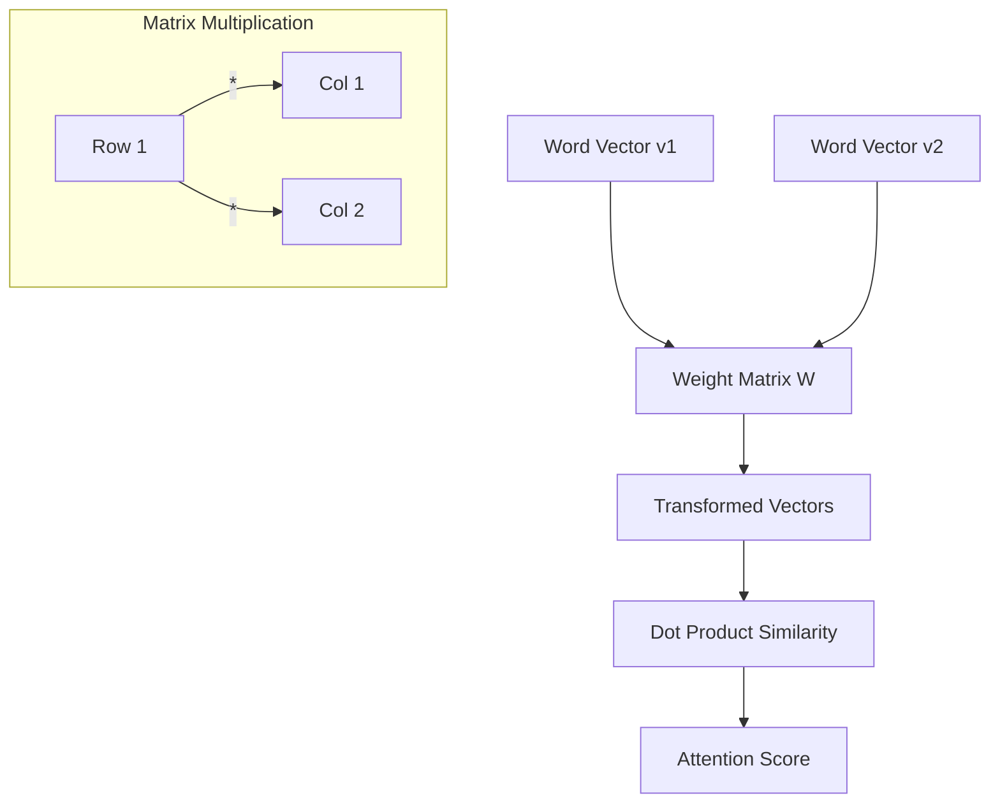

# Linear Algebra for LLMs

## 1. Beginner-friendly Hinglish Explanation 🇮🇳
Bhai, agar LLM ek dimaag hai, toh Linear Algebra uski "Language" hai. 

LLM ke andar har ek word ek "Vector" (numbers ki list) mein convert ho jata hai. Jab model "Attention" lagata hai, toh woh asal mein **Matrix Multiplication** kar raha hota hai. Socho ki words space mein points hain, aur Linear Algebra humein yeh batata hai ki kaunsa point kiske kitne paas hai aur unka "Meaning" kaise combine karna hai. Bina Linear Algebra ke, Transformer sirf ek dabba hai.

---

## 2. Deep Technical Explanation
Linear Algebra Transformer ke andar saare operations ke liye framework provide karta hai:
- **Embeddings**: Tokens ko high-dimensional vector spaces $\mathbb{R}^d$ mein map karna.
- **Linear Transformations**: Weights $W_Q, W_K, W_V$ aise matrices hain jo embeddings ko Query, Key, aur Value spaces mein project karte hain.
- **Dot Product**: Similarity (Attention scores) calculate karne ke liye use hota hai.
- **Eigenvalues/Eigenvectors**: Deep networks mein stability aur model compression (SVD) samajhne ke liye relevant hain.

---

## 3. Mathematical Intuition
LLMs mein sabse important operation **Matrix-Matrix Product** hai.

Self-Attention mechanism ko dekhte hain:
$$Z = \text{softmax}\left(\frac{XW_Q (XW_K)^T}{\sqrt{d_k}}\right) XW_V$$

Yahan:
- $X$ ek $n \times d$ input matrix hai (n tokens, d dimensions).
- $W_Q, W_K, W_V$ weight matrices hain.
- Transpose $(XW_K)^T$ dot product similarity ke liye use hota hai.
- Softmax row-wise apply hota hai scores normalize karne ke liye.

---

## 4. Architecture Diagrams


---

## 5. Production-ready Examples
Linear Algebra ko `PyTorch` aur `Einsum` ke saath optimize karna (Modern standard):

```python
import torch

# Standard matrix multiplication
A = torch.randn(32, 128) # Batch, Dim
B = torch.randn(128, 256)
C = torch.matmul(A, B)

# Multi-head attention style with Einsum (Cleaner & Faster)
# Query: [Batch, Heads, SeqLen, HeadDim]
# Key: [Batch, Heads, SeqLen, HeadDim]
q = torch.randn(1, 8, 128, 64)
k = torch.randn(1, 8, 128, 64)

# Similarity: [Batch, Heads, SeqLen, SeqLen]
# 'bhik, bhjk -> bhij' means dot product over head_dim (k)
scores = torch.einsum('bhik, bhjk -> bhij', q, k)

print(f"Scores shape: {scores.shape}")
```

---

## 6. Real-world Use Cases
- **Similarity Search**: Cosine Similarity ka use karke related documents find karna.
- **Dimensionality Reduction**: PCA ya SVD ka use karke embeddings ko compress karna.
- **Quantization**: High-precision floats ko low-precision integers mein map karna memory bachane ke liye.

---

## 7. Failure Cases
- **Exploding/Vanishing Gradients**: Jab matrix multiplications ki vajah se values Inf ya NaN ho jayein.
- **Rank Collapse**: Jab sab word vectors ek hi direction mein point karne lagein, expressivity khokar.
- **Dimensionality Curse**: Bahut high dimensions mein, saare points almost equidistant ho jate hain.

---

## 8. Debugging Guide
1. **Check Shapes**: 90% Linear Algebra bugs dimension mismatches ki vajah se hote hain (e.g., $128 \times 64$ ko $128 \times 64$ se multiply karne ki koshish karna).
2. **Norm Monitoring**: Agar $\|v\| \to 0$, toh aapka model mar raha hai.
3. **Condition Number**: Agar weight matrix ill-conditioned hai, toh training unstable hogi.

---

## 9. Tradeoffs
| Operation | Complexity | VRAM usage |
|-----------|------------|------------|
| Vector Dot Product | $O(d)$ | Kam |
| Matrix Multi (GEMM)| $O(n^3)$ | Zyada |
| Sparse Matrix Multi| $O(\text{nnz})$ | Madhyam |

---

## 10. Security Concerns
- **Adversarial Perturbations**: Input vectors mein chhoti changes jo output mein bade badlaav la deti hain (Matrix sensitivity).
- **Stealing Embeddings**: Agar kisi attacker ko aapki embedding matrix mil jaye, toh woh aapke training data ko reconstruct kar sakta hai.

---

## 11. Scaling Challenges
- **Memory Bottleneck**: GPU par bade weight matrices store karna.
- **Parallelization**: Ek single bade matrix multiplication ko multiple GPUs mein split karna (Tensor Parallelism).

---

## 12. Cost Considerations
- **FP32 vs FP16**: Half precision memory 50% reduce karta hai aur modern Tensor Cores par matrix math speed up karta hai.
- **KV Cache**: Previous Key/Value vectors ko store karna matrix products ko re-compute hone se bachane ke liye.

---

## 13. Best Practices
- **Use `einsum`**: Complex multi-dimensional math ke liye yeh zyada readable aur kam error-prone hai.
- **Weights Initialize karein**: Variances stable rakhne ke liye Xavier ya Kaiming initialization use karein.
- **Normalize karein**: Vectors ko healthy range mein rakhne ke liye LayerNorm ya RMSNorm use karein.

---

## 14. Interview Questions
1. Dot Product aur Cosine Similarity mein kya antar hai?
2. Attention mein $1/\sqrt{d_k}$ scaling factor ki kya zaroorat hai?
3. Singular Value Decomposition (SVD) model compression mein kaise madad karta hai?
4. Transformer layer mein Linear Transformation ke peeche ki intuition samjhao.

---

## 15. Latest 2026 LLM Engineering Patterns
- **Low-Rank Adaptation (LoRA)**: Fine-tuning ke dauran poori weight matrix ki jagah sirf ek chhoti, low-rank matrix ko update karna.
- **Quantized Matrix Multiplication**: Bina full dequantization ke 4-bit weights par directly GEMM perform karna.
- **Rotary Positional Embeddings (RoPE)**: Additive vectors ki jagah rotation matrices ka use karke position encode karna.