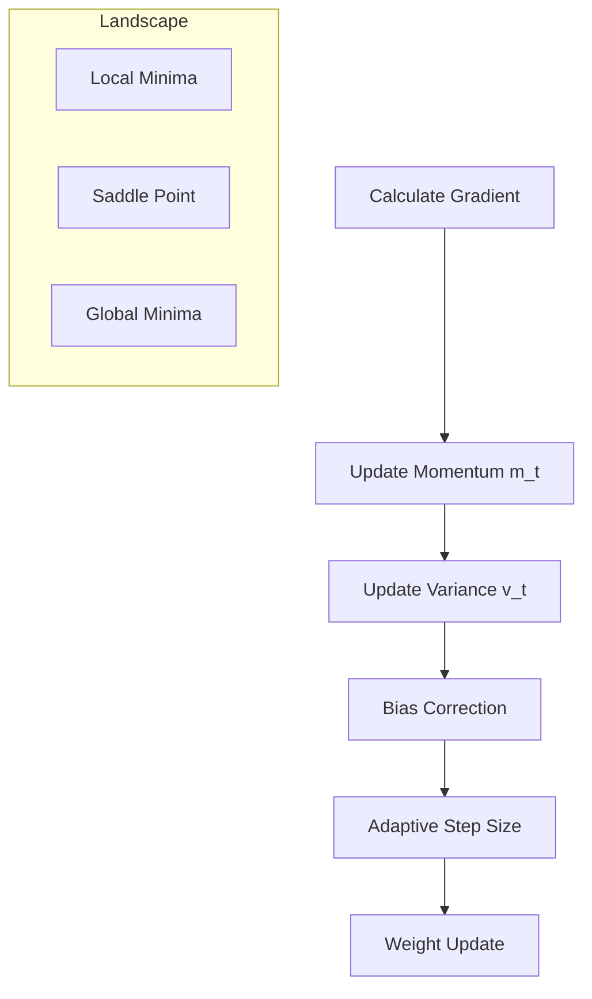

# Optimization Algorithms in LLMs

## 1. Beginners Ke Liye Hinglish Samjhai 🇮🇳
Bhai, socho tum ek game khel rahe ho jahan tumhe andhere mein khazana dhundhna hai. Calculus ne tumhe bataya ki "niche ki taraf dhalan hai", lekin **Optimization Algorithm** yeh decide karta hai ki tum kitna bada kadam (Step Size) loge aur kya tum pichli speed (Momentum) ko yaad rakhoge.

Agar tum bohot bade kadam loge, toh khazana miss kar doge. Agar bohot chhote loge, toh agle saal tak bhi nahi pahunchoge. **AdamW** aaj kal ka sabse smart optimizer hai jo har parameter ke liye alag step size rakhta hai.

---

## 2. Gehri Technical Samjhai
LLMs mein optimization ka matlab high-dimensional, non-convex loss landscapes mein navigate karna hai.
- **SGD (Stochastic Gradient Descent)**: Sabse simple optimizer. Ye weights ko negative gradient ki direction mein update karta hai.
- **Momentum**: Pichle update ka ek fraction current update mein jodta hai taaki chhoti hills ko cross kar sake.
- **RMSProp**: Recent gradients ki magnitude ke hisaab se learning rate ko scale karta hai taaki alag scales ko handle kar sake.
- **Adam (Adaptive Moment Estimation)**: Momentum aur RMSProp ko combine karta hai. Ye gradients aur unke squares ka running average maintain karta hai.
- **AdamW**: Adam ka ek variant jo weight decay ko gradient update se alag kar deta hai, jo transformer stability ke liye crucial hai.

---

## 3. Ganitik Intuition
**Adam** update rule yeh hai:
1.  Gradient $g_t$ calculate karo.
2.  First moment (momentum) update karo: $m_t = \beta_1 m_{t-1} + (1 - \beta_1) g_t$.
3.  Second moment (variance) update karo: $v_t = \beta_2 v_{t-1} + (1 - \beta_2) g_t^2$.
4.  Bias correction karo: $\hat{m}_t = \frac{m_t}{1 - \beta_1^t}, \hat{v}_t = \frac{v_t}{1 - \beta_2^t}$.
5.  Weight update karo: $\theta_t = \theta_{t-1} - \eta \frac{\hat{m}_t}{\sqrt{\hat{v}_t} + \epsilon}$.

---

## 4. Architecture Diagrams


---

## 5. Production-ready Udaharan
Chhota model train karne liye `PyTorch` mein AdamW implement karna:

```python
import torch
import torch.optim as optim

model = MyTransformerModel() # Dummy model

# Production parameters for AdamW (Standard for LLMs)
optimizer = optim.AdamW(
    model.parameters(), 
    lr=1e-4, 
    betas=(0.9, 0.95), # Standard betas for large models
    eps=1e-8, 
    weight_decay=0.1 # Crucial for preventing overfitting
)

# Training loop
for input, target in dataloader:
    optimizer.zero_grad()
    output = model(input)
    loss = criterion(output, target)
    loss.backward()
    
    # Gradient clipping: Essential for Transformer stability
    torch.nn.utils.clip_grad_norm_(model.parameters(), max_norm=1.0)
    
    optimizer.step()
```

---

## 6. Vastavik Duniya ke Use Cases
- **Pre-training**: Large batch sizes aur small learning rates use karna AdamW ke saath.
- **Fine-tuning**: Aur bhi chhote learning rates use karna taaki pre-trained knowledge kharab na ho.
- **RLHF**: PPO (Proximal Policy Optimization) use karna jo ek specialized optimizer hai reinforcement learning ke liye.

---

## 7. Nakami ke Cases
- **Divergence**: Agar learning rate bahut zyada ho, toh loss NaN mein chala jata hai.
- **Plateauing**: Agar learning rate bahut kam ho, toh model learning karna band kar deta hai optimum tak pahunchne se pehle.
- **Weight Decay Mismanagement**: Standard Adam (not AdamW) transformers mein weights galat tarah se penalize karta hai, jis se sub-optimal models bante hain.

---

## 8. Debugging Guide
1. **Learning Rate Finder**: Chhote se shuru karo aur gradually badhao dekho ki loss kab drop hone lagta hai.
2. **Gradient Norm Tracking**: Agar norm regularly 10.0 se zyada hai, toh tumhara training bahut aggressive hai.
3. **Loss Spikes**: Agar loss suddenly spike kare, toh data corruption check karo ya learning rate kam karo.

---

## 11. Scaling Challenges
- **Optimizer States VRAM**: 7B parameter model ke liye, AdamW ko ~56GB VRAM chahiye sirf apne internal states ke liye (agar FP32 use karte hain).
- **8-bit Optimizers**: `bitsandbytes` use karna optimizer memory ko 4x kam karne ke liye bina performance khoye.

---

## 12. Cost Considerations
- **Communication Cost**: Adam states ko GPUs ke across sync karna padta hai, jo sirf gradients sync karne se dheema hai.
- **Convergence Speed**: Behtar optimizer paisa bachata hai H100 clusters par total required hours kam karke.

---

## 13. Best Practices
- **Warmup Steps**: Pehle kuch hazaar steps mein learning rate ko 0 se slowly increase karo taaki "cold" model stabilize ho.
- **Cosine Annealing**: Training ke end mein learning rate ko smoothly decay karo.
- **Beta2 Tuning**: Bahut bade models ke liye, $\beta_2$ ko 0.98 ya 0.999 tak badhane se stability mein madad mil sakti hai.

---

## 14. Interview Questions
1. Transformer models ke liye standard Adam ke muqable AdamW kyun pasand kiya jata hai?
2. Optimization mein "Momentum" term ki kya भूमिका hai?
3. Gradient Clipping "Exploding Gradients" ko kaise prevent karta hai?
4. Adam mein "Bias Correction" step skip karne se kya hota hai?

---

## 15. 2026 ke Latest LLM Engineering Patterns
- **Sophia (Second-order Optimizer)**: Ek naya optimizer jo "Hessian" diagonal estimates use karta hai taaki Adam se 2x faster converge ho.
- **Shampoo Optimizer**: Kronecker-product structures ke saath gradients ko pre-condition karta hai TPUs par faster training ke liye.
- **Parameter-efficient Optimizers**: Aisi techniques jo sirf subset of parameters ko optimize karein ya optimizer states ke liye low-rank approximations use karein.