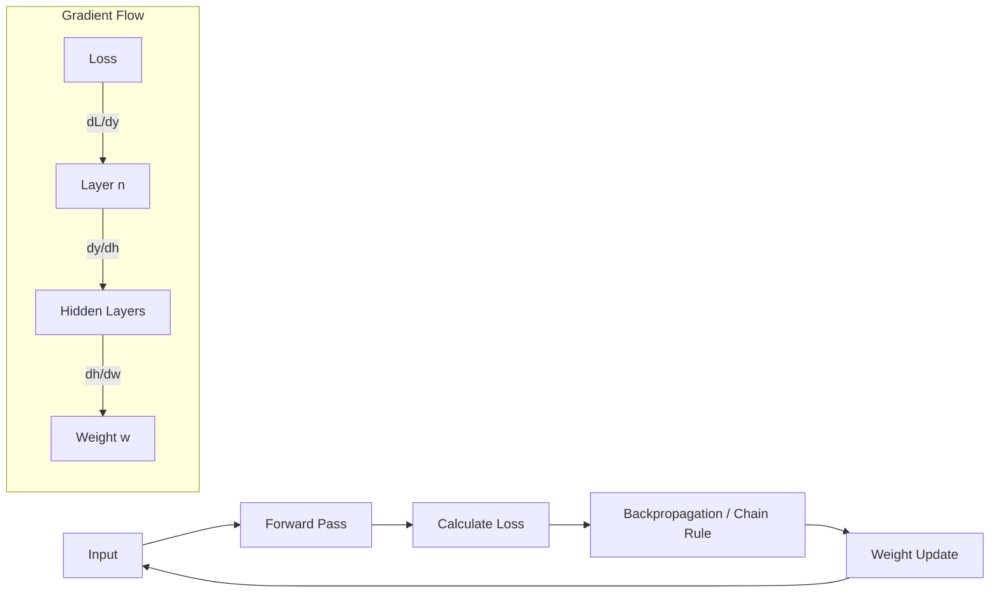

# Calculus for Deep Learning

## 1. Beginner-friendly Hinglish Explanation 🇮🇳
Bhai, agar Linear Algebra "Language" hai, toh Calculus woh "Engine" hai jo model ko sikhata hai.

Socho tum ek pahad ki choti par ho aur tumhe niche utarna hai andhere mein. Tum har kadam par check karte ho ki dhalan (slope) kis taraf hai. Calculus humein wahi "Slope" ya **Gradient** nikal kar deta hai. Jab model galti karta hai, toh Calculus humein batata hai ki har ek Weight ko kitna "thoda sa" badalna hai taaki agli baar galti kam ho. Isi ko hum **Backpropagation** kehte hain.

---

## 2. Deep Technical Explanation
Deep Learning relies on **Differential Calculus** to optimize loss functions:
- **Partial Derivatives**: Calculating how the loss changes with respect to one weight while keeping others constant.
- **The Chain Rule**: Propagating the error gradient from the output layer back through thousands of layers to the first layer.
- **Gradient Descent**: Updating weights in the direction of the negative gradient: $w = w - \eta \nabla L$.
- **Automatic Differentiation**: The engine behind PyTorch and JAX that calculates these derivatives automatically.

---

## 3. Mathematical Intuition
The core of training is minimizing a Loss Function $J(\theta)$ using the gradient $\nabla J(\theta)$.

By the **Chain Rule**, for a nested function $L(y(x))$:
$$\frac{dL}{dx} = \frac{dL}{dy} \cdot \frac{dy}{dx}$$

In a transformer, if $L$ is the loss, and $w$ is a weight in layer 1:
$$\frac{\partial L}{\partial w} = \frac{\partial L}{\partial a_n} \cdot \frac{\partial a_n}{\partial a_{n-1}} \cdots \frac{\partial a_2}{\partial a_1} \cdot \frac{\partial a_1}{\partial w}$$

---

## 4. Architecture Diagrams


---

## 5. Production-ready Examples
Understanding gradients in `PyTorch`:

```python
import torch

# Create a weight matrix with gradient tracking
W = torch.randn(10, 10, requires_grad=True)
x = torch.randn(1, 10)

# Forward pass
output = torch.matmul(x, W)
loss = output.sum() # Simple loss

# Backward pass (Calculus in action!)
loss.backward()

# View the gradient calculated via Chain Rule
print(f"Gradient of W: {W.grad}")

# Optimizer step
with torch.no_grad():
    W -= 0.01 * W.grad # Stochastic Gradient Descent step
```

---

## 6. Real-world Use Cases
- **Training LLMs**: Updating billions of parameters based on massive text corpora.
- **Adversarial Training**: Using gradients to find "vulnerable" inputs.
- **Neural Architecture Search**: Using calculus to optimize the architecture itself.

---

## 7. Failure Cases
- **Vanishing Gradients**: In very deep networks, the gradient becomes so small (close to 0) that layers stop learning.
- **Exploding Gradients**: The gradient becomes so large (Inf) that weights get destroyed.
- **Local Minima/Saddle Points**: Getting stuck in a part of the loss landscape that isn't the best solution.

---

## 8. Debugging Guide
1. **Gradient Clipping**: If gradients explode, "clip" them to a max value.
2. **Check for Infs/NaNs**: Use `torch.autograd.set_detect_anomaly(True)` to find where the math breaks.
3. **Activation Scaling**: Use LayerNorm to prevent gradients from shrinking too fast.

---

## 9. Tradeoffs
| Technique | Precision | Speed |
|-----------|-----------|-------|
| Full Batch Gradient | High | Very Slow |
| Stochastic Gradient | Low | Very Fast |
| Mini-batch Gradient | Medium| Optimal |

---

## 10. Security Concerns
- **Gradient Leakage**: In Federated Learning, an attacker can sometimes reconstruct private data just by looking at the shared gradients.
- **Poisoning**: Slightly altering data to create "stealthy" gradients that misalign the model.

---

## 11. Scaling Challenges
- **Memory for Gradients**: Storing the "Backward" state requires 2-3x more VRAM than just the model itself.
- **Communication Latency**: In distributed training, syncing gradients across thousands of GPUs is the main bottleneck.

---

## 12. Cost Considerations
- **Optimizer Memory**: Using Adam requires storing "momentum" and "variance" (4 bytes per parameter each), which is expensive.
- **Gradient Accumulation**: A trick to simulate large batch sizes on small GPUs by summing gradients over multiple steps.

---

## 13. Best Practices
- **Use Modern Optimizers**: AdamW is the 2026 gold standard for LLMs.
- **Monitor Gradient Norms**: Plot them in WandB to ensure training is healthy.
- **Learning Rate Scheduling**: Decay the learning rate using a Cosine schedule for better convergence.

---

## 14. Interview Questions
1. Explain the Chain Rule in the context of a 3-layer neural network.
2. What is the difference between Gradient Descent and Stochastic Gradient Descent?
3. How do Residual Connections (ResNets) help with the Vanishing Gradient problem?
4. Why do we need an activation function (like ReLU) to be differentiable?

---

## 15. Latest 2026 LLM Engineering Patterns
- **Second-Order Optimization**: Using techniques like K-FAC or Shampoo that use the "Hessian" (curvature) for faster convergence.
- **Gradient-Free Optimization**: For alignment tasks where gradients are hard to compute (Evolutionary strategies).
- **Differentiable Tokenization**: Attempts to make the discrete tokenization step differentiable for end-to-end training.
