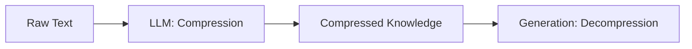

# Information Theory for LLMs

## 1. Beginner-friendly Hinglish Explanation 🇮🇳
Bhai, Information Theory ka matlab hai: **"Data ko kitna nichoda ja sakta hai?"**. 

LLMs asal mein information compression machines hain. Jab model seekhta hai, toh woh billions of pages ki information ko apne weights mein compress kar leta hai. Hum **Entropy** use karte hain yeh measure karne ke liye ki kisi message mein kitni "surprise" ya information hai. Agar main bolun "Kal suraj niklega", toh zero information hai (sabko pata hai). Par agar main bolun "Kal LLMs duniya khatam kar denge", toh bohot high entropy/information hai!

---

## 2. Deep Technical Explanation
Information Theory provides the metrics for training LLMs:
- **Entropy ($H$)**: Measure of uncertainty in the token distribution.
- **Cross-Entropy ($CE$)**: The loss function we minimize. It measures the difference between the true distribution (data) and the predicted distribution (model).
- **KL Divergence**: Measures how much one probability distribution diverges from a second, reference distribution. Essential for **RLHF/DPO**.

---

## 3. Mathematical Intuition
**Shannon Entropy**:
$$H(X) = -\sum_{i} P(x_i) \log P(x_i)$$
**Cross-Entropy Loss** (what we optimize):
$$L = -\sum_{i} y_i \log(\hat{y}_i)$$
Where $y$ is the ground truth (one-hot) and $\hat{y}$ is the model prediction. Minimizing CE is equivalent to minimizing the KL Divergence between data and model.

---

## 4. Architecture Diagrams


---

## 5. Production-ready Examples
```python
import torch
import torch.nn as nn

# Target: index 2 (e.g., word 'apple')
target = torch.tensor([2]) 
# Logits from model
logits = torch.tensor([[0.1, 0.2, 5.0, 0.1]]) 

criterion = nn.CrossEntropyLoss()
loss = criterion(logits, target)

print(f"Cross-Entropy Loss: {loss.item()}")
# Lower loss = Better compression of truth into model
```

---

## 6. Real-world Use Cases
- **Tokenization**: BPE is an information-theoretic algorithm to find the most efficient sub-units of language.
- **Model Pruning**: Removing weights that contribute little to the information flow.

---

## 7. Failure Cases
- **Information Bottleneck**: If the model is too small, it can't "fit" all the information, leading to loss of facts.

---

## 8. Debugging Guide
1. Monitor **Bits-per-character (BPC)**: A standard metric in language modeling.
2. Check for **Mode Collapse**: When the model's entropy drops too low, it becomes repetitive.

---

## 9. Tradeoffs
| Metric | Focus |
|---|---|
| Accuracy | Is the word correct? |
| Entropy | How confident/diverse is the model? |

---

## 10. Security Concerns
- **Side-channel attacks**: Analyzing the entropy of outputs to guess internal model states.

---

## 11. Scaling Challenges
- **Data Saturation**: Eventually, adding more data doesn't provide new "information" to the model.

---

## 12. Cost Considerations
- **Lossy Compression**: Quantization is a form of lossy compression. 4-bit vs 16-bit is an information-theoretic tradeoff.

---

## 13. Best Practices
- Use **Label Smoothing** to prevent the model from becoming too overconfident (too low entropy).

---

## 14. Interview Questions
1. Why is Cross-Entropy used as a loss function instead of Mean Squared Error?
2. What is KL Divergence and why is it important for model alignment?

---

## 15. Latest 2026 Patterns
- **Information-Theoretic Discovery**: Using LLMs to find new patterns in scientific data by measuring "surprise" in experimental results.
