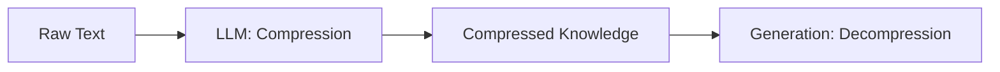

# Information Theory for LLMs

## 1. Beginner-friendly Hinglish Explanation 🇮🇳
Bhai, Information Theory ka matlab hai: **"Data ko kitna nichoda ja sakta hai?"**. 

LLMs asal mein information compression machines hain. Jab model seekhta hai, toh woh billions of pages ki information ko apne weights mein compress kar leta hai. Hum **Entropy** use karte hain yeh measure karne ke liye ki kisi message mein kitni "surprise" ya information hai. Agar main bolun "Kal suraj niklega", toh zero information hai (sabko pata hai). Par agar main bolun "Kal LLMs duniya khatam kar denge", toh bohot high entropy/information hai!

---

## 2. Deep Technical Explanation
Information Theory LLMs train karne ke liye metrics provide karti hai:
- **Entropy ($H$)**: Token distribution mein uncertainty ka measure.
- **Cross-Entropy ($CE$)**: Loss function jo hum minimize karte hain. Ye true distribution (data) aur predicted distribution (model) ke beech ka difference measure karta hai.
- **KL Divergence**: Measure karta hai ki ek probability distribution doosre reference distribution se kitna diverge hota hai. **RLHF/DPO** ke liye essential hai.

---

## 3. Mathematical Intuition
**Shannon Entropy**:
$$H(X) = -\sum_{i} P(x_i) \log P(x_i)$$
**Cross-Entropy Loss** (jisko hum optimize karte hain):
$$L = -\sum_{i} y_i \log(\hat{y}_i)$$
Jahan $y$ ground truth (one-hot) hai aur $\hat{y}$ model prediction hai. CE ko minimize karna, data aur model ke beech KL Divergence minimize karne ke equal hai.

---

## 4. Architecture Diagrams

```mermaid
graph LR
    Data[Raw Text] --> Comp[LLM: Compression]
    Comp --> Weights[Compressed Knowledge]
    Weights --> Decomp[Generation: Decompression]
```

---

## 5. Production-ready Examples
```python
import torch
import torch.nn as nn

# Target: index 2 (jaise, word 'apple')
target = torch.tensor([2]) 
# Model se logits
logits = torch.tensor([[0.1, 0.2, 5.0, 0.1]]) 

criterion = nn.CrossEntropyLoss()
loss = criterion(logits, target)

print(f"Cross-Entropy Loss: {loss.item()}")
# Loss jitna low = Truth ka model mein utna better compression
```

---

## 6. Real-world Use Cases
- **Tokenization**: BPE ek information-theoretic algorithm hai jo language ke sabse efficient sub-units ko find karta hai.
- **Model Pruning**: Un weights ko remove karna jo information flow mein zyada contribute nahi karte.

---

## 7. Failure Cases
- **Information Bottleneck**: Agar model bahut chhota hai, toh woh saari information ko "fit" nahi kar sakta, jisse facts ka loss hota hai.

---

## 8. Debugging Guide
1. **Bits-per-character (BPC)** monitor karo: Language modeling mein ek standard metric hai.
2. **Mode Collapse** check karo: Jab model ka entropy bahut low ho jata hai, toh woh repetitive ho jata hai.

---

## 9. Tradeoffs
| Metric | Focus |
|---|---|
| Accuracy | Kya word sahi hai? |
| Entropy | Model kitna confident/diverse hai? |

---

## 10. Security Concerns
- **Side-channel attacks**: Outputs ki entropy analyze karke internal model states guess karna.

---

## 11. Scaling Challenges
- **Data Saturation**: Eventually, zyada data add karne se model ko nayi "information" nahi milti.

---

## 12. Cost Considerations
- **Lossy Compression**: Quantization lossy compression ka ek form hai. 4-bit vs 16-bit ek information-theoretic tradeoff hai.

---

## 13. Best Practices
- **Label Smoothing** use karo taaki model overconfident na ho (bahut low entropy se bachne ke liye).

---

## 14. Interview Questions
1. Cross-Entropy ko loss function ke tor par Mean Squared Error ki jagah kyun use kiya jata hai?
2. KL Divergence kya hai aur yeh model alignment ke liye kyun important hai?

---

## 15. Latest 2026 Patterns
- **Information-Theoretic Discovery**: LLMs ka use karke scientific data mein naye patterns find karna, experimental results mein "surprise" measure kar ke.