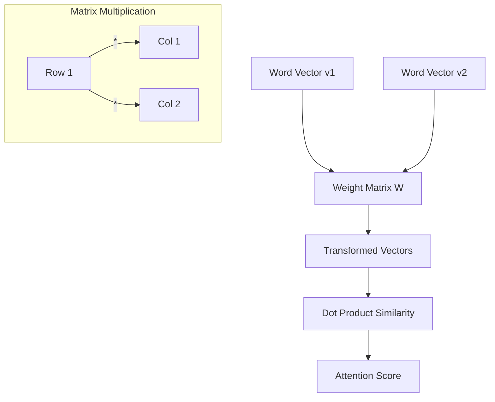

# Linear Algebra for LLMs

## 1. Beginner-friendly Hinglish Explanation 🇮🇳
Bhai, agar LLM ek dimaag hai, toh Linear Algebra uski "Language" hai. 

LLM ke andar har ek word ek "Vector" (numbers ki list) mein convert ho jata hai. Jab model "Attention" lagata hai, toh woh asal mein **Matrix Multiplication** kar raha hota hai. Socho ki words space mein points hain, aur Linear Algebra humein yeh batata hai ki kaunsa point kiske kitne paas hai aur unka "Meaning" kaise combine karna hai. Bina Linear Algebra ke, Transformer sirf ek dabba hai.

---

## 2. Deep Technical Explanation
Linear Algebra provides the framework for all operations within a Transformer:
- **Embeddings**: Mapping tokens to high-dimensional vector spaces $\mathbb{R}^d$.
- **Linear Transformations**: Weights $W_Q, W_K, W_V$ are matrices that project embeddings into Query, Key, and Value spaces.
- **Dot Product**: Used to calculate similarity (Attention scores).
- **Eigenvalues/Eigenvectors**: Relevant for understanding stability in deep networks and model compression (SVD).

---

## 3. Mathematical Intuition
The most important operation in LLMs is the **Matrix-Matrix Product**.

Consider the Self-Attention mechanism:
$$Z = \text{softmax}\left(\frac{XW_Q (XW_K)^T}{\sqrt{d_k}}\right) XW_V$$

Here:
- $X$ is an $n \times d$ input matrix (n tokens, d dimensions).
- $W_Q, W_K, W_V$ are weight matrices.
- The transpose $(XW_K)^T$ is used for the dot product similarity.
- Softmax is applied row-wise to normalize scores.

---

## 4. Architecture Diagrams


---

## 5. Production-ready Examples
Optimizing Linear Algebra with `PyTorch` and `Einsum` (Modern standard):

```python
import torch

# Standard matrix multiplication
A = torch.randn(32, 128) # Batch, Dim
B = torch.randn(128, 256)
C = torch.matmul(A, B)

# Multi-head attention style with Einsum (Cleaner & Faster)
# Query: [Batch, Heads, SeqLen, HeadDim]
# Key: [Batch, Heads, SeqLen, HeadDim]
q = torch.randn(1, 8, 128, 64)
k = torch.randn(1, 8, 128, 64)

# Similarity: [Batch, Heads, SeqLen, SeqLen]
# 'bhik, bhjk -> bhij' means dot product over head_dim (k)
scores = torch.einsum('bhik, bhjk -> bhij', q, k)

print(f"Scores shape: {scores.shape}")
```

---

## 6. Real-world Use Cases
- **Similarity Search**: Finding related documents using Cosine Similarity.
- **Dimensionality Reduction**: Using PCA or SVD to compress embeddings.
- **Quantization**: Mapping high-precision floats to low-precision integers to save memory.

---

## 7. Failure Cases
- **Exploding/Vanishing Gradients**: When matrix multiplications cause values to become Inf or NaN.
- **Rank Collapse**: When all word vectors start pointing in the same direction, losing expressivity.
- **Dimensionality Curse**: In very high dimensions, all points become almost equidistant.

---

## 8. Debugging Guide
1. **Check Shapes**: 90% of Linear Algebra bugs are dimension mismatches (e.g., trying to multiply $128 \times 64$ with $128 \times 64$).
2. **Norm Monitoring**: If $\|v\| \to 0$, your model is dying.
3. **Condition Number**: If the weight matrix is ill-conditioned, training will be unstable.

---

## 9. Tradeoffs
| Operation | Complexity | VRAM usage |
|-----------|------------|------------|
| Vector Dot Product | $O(d)$ | Low |
| Matrix Multi (GEMM)| $O(n^3)$ | High |
| Sparse Matrix Multi| $O(\text{nnz})$ | Medium |

---

## 10. Security Concerns
- **Adversarial Perturbations**: Small changes in input vectors that lead to wild changes in output (Matrix sensitivity).
- **Stealing Embeddings**: If an attacker gets your embedding matrix, they can reconstruct your training data.

---

## 11. Scaling Challenges
- **Memory Bottleneck**: Storing large weight matrices on GPU.
- **Parallelization**: Splitting a single large matrix multiplication across multiple GPUs (Tensor Parallelism).

---

## 12. Cost Considerations
- **FP32 vs FP16**: Half precision reduces memory by 50% and speeds up matrix math on modern Tensor Cores.
- **KV Cache**: Storing previous Key/Value vectors to avoid re-computing matrix products.

---

## 13. Best Practices
- **Use `einsum`**: It's more readable and less error-prone for complex multi-dimensional math.
- **Initialize Weights**: Use Xavier or Kaiming initialization to keep variances stable.
- **Normalize**: Use LayerNorm or RMSNorm to keep vectors in a healthy range.

---

## 14. Interview Questions
1. What is the difference between a Dot Product and Cosine Similarity?
2. Why do we need the $1/\sqrt{d_k}$ scaling factor in Attention?
3. How does Singular Value Decomposition (SVD) help in model compression?
4. Explain the intuition behind a Linear Transformation in a Transformer layer.

---

## 15. Latest 2026 LLM Engineering Patterns
- **Low-Rank Adaptation (LoRA)**: Updating only a small, low-rank matrix instead of the full weight matrix during fine-tuning.
- **Quantized Matrix Multiplication**: Performing GEMM directly on 4-bit weights without full dequantization.
- **Rotary Positional Embeddings (RoPE)**: Using rotation matrices to encode position instead of additive vectors.
