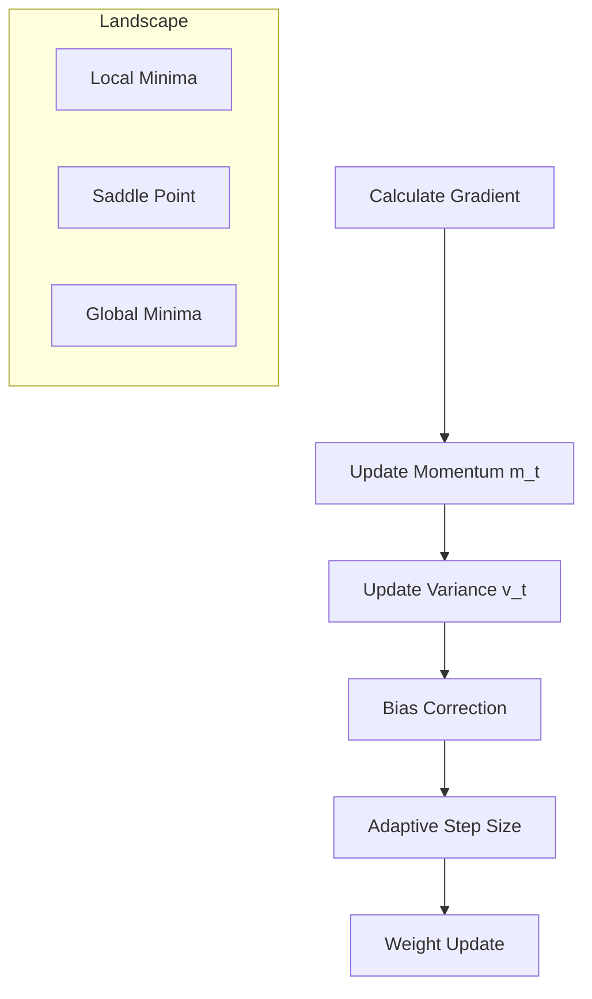

# Optimization Algorithms in LLMs

## 1. Beginner-friendly Hinglish Explanation 🇮🇳
Bhai, socho tum ek game khel rahe ho jahan tumhe andhere mein khazana dhundhna hai. Calculus ne tumhe bataya ki "niche ki taraf dhalan hai", lekin **Optimization Algorithm** yeh decide karta hai ki tum kitna bada kadam (Step Size) loge aur kya tum pichli speed (Momentum) ko yaad rakhoge.

Agar tum bohot bade kadam loge, toh khazana miss kar doge. Agar bohot chhote loge, toh agle saal tak bhi nahi pahunchoge. **AdamW** aaj kal ka sabse smart optimizer hai jo har parameter ke liye alag step size rakhta hai.

---

## 2. Deep Technical Explanation
Optimization in LLMs is about navigating high-dimensional, non-convex loss landscapes.
- **SGD (Stochastic Gradient Descent)**: The simplest optimizer. It update weights in the direction of the negative gradient.
- **Momentum**: Adds a fraction of the previous update to the current one to "roll over" small hills.
- **RMSProp**: Scales the learning rate based on the magnitude of recent gradients to handle differing scales.
- **Adam (Adaptive Moment Estimation)**: Combines Momentum and RMSProp. It maintains a running average of gradients and their squares.
- **AdamW**: A variant of Adam that decouples weight decay from the gradient update, crucial for transformer stability.

---

## 3. Mathematical Intuition
The **Adam** update rule:
1.  Calculate gradient $g_t$.
2.  Update 1st moment (momentum): $m_t = \beta_1 m_{t-1} + (1 - \beta_1) g_t$.
3.  Update 2nd moment (variance): $v_t = \beta_2 v_{t-1} + (1 - \beta_2) g_t^2$.
4.  Bias correction: $\hat{m}_t = \frac{m_t}{1 - \beta_1^t}, \hat{v}_t = \frac{v_t}{1 - \beta_2^t}$.
5.  Update weight: $\theta_t = \theta_{t-1} - \eta \frac{\hat{m}_t}{\sqrt{\hat{v}_t} + \epsilon}$.

---

## 4. Architecture Diagrams


---

## 5. Production-ready Examples
Implementing AdamW in `PyTorch` for training a small model:

```python
import torch
import torch.optim as optim

model = MyTransformerModel() # Dummy model

# Production parameters for AdamW (Standard for LLMs)
optimizer = optim.AdamW(
    model.parameters(), 
    lr=1e-4, 
    betas=(0.9, 0.95), # Standard betas for large models
    eps=1e-8, 
    weight_decay=0.1 # Crucial for preventing overfitting
)

# Training loop
for input, target in dataloader:
    optimizer.zero_grad()
    output = model(input)
    loss = criterion(output, target)
    loss.backward()
    
    # Gradient clipping: Essential for Transformer stability
    torch.nn.utils.clip_grad_norm_(model.parameters(), max_norm=1.0)
    
    optimizer.step()
```

---

## 6. Real-world Use Cases
- **Pre-training**: Using large batch sizes and small learning rates with AdamW.
- **Fine-tuning**: Using even smaller learning rates to avoid destroying pre-trained knowledge.
- **RLHF**: Using PPO (Proximal Policy Optimization) which is a specialized optimizer for reinforcement learning.

---

## 7. Failure Cases
- **Divergence**: If the learning rate is too high, the loss explodes to NaN.
- **Plateauing**: If the learning rate is too low, the model stops learning before reaching the optimum.
- **Weight Decay Mismanagement**: Standard Adam (not AdamW) penalizes weights incorrectly in transformers, leading to sub-optimal models.

---

## 8. Debugging Guide
1. **Learning Rate Finder**: Start small and gradually increase to see where the loss starts dropping.
2. **Gradient Norm Tracking**: If the norm is > 10.0 regularly, your training is too aggressive.
3. **Loss Spikes**: If loss spikes suddenly, check for data corruption or reduce the learning rate.

---

## 11. Scaling Challenges
- **Optimizer States VRAM**: For a 7B parameter model, AdamW needs ~56GB VRAM just for its internal states (if using FP32).
- **8-bit Optimizers**: Using `bitsandbytes` to reduce optimizer memory by 4x without losing performance.

---

## 12. Cost Considerations
- **Communication Cost**: Adam states must be synced across GPUs, which is slower than syncing just gradients.
- **Convergence Speed**: A better optimizer saves money by reducing the total hours needed on H100 clusters.

---

## 13. Best Practices
- **Warmup Steps**: Slowly increase the learning rate from 0 for the first few thousand steps to stabilize the "cold" model.
- **Cosine Annealing**: Decay the learning rate smoothly towards the end of training.
- **Beta2 Tuning**: For very large models, increasing $\beta_2$ to 0.98 or 0.999 can help with stability.

---

## 14. Interview Questions
1. Why is AdamW preferred over standard Adam for Transformer models?
2. What is the role of the "Momentum" term in optimization?
3. How does Gradient Clipping prevent "Exploding Gradients"?
4. What happens if you skip the "Bias Correction" step in Adam?

---

## 15. Latest 2026 LLM Engineering Patterns
- **Sophia (Second-order Optimizer)**: A newer optimizer that uses "Hessian" diagonal estimates to converge 2x faster than Adam.
- **Shampoo Optimizer**: Pre-conditioning gradients with Kronecker-product structures for faster training on TPUs.
- **Parameter-efficient Optimizers**: Techniques that only optimize a subset of parameters or use low-rank approximations for the optimizer states.
