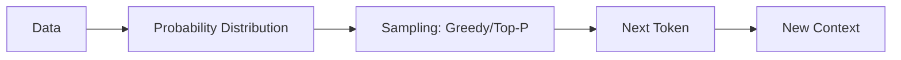

# Probability and Statistics for LLMs

## 1. Beginner-friendly Hinglish Explanation 🇮🇳
Bhai, LLM koi magic machine nahi hai, yeh ek **"Probability Machine"** hai. Jab tum "Hello" likhte ho, toh model check karta hai ki uske training data mein "Hello" ke baad "World" aane ke kitne chances hain. Statistics humein batati hai ki data mein patterns kaise find karne hain aur Probability humein batati hai ki un patterns ke base par "Guess" kaise lagana hai. Bina iske, LLM sirf random words fekega.

---

## 2. Deep Technical Explanation
LLMs are probabilistic graphical models at scale.
- **Joint Probability**: Probability of a sequence $P(w_1, w_2, ..., w_n)$.
- **Conditional Probability**: $P(w_n | w_1, ..., w_{n-1})$ - the core of next-token prediction.
- **Bayes' Theorem**: Updating our belief about a token given new context.
- **Distributions**: Understanding Softmax outputs as a probability distribution over the vocabulary.

---

## 3. Mathematical Intuition
The model predicts the next token by sampling from a distribution:
$$P(x_{t+1} | x_{1:t}) = \text{Softmax}(f(x_{1:t}))$$
The **Perplexity** (a key evaluation metric) is derived from the exponential of the average negative log-likelihood:
$$PP(S) = \exp\left(-\frac{1}{N} \sum_{i=1}^N \log P(w_i | w_{<i})\right)$$

---

## 4. Architecture Diagrams


---

## 5. Production-ready Examples
```python
import torch
import torch.nn.functional as F

logits = torch.tensor([1.0, 2.0, 5.0, 0.5]) # Raw scores
probs = F.softmax(logits, dim=-1) # Probabilities: [0.015, 0.041, 0.932, 0.012]

# Sampling with Top-P (Nucleus Sampling)
def nucleus_sampling(probs, p=0.9):
    sorted_probs, indices = torch.sort(probs, descending=True)
    cumulative_probs = torch.cumsum(sorted_probs, dim=-1)
    # Filter
    sorted_indices_to_remove = cumulative_probs > p
    sorted_probs[sorted_indices_to_remove] = 0
    return torch.multinomial(sorted_probs / sorted_probs.sum(), 1)
```

---

## 6. Real-world Use Cases
- **Hallucination Detection**: Using entropy to see when the model is "unsure".
- **Confidence Scoring**: Deciding whether to show an answer to a user.
- **A/B Testing**: Statistical significance in model performance.

---

## 7. Failure Cases
- **Overconfidence**: High probability for wrong facts.
- **Sampling Bias**: Model getting stuck in repetitive loops due to bad probability weightage.

---

## 8. Debugging Guide
1. Check **Entropy**: If entropy is too high, the model is confused.
2. Monitor **Loss Curves**: Smooth descent in log-loss indicates healthy probabilistic learning.

---

## 9. Tradeoffs
| Method | Accuracy | Diversity |
|---|---|---|
| Greedy | High | Zero |
| Sampling | Medium | High |

---

## 10. Security Concerns
- **Data Leakage**: Models memorizing rare (low probability) but sensitive tokens.

---

## 11. Scaling Challenges
- **Large Vocab**: Computing softmax over 100k+ tokens is expensive.

---

## 12. Cost Considerations
- **Search Algorithms**: Beam search is $O(k \cdot n)$ more expensive than simple sampling.

---

## 13. Best Practices
- Always use **Bias Correction** in optimizers.
- Use **Temperature** to flatten or sharpen the distribution.

---

## 14. Interview Questions
1. What is Perplexity and how does it relate to Entropy?
2. Explain the difference between Joint and Conditional probability in LLMs.

---

## 15. Latest 2026 Patterns
- **Calibrated LLMs**: Models that "know what they don't know" using advanced statistical calibration.
