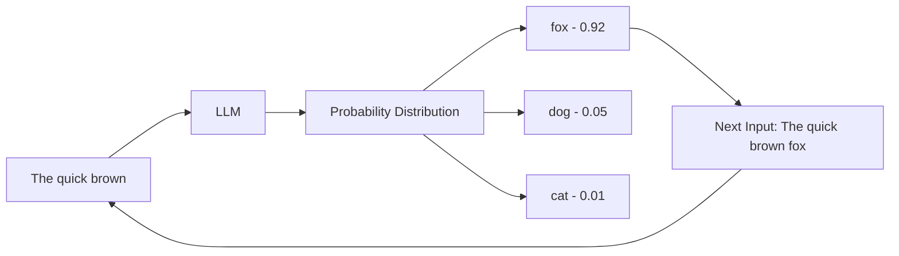

# Language Modeling: The Heart of LLMs

## 1. Beginner-friendly Hinglish Explanation 🇮🇳
Bhai, "Language Modeling" sunne mein bada technical lagta hai, par iska matlab bohot simple hai: **"Agla word kya hoga?"** predict karna.

Socho tum WhatsApp par "I am" likhte ho aur upar suggestions aate hain "fine", "going", "busy". Wahi suggestion engine ek primitive Language Model hai. LLMs wahi engine hain, bas wo itne powerful ho gaye hain ki wo sirf ek word nahi, balki poora code block ya story predict kar dete hain. Unhe duniya bhar ka text dikha kar yeh seekhaya gaya hai ki "Language ke patterns kya hain".

---

## 2. Deep Technical Explanation
Language Modeling is the task of estimating the probability distribution over sequences of words or tokens. There are two main types:
- **Causal Language Modeling (CLM)**: Predicts the next token $x_t$ given $x_{1...t-1}$. This is the "Generative" part (e.g., GPT).
- **Masked Language Modeling (MLM)**: Predicts a hidden ("masked") token given the context on both sides. This is the "Understanding" part (e.g., BERT).
- **Auto-regressive property**: The model generates one token at a time and feeds it back into the input to generate the next.

---

## 3. Mathematical Intuition
A Language Model computes the joint probability of a sequence $w_1, ..., w_T$:
$$P(w_1, ..., w_T) = \prod_{t=1}^T P(w_t | w_{1...t-1})$$

In deep learning, we use a softmax over the vocabulary $V$ to get this probability:
$$P(w_t | \text{context}) = \frac{\exp(h_t \cdot e_{w_t})}{\sum_{w \in V} \exp(h_t \cdot e_w)}$$
where $h_t$ is the hidden state (context representation) and $e_{w}$ is the embedding for word $w$.

---

## 4. Architecture Diagrams


---

## 5. Production-ready Examples
Implementing a basic "Greedy" and "Top-K" sampling loop:

```python
import torch
import torch.nn.functional as F

def sample_next_token(logits, method="top_k", k=50, temperature=1.0):
    # Apply temperature
    logits = logits / temperature
    
    if method == "greedy":
        return torch.argmax(logits, dim=-1)
    
    if method == "top_k":
        # Keep only the top k tokens
        values, indices = torch.topk(logits, k)
        logits[logits < values[..., -1, None]] = -float('Inf')
        
        # Sample from the filtered distribution
        probs = F.softmax(logits, dim=-1)
        return torch.multinomial(probs, num_samples=1)
```

---

## 6. Real-world Use Cases
- **Autosuggest**: Email and chat completions.
- **Translation**: Modeling the "target language" to ensure fluency.
- **Code Completion**: Predicting the next line of code based on existing context.
- **Zero-shot Task Solving**: Re-framing every task (classification, summary) as a "next word" prediction problem.

---

## 7. Failure Cases
- **Repetitive Loops**: "The cat sat on the mat on the mat on the mat..." (Lack of diversity).
- **Drift**: Over a long sequence, the model forgets the original topic.
- **Probability Smearing**: Giving high probability to nonsensical but grammatically correct words.

---

## 8. Debugging Guide
1. **Perplexity**: A low perplexity means the model is "less surprised" by the data. If perplexity is high, your data or training is wrong.
2. **Logit Visualization**: Plot the softmax distribution. If one word has 0.99 probability constantly, your model might be overfitted.
3. **EOS Handling**: Check if the model is correctly generating the `<|endoftext|>` token.

---

## 9. Tradeoffs
| Feature | Greedy Search | Beam Search | Nucleus (Top-P) Sampling |
|---------|---------------|-------------|--------------------------|
| Quality | Low           | High        | Very High (Creative)     |
| Speed   | Very Fast     | Slow        | Fast                     |
| Diversity| None         | Low         | High                     |

---

## 10. Security Concerns
- **Data Memorization**: The model might "model" a private API key or password that was in its training set.
- **Poisoning**: Injecting specific patterns into the modeling data to trigger malicious outputs.

---

## 11. Scaling Challenges
- **Vocabulary Size**: Large vocab (100k+ tokens) increases the final layer size significantly.
- **Context Length**: The complexity of modeling the "context" grows quadratically with length in Transformers.

---

## 12. Cost Considerations
- **Training Tokens**: Modeling "trillions" of tokens requires months of compute.
- **Inference Sampling**: Complex sampling (Beam Search) can be 5-10x more expensive than greedy.

---

## 13. Best Practices
- **Use Dynamic Temperature**: High for creative tasks, low for factual tasks.
- **Entropy Monitoring**: If the model's prediction entropy drops to zero, it's getting stuck.
- **Pre-train on High Quality**: Garbage in, Garbage out applies heavily to Language Modeling.

---

## 14. Interview Questions
1. What is the difference between Auto-regressive and Auto-encoding models?
2. How do you calculate Perplexity, and what does it represent?
3. Why do we use Cross-Entropy loss for Language Modeling?
4. Explain the "Exposure Bias" in training vs inference.

---

## 15. Latest 2026 LLM Engineering Patterns
- **Contrastive Decoding**: Comparing a large model's output with a small model's "bad" output to enhance quality.
- **Test-Time Training (TTT)**: Updating the model's "context memory" during inference to model new information perfectly.
- **Guided Generation**: Using grammar constraints (JSON schema) to force the language model into specific output formats.
