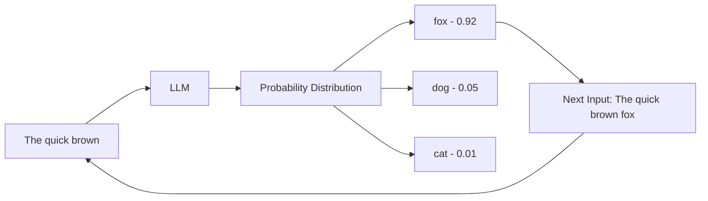

# Language Modeling: LLMs Ka Dil

## 1. Beginner-friendly Hinglish Explanation 🇮🇳
Bhai, "Language Modeling" sunne mein bada technical lagta hai, par iska matlab bohot simple hai: **"Agla word kya hoga?"** predict karna.

Socho tum WhatsApp par "I am" likhte ho aur upar suggestions aate hain "fine", "going", "busy". Wahi suggestion engine ek primitive Language Model hai. LLMs wahi engine hain, bas wo itne powerful ho gaye hain ki wo sirf ek word nahi, balki poora code block ya story predict kar dete hain. Unhe duniya bhar ka text dikha kar yeh seekhaya gaya hai ki "Language ke patterns kya hain".

---

## 2. Gehra Technical Explanation
Language Modeling ka task hai words ya tokens ke sequences par probability distribution estimate karna. Yeh do main types hain:
- **Causal Language Modeling (CLM)**: $x_{1...t-1}$ ke base pe agla token $x_t$ predict karta hai. Yeh "Generative" part hai (e.g., GPT).
- **Masked Language Modeling (MLM)**: Dono taraf ke context ke base pe ek hidden ("masked") token predict karta hai. Yeh "Understanding" part hai (e.g., BERT).
- **Auto-regressive property**: Model ek token ek time pe generate karta hai aur use wapas input mein daal kar agla generate karta hai.

---

## 3. Mathematical Intuition
Ek Language Model sequence $w_1, ..., w_T$ ki joint probability compute karta hai:
$$P(w_1, ..., w_T) = \prod_{t=1}^T P(w_t | w_{1...t-1})$$

Deep learning mein, hum vocabulary $V$ par softmax use karte hain yeh probability pane ke liye:
$$P(w_t | \text{context}) = \frac{\exp(h_t \cdot e_{w_t})}{\sum_{w \in V} \exp(h_t \cdot e_w)}$$
Jahan $h_t$ hidden state (context representation) hai aur $e_{w}$ word $w$ ke liye embedding hai.

---

## 4. Architecture Diagrams

```mermaid
graph LR
    Input[The quick brown] --> Model[LLM]
    Model --> Prob[Probability Distribution]
    Prob --> Word1[fox - 0.92]
    Prob --> Word2[dog - 0.05]
    Prob --> Word3[cat - 0.01]
    Word1 --> Feedback[Next Input: The quick brown fox]
    Feedback --> Input
```

---

## 5. Production-ready Examples
Ek basic "Greedy" aur "Top-K" sampling loop implement karna:

```python
import torch
import torch.nn.functional as F

def sample_next_token(logits, method="top_k", k=50, temperature=1.0):
    # Apply temperature
    logits = logits / temperature
    
    if method == "greedy":
        return torch.argmax(logits, dim=-1)
    
    if method == "top_k":
        # Keep only the top k tokens
        values, indices = torch.topk(logits, k)
        logits[logits < values[..., -1, None]] = -float('Inf')
        
        # Sample from the filtered distribution
        probs = F.softmax(logits, dim=-1)
        return torch.multinomial(probs, num_samples=1)
```

---

## 6. Real-world Use Cases
- **Autosuggest**: Email aur chat completions.
- **Translation**: Fluency ensure karne ke liye "target language" modeling.
- **Code Completion**: Existing context ke base pe next line of code predict karna.
- **Zero-shot Task Solving**: Har task (classification, summary) ko "next word" prediction problem ki tarah re-frame karna.

---

## 7. Failure Cases
- **Repetitive Loops**: "The cat sat on the mat on the mat on the mat..." (Diversity ki kami).
- **Drift**: Lambi sequence mein model original topic bhool jata hai.
- **Probability Smearing**: Nonsensical lekin grammatically correct words ko high probability dena.

---

## 8. Debugging Guide
1. **Perplexity**: Low perplexity ka matlab model data se "less surprised" hai. Agar perplexity high hai, toh data ya training galat hai.
2. **Logit Visualization**: Softmax distribution plot karo. Agar koi word lagatar 0.99 probability dikhata hai, toh model overfitted ho sakta hai.
3. **EOS Handling**: Check karo ki model `<|endoftext|>` token sahi se generate kar raha hai ya nahi.

---

## 9. Tradeoffs
| Feature | Greedy Search | Beam Search | Nucleus (Top-P) Sampling |
|---------|---------------|-------------|--------------------------|
| Quality | Kam | Zyada | Bahut Zyada (Creative) |
| Speed   | Bahut Tej | Dheema | Tej |
| Diversity| Koi Nahi | Kam | Zyada |

---

## 10. Security Concerns
- **Data Memorization**: Model apne training set mein koi private API key ya password ko "model" kar sakta hai.
- **Poisoning**: Modeling data mein specific patterns daal kar malicious outputs trigger karna.

---

## 11. Scaling Challenges
- **Vocabulary Size**: Bada vocab (100k+ tokens) final layer size ko significantly increase karta hai.
- **Context Length**: Transformers mein "context" modeling ki complexity length ke saath quadratically badhti hai.

---

## 12. Cost Considerations
- **Training Tokens**: "Trillions" tokens modeling ke liye months of compute chahiye.
- **Inference Sampling**: Complex sampling (Beam Search) greedy se 5-10x zyada expensive ho sakta hai.

---

## 13. Best Practices
- **Use Dynamic Temperature**: Creative tasks ke liye high, factual tasks ke liye low.
- **Entropy Monitoring**: Agar model ki prediction entropy zero ho jaye, toh wo stuck ho raha hai.
- **Pre-train on High Quality**: Garbage in, Garbage out Language Modeling par heavily apply hota hai.

---

## 14. Interview Questions
1. Auto-regressive aur Auto-encoding models mein kya difference hai?
2. Aap Perplexity kaise calculate karte hain, aur yeh kya represent karta hai?
3. Hum Language Modeling ke liye Cross-Entropy loss kyun use karte hain?
4. Training vs inference mein "Exposure Bias" explain karo.

---

## 15. Latest 2026 LLM Engineering Patterns
- **Contrastive Decoding**: Quality enhance karne ke liye bade model ke output ko chhote model ke "bad" output se compare karna.
- **Test-Time Training (TTT)**: Inference ke dauran model ki "context memory" update karna taaki nayi information perfectly model ho.
- **Guided Generation**: Language model ko specific output formats mein force karne ke liye grammar constraints (JSON schema) use karna.