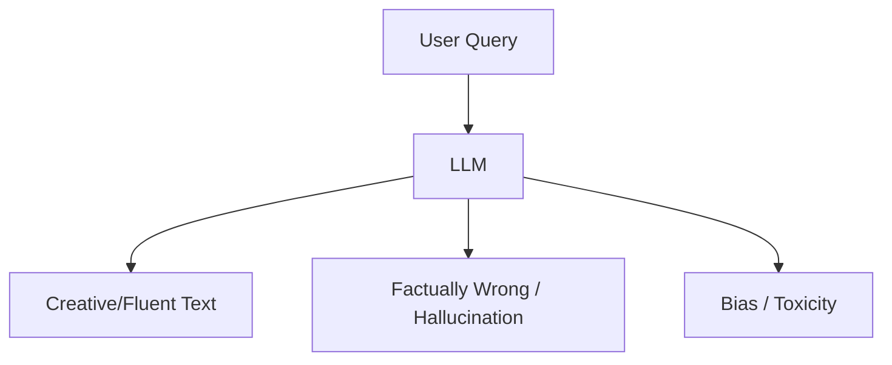

# NLP Limitations: What LLMs Still Can't Do

## 1. Beginner-friendly Hinglish Explanation 🇮🇳
Bhai, LLM bohot smart lagte hain, lekin woh insaan nahi hain. Woh sirf "Patterns" samajhte hain, "Meaning" nahi. 

Socho ek tota (parrot) jo "Main ek chor hoon" bolna seekh gaya. Kya use pata hai ki 'chor' kya hota hai? Nahi. LLMs ke saath bhi yahi problem hai. Woh facts mein galti kar dete hain (Hallucination), unhe "Common Sense" ki kami hoti hai, aur woh aksar bias dikhate hain. Yeh limitations samajhna ek engineer ke liye bohot zaroori hai taaki woh model par aankh band karke bharosa na kare.

---

## 2. Deep Technical Explanation
Despite the success of Transformers, NLP models face fundamental hurdles:
- **Hallucinations**: Generating plausible but factually incorrect information.
- **Lack of Grounding**: Models only know "Text", they don't have physical world experience (unless multimodal).
- **Reasoning Gaps**: LLMs often fail at simple logic or multi-step math if not prompted correctly (Chain of Thought).
- **Data Bias**: Models inherit prejudices present in the internet data they were trained on.

---

## 3. Mathematical Intuition
The **Maximum Likelihood Estimation (MLE)** objective used in training encourages the model to be "Average". If the training data says "The sky is blue" 90% of the time and "The sky is green" 10% of the time, the model will be uncertain and might "hallucinate" a mix.
$$P(y|x) = \text{Average over diverse opinions in training data}$$
This leads to "Regression to the mean" rather than absolute truth.

---

## 4. Architecture Diagrams


---

## 5. Production-ready Examples
Using a "Guardrail" to catch common limitations:

```python
# Simple factual check example
def validate_output(llm_output, ground_truth_facts):
    for fact in ground_truth_facts:
        if fact not in llm_output:
            return False, "Missing Fact"
    return True, "Valid"

# In production, use libraries like Guardrails AI or NeMo Guardrails.
```

---

## 6. Real-world Use Cases
- **Legal/Medical**: Where hallucination can lead to life-threatening or legal consequences.
- **Coding**: Models suggesting deprecated or insecure libraries.

---

## 7. Failure Cases
- **Arithmetic**: "What is 98723 * 123?" (Model might guess the number of digits correctly but get the last few digits wrong).
- **Temporal Knowledge**: "Who is the Prime Minister of UK?" (Might give an answer from 2 years ago if the data is old).

---

## 8. Debugging Guide
1. **Red Teaming**: Actively try to make the model fail using edge cases.
2. **Confidence Calibration**: Check if the model's self-reported confidence matches its accuracy.

---

## 9. Tradeoffs
| Factor | Safety | Creativity |
|---|---|---|
| High Guardrails | Boring/Refusals | Low Hallucination |
| No Guardrails | Fun/Creative | Dangerous/Wrong |

---

## 10. Security Concerns
- **Prompt Injection**: Tricking the model into ignoring its safety training.
- **Social Engineering**: Using LLMs to create highly personalized phishing attacks at scale.

---

## 11. Scaling Challenges
- **The Intelligence Plateau**: Simply adding more parameters might not solve fundamental reasoning issues.

---

## 12. Cost Considerations
- **Human Evaluation**: Measuring limitations requires expensive human experts (RLHF).

---

## 13. Best Practices
- **Human-in-the-loop**: Never let an LLM make critical decisions without human oversight.
- **RAG**: Use Retrieval Augmented Generation to ground the model in real, updated facts.

---

## 14. Interview Questions
1. Why do LLMs hallucinate, and how can we mitigate it?
2. Explain the "Data Contamination" problem in LLM evaluation.

---

## 15. Latest 2026 Patterns
- **World Models**: Building models that have an internal simulation of the physical world (Video models) to reduce hallucinations about reality.
- **Self-Correction**: Models like o1 that use RL to "Reflect" and fix their own errors before showing the final answer.
