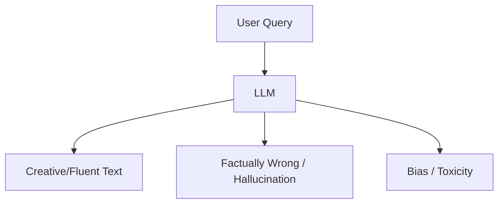

# NLP Limitations: LLMs abhi bhi kya nahi kar sakte hain?

## 1. Beginner-friendly Hinglish Explanation 🇮🇳
Bhai, LLM bohot smart lagte hain, lekin woh insaan nahi hain. Woh sirf "Patterns" samajhte hain, "Meaning" nahi. 

Socho ek tota (parrot) jo "Main ek chor hoon" bolna seekh gaya. Kya use pata hai ki 'chor' kya hota hai? Nahi. LLMs ke saath bhi yahi problem hai. Woh facts mein galti kar dete hain (Hallucination), unhe "Common Sense" ki kami hoti hai, aur woh aksar bias dikhate hain. Yeh limitations samajhna ek engineer ke liye bohot zaroori hai taaki woh model par aankh band karke bharosa na kare.

---

## 2. Deep Technical Explanation
Transformers ki safalta ke bawajood, NLP models kuch fundamental hurdles face karte hain:
- **Hallucinations**: Plausible lekin factually galat information generate karna.
- **Lack of Grounding**: Models sirf "Text" ko jaante hain, unke paas physical world experience nahi hai (unless multimodal ho).
- **Reasoning Gaps**: LLMs aksar simple logic ya multi-step math mein fail ho jaate hain agar sahi prompting na ho (Chain of Thought).
- **Data Bias**: Models un prejudices ko inherit karte hain jo internet data mein present hain jis par woh trained the.

---

## 3. Mathematical Intuition
Training mein istemal hone wala **Maximum Likelihood Estimation (MLE)** objective model ko "Average" hone ke liye encourage karta hai. Agar training data 90% baar "The sky is blue" aur 10% baar "The sky is green" kahte hain, to model uncertain hoga aur ek mix "hallucinate" kar sakta hai.
$$P(y|x) = \text{Average over diverse opinions in training data}$$
Yeh "Regression to the mean" ki taraf le jaata hai, absolute truth ke bajaye.

---

## 4. Architecture Diagrams

```mermaid
graph TD
    Input[User Query] --> Model[LLM]
    Model --> Good[Creative/Fluent Text]
    Model --> Bad[Factually Wrong / Hallucination]
    Model --> Ugly[Bias / Toxicity]
```

---

## 5. Production-ready Examples
Common limitations ko catch karne ke liye ek "Guardrail" ka istemal karte hain:

```python
# Simple factual check example
def validate_output(llm_output, ground_truth_facts):
    for fact in ground_truth_facts:
        if fact not in llm_output:
            return False, "Missing Fact"
    return True, "Valid"

# In production, use libraries like Guardrails AI or NeMo Guardrails.
```

---

## 6. Real-world Use Cases
- **Legal/Medical**: Jahan hallucination life-threatening ya legal consequences ka cause ban sakta hai.
- **Coding**: Models deprecated ya insecure libraries suggest karte hain.

---

## 7. Failure Cases
- **Arithmetic**: "What is 98723 * 123?" (Model digits ka number sahi guess kar sakta hai lekin aakhri kuch digits galat kar deta hai.)
- **Temporal Knowledge**: "Who is the Prime Minister of UK?" (Agar data purana hai toh 2 saal pehle ka jawab de sakta hai.)

---

## 8. Debugging Guide
1. **Red Teaming**: Edge cases ka istemal karke model ko fail karne ki koshish karna.
2. **Confidence Calibration**: Check karna ki model ka self-reported confidence uski accuracy se match karta hai ya nahi.

---

## 9. Tradeoffs
| Factor | Safety | Creativity |
|---|---|---|
| High Guardrails | Boring/Refusals | Low Hallucination |
| No Guardrails | Fun/Creative | Dangerous/Wrong |

---

## 10. Security Concerns
- **Prompt Injection**: Model ko uski safety training ko ignore karne mein trick karna.
- **Social Engineering**: LLMs ka istemal karke bade scale par highly personalized phishing attacks banana.

---

## 11. Scaling Challenges
- **The Intelligence Plateau**: Bas aur parameters add karne se fundamental reasoning issues solve nahi hote.

---

## 12. Cost Considerations
- **Human Evaluation**: Limitations ko measure karne ke liye expensive human experts (RLHF) ki zaroorat hoti hai.

---

## 13. Best Practices
- **Human-in-the-loop**: Kabhi bhi LLM ko bina human oversight ke critical decisions lene na den.
- **RAG**: Model ko real, updated facts mein ground karne ke liye Retrieval Augmented Generation (RAG) ka istemal karein.

---

## 14. Interview Questions
1. LLMs hallucinate kyun karte hain, aur hum ise kaise mitigate kar sakte hain?
2. LLM evaluation mein "Data Contamination" problem ko samjhao.

---

## 15. Latest 2026 Patterns
- **World Models**: Aise models banana jinke paas physical world ka internal simulation ho (Video models) taaki reality ke baare mein hallucinations kam ho.
- **Self-Correction**: Models jaise o1 jo RL ka istemal karte hain "Reflect" karne aur apne errors theek karne ke liye final answer dikhane se pehle.