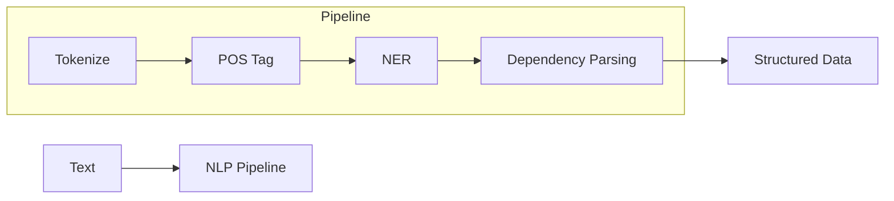

# Natural Language Processing (NLP) Overview

## 1. Beginner-friendly Hinglish Explanation 🇮🇳
Bhai, NLP (Natural Language Processing) woh technology hai jo computer ko humari "Human Language" samajhne aur bolne mein madad karti hai. 

Pehle computer sirf numbers samajhte the (0 aur 1). NLP ne unhe sikhaya ki "Apple" ka matlab sirf ek phal nahi, balki ek company bhi ho sakti hai. Yeh safar **Rule-based systems** (agar 'bye' dikhe toh 'goodbye' bolo) se shuru hokar aaj ke **LLMs** tak pahuncha hai. NLP ke bina, AI sirf ek calculator hota.

---

## 2. Deep Technical Explanation
NLP combines computational linguistics with statistical, machine learning, and deep learning models.
- **Core Tasks**: Tokenization, POS Tagging, Named Entity Recognition (NER), Sentiment Analysis.
- **Syntactic Analysis**: Understanding grammar and structure.
- **Semantic Analysis**: Understanding meaning and context.
- **Evolution**: From N-grams and HMMs to LSTMs and finally Transformers.

---

## 3. Mathematical Intuition
Traditional NLP used **TF-IDF** (Term Frequency-Inverse Document Frequency) to weigh words:
$$W_{i,j} = tf_{i,j} \times \log\left(\frac{N}{df_i}\right)$$
This quantified how "important" a word was to a document. Modern NLP uses **Distributed Representations** (Embeddings) where words are vectors in a continuous space.

---

## 4. Architecture Diagrams


---

## 5. Production-ready Examples
Using `spaCy` for traditional NLP tasks:

```python
import spacy

# Load modern English pipeline
nlp = spacy.load("en_core_web_md")

text = "Apple is looking at buying U.K. startup for $1 billion"
doc = nlp(text)

for ent in doc.ents:
    print(f"Entity: {ent.text}, Label: {ent.label_}")
    # Output: Apple (ORG), U.K. (GPE), $1 billion (MONEY)
```

---

## 6. Real-world Use Cases
- **Spam Detection**: Gmail filtering emails.
- **Translation**: Google Translate.
- **Search Engines**: Understanding user intent.

---

## 7. Failure Cases
- **Sarcasm**: "Oh great, another meeting!" (Traditional NLP might think it's positive).
- **Ambiguity**: "I saw the man with the telescope" (Who has the telescope?).

---

## 8. Debugging Guide
1. Check **Stopword removal**: Sometimes removing 'not' flips the sentiment.
2. Verify **Lemmatization**: Ensure 'running' and 'ran' map to 'run' correctly.

---

## 9. Tradeoffs
| Method | Speed | Accuracy |
|---|---|---|
| Rule-based | Instant | Low |
| Deep Learning | Slow | High |

---

## 10. Security Concerns
- **Adversarial attacks**: Adding "noise" to text to fool a classifier.

---

## 11. Scaling Challenges
- **Language Coverage**: Most NLP tools work great for English, but struggle with "Low-resource" languages like Bhojpuri or Swahili.

---

## 12. Cost Considerations
- **Preprocessing overhead**: Running a heavy NLP pipeline on millions of documents can be expensive in terms of CPU time.

---

## 13. Best Practices
- Use **Pre-trained models** instead of building from scratch.
- Always **Normalize** text (lowercase, remove extra spaces).

---

## 14. Interview Questions
1. What is the difference between Stemming and Lemmatization?
2. Explain the intuition behind TF-IDF.

---

## 15. Latest 2026 Patterns
- **LLM-assisted NLP**: Using LLMs to generate high-quality labeled data for smaller, specialized NLP models.
