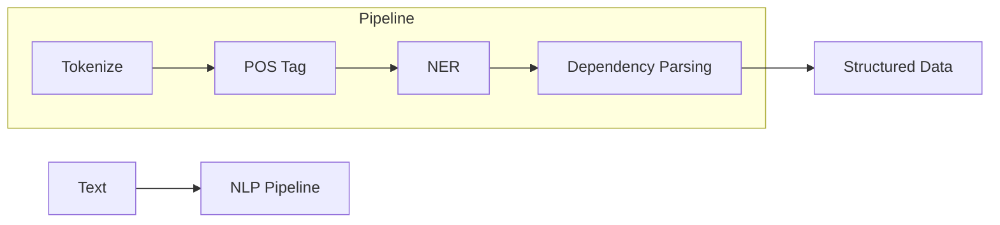

# Natural Language Processing (NLP) Overview

## 1. Beginner-friendly Hinglish Explanation 🇮🇳
Bhai, NLP (Natural Language Processing) woh technology hai jo computer ko humari "Human Language" samajhne aur bolne mein madad karti hai. 

Pehle computer sirf numbers samajhte the (0 aur 1). NLP ne unhe sikhaya ki "Apple" ka matlab sirf ek phal nahi, balki ek company bhi ho sakti hai. Yeh safar **Rule-based systems** (agar 'bye' dikhe toh 'goodbye' bolo) se shuru hokar aaj ke **LLMs** tak pahuncha hai. NLP ke bina, AI sirf ek calculator hota.

---

## 2. Deep Technical Explanation
NLP computational linguistics ko statistical, machine learning, aur deep learning models ke saath combine karta hai.
- **Core Tasks**: Tokenization, POS Tagging, Named Entity Recognition (NER), Sentiment Analysis.
- **Syntactic Analysis**: Grammar aur structure ko samajhna.
- **Semantic Analysis**: Meaning aur context ko samajhna.
- **Evolution**: From N-grams and HMMs to LSTMs and finally Transformers.

---

## 3. Mathematical Intuition
Traditional NLP **TF-IDF** (Term Frequency-Inverse Document Frequency) use karta tha words weigh karne ke liye:
$$W_{i,j} = tf_{i,j} \times \log\left(\frac{N}{df_i}\right)$$
Yeh quantify karta tha ki ek word document ke liye kitna "important" tha. Modern NLP **Distributed Representations** (Embeddings) use karta hai jahan words continuous space mein vectors hote hain.

---

## 4. Architecture Diagrams

```mermaid
graph LR
    Input[Text] --> Pipe[NLP Pipeline]
    subgraph "Pipeline"
        Tok[Tokenize] --> POS[POS Tag]
        POS --> NER[NER]
        NER --> Dep[Dependency Parsing]
    end
    Dep --> Output[Structured Data]
```

---

## 5. Production-ready Examples
Traditional NLP tasks ke liye `spaCy` use karte hain:

```python
import spacy

# Load modern English pipeline
nlp = spacy.load("en_core_web_md")

text = "Apple is looking at buying U.K. startup for $1 billion"
doc = nlp(text)

for ent in doc.ents:
    print(f"Entity: {ent.text}, Label: {ent.label_}")
    # Output: Apple (ORG), U.K. (GPE), $1 billion (MONEY)
```

---

## 6. Real-world Use Cases
- **Spam Detection**: Gmail emails filter karta hai.
- **Translation**: Google Translate.
- **Search Engines**: User intent ko samajhna.

---

## 7. Failure Cases
- **Sarcasm**: "Oh great, another meeting!" (Traditional NLP ise positive samajh sakta hai).
- **Ambiguity**: "I saw the man with the telescope" (Durbin kis ke paas hai?).

---

## 8. Debugging Guide
- **Stopword removal**: Kabhi kabhi 'not' hatane se sentiment palat sakta hai.
- **Lemmatization**: Dhyaan rakhein ki 'running' aur 'ran' 'run' mein sahi se map ho.

---

## 9. Tradeoffs
| Method | Speed | Accuracy |
|---|---|---|
| Rule-based | Instant | Low |
| Deep Learning | Slow | High |

---

## 10. Security Concerns
- **Adversarial attacks**: Text mein "noise" daal kar classifier ko fool karna.

---

## 11. Scaling Challenges
- **Language Coverage**: Zyada tar NLP tools English ke liye accha work karte hain, lekin "Low-resource" languages jaise Bhojpuri ya Swahili mein struggle karte hain.

---

## 12. Cost Considerations
- **Preprocessing overhead**: Lakhon documents par heavy NLP pipeline chalaana CPU time ke hisaab se mehnga ho sakta hai.

---

## 13. Best Practices
- **Pre-trained models** use karein, scratch se banane ke bajaye.
- Hamesha text ko **Normalize** karein (lowercase karein, extra spaces hata dein).

---

## 14. Interview Questions
1. Stemming aur Lemmatization mein kya antar hai?
2. TF-IDF ke peeche kya intuition hai? Samjhaayein.

---

## 15. Latest 2026 Patterns
- **LLM-assisted NLP**: LLMs ka use karke chhote, specialized NLP models ke liye high-quality labeled data generate karna.