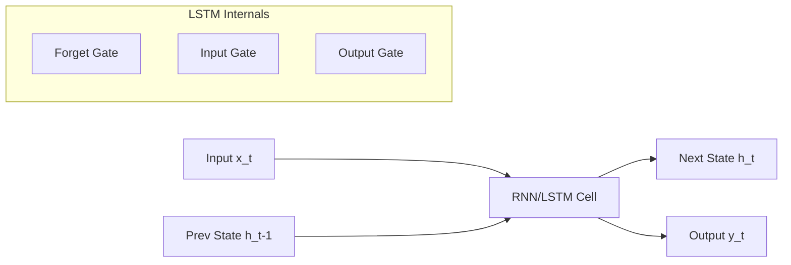

# Sequence Models: From RNNs to LSTMs

## 1. Beginner-friendly Hinglish Explanation 🇮🇳
Bhai, socho tum ek movie dekh rahe ho. Agar tum har frame ko pichle frame se alag dekhoge, toh tumhe story samajh nahi aayegi. Language bhi aisi hi hai. Har word pichle word par depend karta hai.

**Sequence Models** woh purane models hain jo words ko "ek-ek karke" padhte the aur ek "Memory" (Hidden State) banate the. **RNNs** (Recurrent Neural Networks) pehle aaye, lekin woh bohot jaldi cheezein bhool jate the (Short-term memory). Phir aaye **LSTMs**, jo thoda zyada yaad rakh sakte the. Yeh Transformers ke purvaj (ancestors) hain.

---

## 2. Deep Technical Explanation
Sequence models are designed to handle data where order matters.
- **RNN (Recurrent Neural Network)**: Uses a loop to pass information from one step to the next. The state $h_t = \sigma(W_{hh}h_{t-1} + W_{xh}x_t)$.
- **LSTM (Long Short-Term Memory)**: Introduces "Gates" (Input, Forget, Output) and a "Cell State" to control the flow of information and solve the vanishing gradient problem.
- **GRU (Gated Recurrent Unit)**: A simpler version of LSTM with fewer gates.

---

## 3. Mathematical Intuition
The core problem with RNNs is the **Vanishing Gradient**. Since $h_t$ is computed by repeated multiplication of weights, if weights are small, the gradient for early steps becomes nearly zero:
$$\frac{\partial h_t}{\partial h_1} = \prod_{k=2}^t \frac{\partial h_k}{\partial h_{k-1}}$$
LSTM solves this by using the **Constant Error Carousel** (Cell State), allowing gradients to flow unchanged via addition instead of multiplication.

---

## 4. Architecture Diagrams


---

## 5. Production-ready Examples
Using `PyTorch` for a simple LSTM:

```python
import torch
import torch.nn as nn

# (batch_size, seq_len, input_size)
input_data = torch.randn(32, 10, 512) 

# LSTM with 512 input dim and 1024 hidden dim
lstm = nn.LSTM(input_size=512, hidden_size=1024, num_layers=2, batch_first=True)

output, (h_n, c_n) = lstm(input_data)

print(f"Output shape: {output.shape}") # [32, 10, 1024]
print(f"Final Hidden State: {h_n.shape}") # [2, 32, 1024]
```

---

## 6. Real-world Use Cases
- **Time Series Forecasting**: Predicting stock prices or weather.
- **Speech Recognition**: Converting audio frames (a sequence) to text.
- **Legacy Machine Translation**: Before Transformers took over.

---

## 7. Failure Cases
- **Sequential Bottleneck**: Cannot process words in parallel (unlike Transformers).
- **Forgetting**: Even LSTMs struggle with sequences longer than ~1000 tokens.

---

## 8. Debugging Guide
1. **Gradient Clipping**: Essential for RNNs to prevent exploding gradients.
2. **Hidden State Initialization**: Always initialize with zeros or learnable parameters, not random noise.

---

## 9. Tradeoffs
| Model | Parallelization | Long-range Memory |
|---|---|---|
| RNN | No | Poor |
| LSTM | No | Medium |
| Transformer | Yes | Excellent |

---

## 10. Security Concerns
- **State Manipulation**: If an attacker can control the hidden state, they can alter the model's "memory" across steps.

---

## 11. Scaling Challenges
- **Speed**: Training is $O(N)$ sequential, making it 10-100x slower to train than Transformers on large datasets.

---

## 12. Cost Considerations
- **Training Time**: High GPU hours due to lack of parallelization.

---

## 13. Best Practices
- For modern LLMs, **don't use RNNs**. Use them only for low-latency time-series tasks.
- Use **Bidirectional** LSTMs for tasks where the future context is available (like classification).

---

## 14. Interview Questions
1. Why do LSTMs use a "Forget Gate"?
2. Explain the Vanishing Gradient problem in simple RNNs.

---

## 15. Latest 2026 Patterns
- **Mamba & SSMs**: The "Return of Sequences". Modern State Space Models like Mamba combine the speed of Transformers (parallel training) with the infinite memory/speed of RNNs (linear inference).
