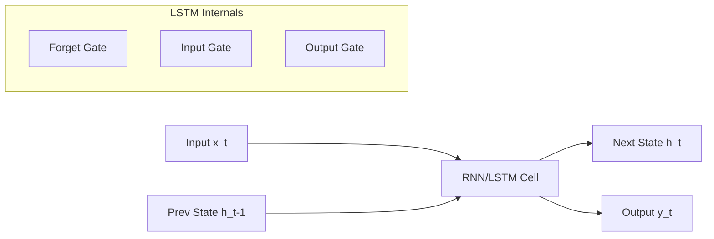

# Sequence Models: RNNs se LSTMs tak

## 1. Beginner-friendly Hinglish Explanation 🇮🇳
Bhai, socho tum ek movie dekh rahe ho. Agar tum har frame ko pichle frame se alag dekhoge, toh tumhe story samajh nahi aayegi. Language bhi aisi hi hai. Har word pichle word par depend karta hai.

**Sequence Models** woh purane models hain jo words ko "ek-ek karke" padhte the aur ek "Memory" (Hidden State) banate the. **RNNs** (Recurrent Neural Networks) pehle aaye, lekin woh bohot jaldi cheezein bhool jate the (Short-term memory). Phir aaye **LSTMs**, jo thoda zyada yaad rakh sakte the. Yeh Transformers ke purvaj (ancestors) hain.

---

## 2. Deep Technical Explanation
Sequence models aise data handle karne ke liye bane hain jahan order important hota hai.
- **RNN (Recurrent Neural Network)**: Ek loop use karta hai information ko ek step se doosre step pass karne ke liye. State $h_t = \sigma(W_{hh}h_{t-1} + W_{xh}x_t)$.
- **LSTM (Long Short-Term Memory)**: "Gates" (Input, Forget, Output) aur ek "Cell State" introduce karta hai information flow ko control karne aur Vanishing Gradient problem solve karne ke liye.
- **GRU (Gated Recurrent Unit)**: LSTM ka simpler version hai jisme gates kam hote hain.

---

## 3. Mathematical Intuition
RNNs ki sabse badi problem hai **Vanishing Gradient**. Kyunki $h_t$ repeated multiplication of weights se compute hota hai, agar weights chhote hain toh early steps ke liye gradient lagbhag zero ho jata hai:
$$\frac{\partial h_t}{\partial h_1} = \prod_{k=2}^t \frac{\partial h_k}{\partial h_{k-1}}$$
LSTM ise solve karta hai **Constant Error Carousel** (Cell State) use karke, jo gradients ko addition ke through unchanged flow karne deta hai multiplication ki jagah.

---

## 4. Architecture Diagrams

```mermaid
graph LR
    X[Input x_t] --> Cell[RNN/LSTM Cell]
    State_in[Prev State h_t-1] --> Cell
    Cell --> State_out[Next State h_t]
    Cell --> Y[Output y_t]
    
    subgraph "LSTM Internals"
        F[Forget Gate]
        I[Input Gate]
        O[Output Gate]
    end
```

---

## 5. Production-ready Examples
Simple LSTM ke liye `PyTorch` use karte hain:

```python
import torch
import torch.nn as nn

# (batch_size, seq_len, input_size)
input_data = torch.randn(32, 10, 512) 

# LSTM with 512 input dim and 1024 hidden dim
lstm = nn.LSTM(input_size=512, hidden_size=1024, num_layers=2, batch_first=True)

output, (h_n, c_n) = lstm(input_data)

print(f"Output shape: {output.shape}") # [32, 10, 1024]
print(f"Final Hidden State: {h_n.shape}") # [2, 32, 1024]
```

---

## 6. Real-world Use Cases
- **Time Series Forecasting**: Stock prices ya weather predict karna.
- **Speech Recognition**: Audio frames (sequence) ko text mein convert karna.
- **Legacy Machine Translation**: Transformers ke aane se pehle.

---

## 7. Failure Cases
- **Sequential Bottleneck**: Parallel mein words process nahi kar sakte (Transformers ke opposite).
- **Forgetting**: LSTMs bhi approximately 1000 tokens se zyada lambi sequences mein struggle karte hain.

---

## 8. Debugging Guide
1. **Gradient Clipping**: RNNs ke liye zaroori hai Exploding Gradients ko rokne ke liye.
2. **Hidden State Initialization**: Hamesha zeros ya learnable parameters se initialize karo, random noise se nahi.

---

## 9. Tradeoffs
| Model | Parallelization | Long-range Memory |
|---|---|---|
| RNN | No | Poor |
| LSTM | No | Medium |
| Transformer | Yes | Excellent |

---

## 10. Security Concerns
- **State Manipulation**: Agar koi attacker Hidden State ko control kar sakta hai, toh woh model ki "memory" ko across steps alter kar sakta hai.

---

## 11. Scaling Challenges
- **Speed**: Training $O(N)$ sequential hai, jo large datasets pe Transformers ke muqable 10-100x slower hota hai.

---

## 12. Cost Considerations
- **Training Time**: Parallelization ki kami ki vajah se high GPU hours lagte hain.

---

## 13. Best Practices
- Modern LLMs ke liye, **RNNs use mat karo**. Sirf low-latency time-series tasks ke liye use karo.
- **Bidirectional** LSTMs use karo un tasks ke liye jahan future context available ho (jaise classification).

---

## 14. Interview Questions
1. LSTMs "Forget Gate" kyun use karte hain?
2. Simple RNNs mein Vanishing Gradient problem ko explain karo.

---

## 15. Latest 2026 Patterns
- **Mamba & SSMs**: "Return of Sequences". Modern State Space Models jaise Mamba, Transformers ki speed (parallel training) ko RNNs ki infinite memory/speed (linear inference) ke saath combine karte hain.