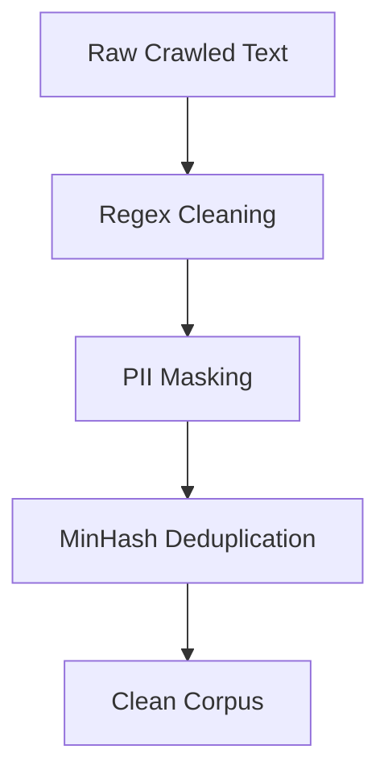

# Text Preprocessing for LLMs

## 1. Beginner-friendly Hinglish Explanation 🇮🇳
Bhai, socho tum ek khichdi bana rahe ho. Agar tum chawal aur daal ko bina dhoye aur saaf kiye daal doge, toh khichdi kharab banegi. 

**Text Preprocessing** wahi "Safai" ka kaam hai. Internet par bohot "Kachra" data hota hai (HTML tags, random symbols, emojis, typos). Model ko train karne se pehle humein text ko clean karna padta hai taaki model sirf kaam ki cheezein seekhe. Jitna saaf data, utna smart model!

---

## 2. Deep Technical Explanation
Text preprocessing is the process of transforming raw text into a format that the model can understand efficiently.
- **Cleaning**: Removing HTML tags, URLs, and special characters.
- **Normalization**: Lowercasing, removing accents, and expanding contractions (e.g., "don't" -> "do not").
- **Handling PII**: Scrubbing names, emails, and phone numbers for privacy.
- **Deduplication**: Removing exact or near-duplicate documents to prevent overfitting.

---

## 3. Mathematical Intuition
Preprocessing affects the **Vocabulary Statistics**. For example, if we don't lowercase, "Apple" and "apple" become two different vectors, splitting the probability mass:
$$P(\text{apple}) \neq P(\text{Apple})$$
Effective preprocessing ensures that the model learns the "concept" rather than the "formatting".

---

## 4. Architecture Diagrams


---

## 5. Production-ready Examples
Using `re` and `cleantext` for robust cleaning:

```python
import re

def clean_text_for_llm(text):
    # Remove HTML tags
    text = re.sub(r'<.*?>', '', text)
    # Remove URLs
    text = re.sub(r'http\S+|www\S+|https\S+', '', text, flags=re.MULTILINE)
    # Remove extra whitespaces
    text = re.sub(r'\s+', ' ', text).strip()
    # Mask emails (simple PII handling)
    text = re.sub(r'\S+@\S+', '[EMAIL]', text)
    return text

raw = "Check this out <p>Visit https://ai.com or email me at bob@gmail.com   !!!</p>"
print(clean_text_for_llm(raw))
# Output: Check this out Visit or email me at [EMAIL] !!!
```

---

## 6. Real-world Use Cases
- **Data Curation**: Preparing the "Pile" or "Common Crawl" for pre-training.
- **Chatbots**: Cleaning user input before sending it to the LLM to improve stability.

---

## 7. Failure Cases
- **Over-cleaning**: Removing numbers might break a model that needs to do math.
- **Language Erasure**: Some cleaning scripts accidentally remove non-Latin characters (Hindi, Chinese), making the model monolingual.

---

## 8. Debugging Guide
1. Run **Word Frequency Analysis**: If `[EMAIL]` is the #1 token, your PII masking is too aggressive.
2. Check **Length Distribution**: If documents are too short after cleaning, they might not be useful for training.

---

## 9. Tradeoffs
| Feature | Clean Everything | Keep Raw |
|---|---|---|
| Model Robustness | Low (only works on clean text)| High (handles typos) |
| Training Efficiency| High | Low |

---

## 10. Security Concerns
- **PII Leakage**: Failing to remove social security numbers or private keys from training data.

---

## 11. Scaling Challenges
- **Terabyte Scale**: Preprocessing 10TB of text requires distributed frameworks like Apache Spark or Ray.

---

## 12. Cost Considerations
- **Storage**: Cleaned data is usually 20-30% smaller than raw data, saving disk costs.

---

## 13. Best Practices
- **Never lowercase** for modern Transformers (they handle case sensitivity well).
- Use **MinHash/LSH** for large-scale deduplication.

---

## 14. Interview Questions
1. Why is deduplication important for LLM pre-training?
2. How do you handle emojis in text preprocessing?

---

## 15. Latest 2026 Patterns
- **AI-Driven Cleaning**: Using a small "Classifier" model to score the quality of text and discarding "Low Quality" (GIGO - Garbage In Garbage Out) data automatically.
