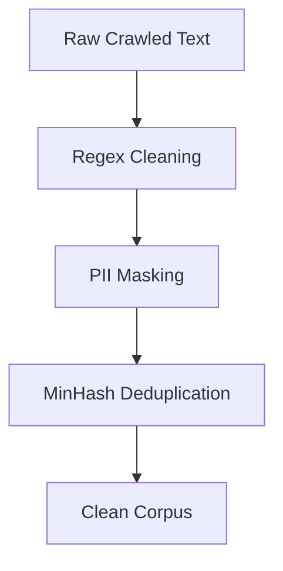

# Text Preprocessing for LLMs

## 1. Beginner-friendly Hinglish Explanation 🇮🇳
Bhai, socho tum ek khichdi bana rahe ho. Agar tum chawal aur daal ko bina dhoye aur saaf kiye daal doge, toh khichdi kharab banegi. 

**Text Preprocessing** wahi "Safai" ka kaam hai. Internet par bohot "Kachra" data hota hai (HTML tags, random symbols, emojis, typos). Model ko train karne se pehle humein text ko clean karna padta hai taaki model sirf kaam ki cheezein seekhe. Jitna saaf data, utna smart model!

## 2. Deep Technical Explanation
Text preprocessing ek process hai jisme hum raw text ko aise format me convert karte hain jise model efficiently samajh sake.
- **Cleaning**: HTML tags, URLs, aur special characters ko hataana.
- **Normalization**: Lowercasing karna, accents hataana, aur contractions expand karna (e.g., "don't" -> "do not").
- **Handling PII**: Privacy ke liye names, emails, aur phone numbers scrub karna.
- **Deduplication**: Exact ya near-duplicate documents ko hataana overfitting se bachne ke liye.

## 3. Mathematical Intuition
Preprocessing **Vocabulary Statistics** ko affect karta hai. Example ke liye, agar hum lowercase nahi karte, to "Apple" aur "apple" do alag vectors ban jaate hain, probability mass split ho jaata hai:
$$P(\text{apple}) \neq P(\text{Apple})$$
Effective preprocessing ensure karta hai ki model "concept" seekhe, na ki "formatting".

## 4. Architecture Diagrams

```mermaid
graph TD
    Raw[Raw Crawled Text] --> Clean[Regex Cleaning]
    Clean --> PII[PII Masking]
    PII --> Dedup[MinHash Deduplication]
    Dedup --> Final[Clean Corpus]
```

## 5. Production-ready Examples
Robust cleaning ke liye `re` aur `cleantext` ka upyog karte hain:

```python
import re

def clean_text_for_llm(text):
    # Remove HTML tags
    text = re.sub(r'<.*?>', '', text)
    # Remove URLs
    text = re.sub(r'http\S+|www\S+|https\S+', '', text, flags=re.MULTILINE)
    # Remove extra whitespaces
    text = re.sub(r'\s+', ' ', text).strip()
    # Mask emails (simple PII handling)
    text = re.sub(r'\S+@\S+', '[EMAIL]', text)
    return text

raw = "Check this out <p>Visit https://ai.com or email me at bob@gmail.com   !!!</p>"
print(clean_text_for_llm(raw))
# Output: Check this out Visit or email me at [EMAIL] !!!
```

## 6. Real-world Use Cases
- **Data Curation**: Pre-training ke liye "Pile" ya "Common Crawl" tayyar karna.
- **Chatbots**: Stability improve karne ke liye user input ko LLM ko bhejne se pehle clean karna.

## 7. Failure Cases
- **Over-cleaning**: Numbers hataane se model jo math karta hai, toot sakta hai.
- **Language Erasure**: Kuch cleaning scripts galti se non-Latin characters (Hindi, Chinese) hataa deti hain, jisse model monolingual ho jaata hai.

## 8. Debugging Guide
1. **Word Frequency Analysis** chalaayein: Agar `[EMAIL]` #1 token hai, to aapki PII masking bahut aggressive hai.
2. **Length Distribution** check karein: Agar cleaning ke baad documents bahut chhote ho gaye hain, to wo training ke liye upyogi nahi ho sakte.

## 9. Tradeoffs
| Feature | Clean Everything | Keep Raw |
|---|---|---|
| Model Robustness | Low (sirf clean text par kaam karta hai) | High (typos