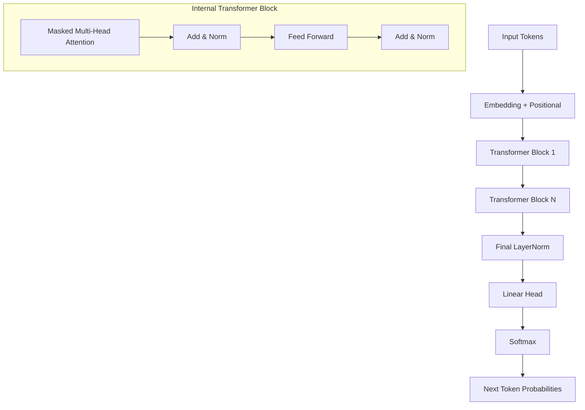

# Building GPT From Scratch (Karpathy Style+)

## 1. Beginner-friendly Hinglish Explanation 🇮🇳
Bhai, agar tumhe sach mein samajhna hai ki LLM kaise kaam karta hai, toh tumhe use ZERO se banana padega.

GPT (Generative Pre-trained Transformer) banana koi rocket science nahi hai. Yeh asal mein bas ek "Lego set" ki tarah hai. Hum pehle tokens banate hain, phir unhe space mein rakhte hain (Embeddings), phir "Self-Attention" ka dimaag lagate hain, aur end mein ek "Head" lagate hain jo batata hai ki agla word kya hoga. Is guide mein hum wahi Lego pieces jod kar ek chota sa "GPT" banayenge jo text generate kar sake.

---

## 2. Deep Technical Explanation
Building a GPT model involves implementing the **Decoder-only Transformer** architecture:
- **Tokenization**: Converting characters or words into integers.
- **Embedding Table**: A lookup table for vectors.
- **Positional Encoding**: Usually learned or sinusoidal to give sequence order.
- **Transformer Block**: Comprising Multi-Head Self-Attention (MHSA) and a Feed-Forward Network (FFN).
- **Residual Connections**: $x + \text{Layer}(x)$ to prevent gradient vanishing.
- **Layer Normalization**: Applied before each sub-block (Pre-norm is the modern standard).

---

## 3. Mathematical Intuition
The logic of a GPT block is:
$$x_{mid} = \text{LayerNorm}(x)$$
$$x = x + \text{Attention}(x_{mid})$$
$$x_{mid2} = \text{LayerNorm}(x)$$
$$x = x + \text{FFN}(x_{mid2})$$

The FFN is typically a 2-layer MLP with a non-linearity like GELU:
$$\text{FFN}(x) = \text{GELU}(xW_1 + b_1)W_2 + b_2$$

---

## 4. Architecture Diagrams


---

## 5. Production-ready Examples (Minimal PyTorch)
```python
import torch
import torch.nn as nn
import torch.nn.functional as F

class Head(nn.Module):
    def __init__(self, head_size, n_embd, block_size):
        super().__init__()
        self.key = nn.Linear(n_embd, head_size, bias=False)
        self.query = nn.Linear(n_embd, head_size, bias=False)
        self.value = nn.Linear(n_embd, head_size, bias=False)
        self.register_buffer('tril', torch.tril(torch.ones(block_size, block_size)))

    def forward(self, x):
        B,T,C = x.shape
        k = self.key(x) # (B,T,hs)
        q = self.query(x) # (B,T,hs)
        # Compute attention scores ("affinities")
        wei = q @ k.transpose(-2,-1) * C**-0.5 # (B, T, T)
        wei = wei.masked_fill(self.tril[:T, :T] == 0, float('-inf')) # (B, T, T)
        wei = F.softmax(wei, dim=-1) # (B, T, T)
        # Perform weighted aggregation
        v = self.value(x) # (B,T,hs)
        out = wei @ v # (B, T, hs)
        return out

# This is the "Atomic" unit of GPT
```

---

## 6. Real-world Use Cases
- **TinyLlama/NanoGPT**: Training very small models for edge devices.
- **Domain Specific GPTs**: Training a model purely on legal or medical text from scratch.
- **Research**: Prototyping new attention mechanisms (e.g., Linear Attention).

---

## 7. Failure Cases
- **Dead Neurons**: If the learning rate is too high, GELU units can "die".
- **Attention Collapse**: All tokens attending to the same token regardless of content.
- **Unstable Training**: Without proper weight initialization (like Xavier), the model won't converge.

---

## 8. Debugging Guide
1. **Overfit a single batch**: If your model can't get 0 loss on one single sentence, the architecture has a bug.
2. **Monitor Grad Norms**: If gradients are zero, check your residual connections.
3. **Weight Histograms**: Check if weights are growing too large.

---

## 9. Tradeoffs
| Factor | Character-level GPT | Subword-level GPT |
|--------|---------------------|-------------------|
| Vocab Size | Small (~256)       | Large (~50k-100k) |
| Sequence Length | Very Long        | Compact           |
| Training Speed | Fast              | Slow              |
| Meaning Depth | Low               | High              |

---

## 10. Security Concerns
- **Backdoors**: If you train from scratch on poisoned data, the model might have hidden triggers.
- **Memorization**: Models are prone to memorizing the training set if they are too large for the data size.

---

## 11. Scaling Challenges
- **Quadratic Attention**: Doubling sequence length quadruples the memory required.
- **Parallelization**: Implementing "Data Parallel" training across 8 GPUs for the first time.

---

## 12. Cost Considerations
- **Compute Budget**: Even a tiny GPT (124M) takes a few hours on an A100 to learn basic English.
- **Data Collection**: High-quality "Clean" data is expensive to curate.

---

## 13. Best Practices
- **Weight Tying**: Use the same weights for the embedding and the final linear head.
- **Warmup & Decay**: Vital for Transformer training.
- **Use `float16` or `bfloat16`**: To save memory and double the speed.

---

## 14. Interview Questions
1. Why do we need the "Mask" in GPT attention?
2. What is the purpose of Residual Connections in Transformers?
3. How does the number of "Heads" affect the model's performance?
4. Explain the difference between Encoder-only and Decoder-only models.

---

## 15. Latest 2026 LLM Engineering Patterns
- **Flash Attention 3**: Implementation for H100s that doubles throughput.
- **RMSNorm**: Replacing LayerNorm for faster inference.
- **SwiGLU**: A more efficient activation function used in Llama-3.
