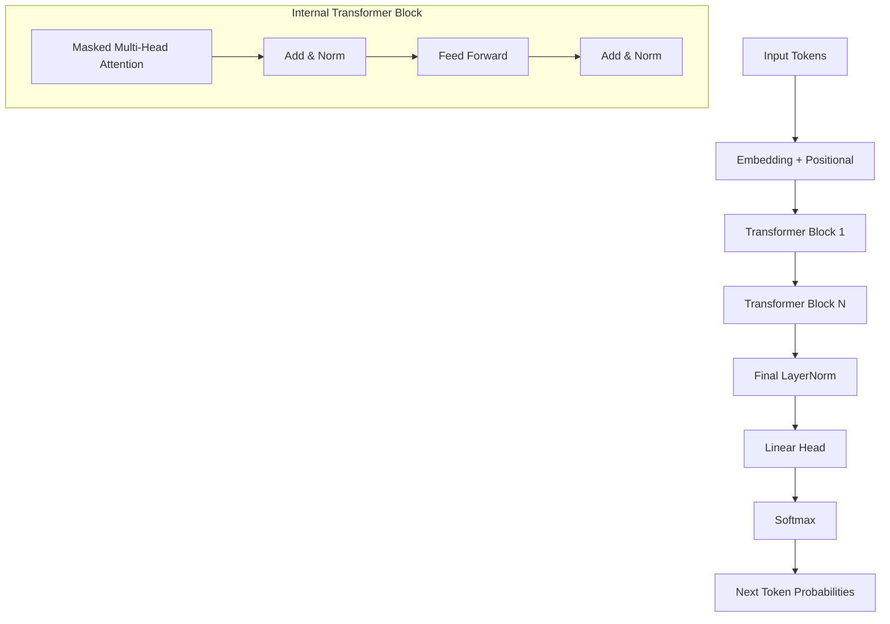

# GPT Ko Scratch Se Banana (Karpathy Style+)

## 1. Shuruaat Ke Liye Hinglish Explanation 🇮🇳
Bhai, agar tumhe sach mein samajhna hai ki LLM kaise kaam karta hai, toh tumhe use ZERO se banana padega.

GPT (Generative Pre-trained Transformer) banana koi rocket science nahi hai. Yeh asal mein bas ek "Lego set" ki tarah hai. Hum pehle tokens banate hain, phir unhe space mein rakhte hain (Embeddings), phir "Self-Attention" ka dimaag lagate hain, aur end mein ek "Head" lagate hain jo batata hai ki agla word kya hoga. Is guide mein hum wahi Lego pieces jod kar ek chota sa "GPT" banayenge jo text generate kar sake.

---

## 2. Gehri Technical Vyakhya
GPT model banane mein **Decoder-only Transformer** architecture implement karna shamil hai:
- **Tokenization**: Characters ya words ko integers mein convert karna.
- **Embedding Table**: Vectors ke liye ek lookup table.
- **Positional Encoding**: Usually learned ya sinusoidal hota hai jo sequence order deta hai.
- **Transformer Block**: Jisme Multi-Head Self-Attention (MHSA) aur Feed-Forward Network (FFN) hote hain.
- **Residual Connections**: $x + \text{Layer}(x)$ jo gradient vanishing ko prevent karta hai.
- **Layer Normalization**: Har sub-block se pehle apply hota hai (Pre-norm modern standard hai).

---

## 3. Mathematical Samajh
GPT block ka logic kuch aisa hai:
$$x_{mid} = \text{LayerNorm}(x)$$
$$x = x + \text{Attention}(x_{mid})$$
$$x_{mid2} = \text{LayerNorm}(x)$$
$$x = x + \text{FFN}(x_{mid2})$$

FFN typically ek 2-layer MLP hota hai jisme GELU jaisi non-linearity hoti hai:
$$\text{FFN}(x) = \text{GELU}(xW_1 + b_1)W_2 + b_2$$

---

## 4. Architecture Chitra (Diagrams)

```mermaid
graph TD
    Input[Input Tokens] --> Emb[Embedding + Positional]
    Emb --> Block1[Transformer Block 1]
    Block1 --> BlockN[Transformer Block N]
    BlockN --> LN[Final LayerNorm]
    LN --> Linear[Linear Head]
    Linear --> Softmax[Softmax]
    Softmax --> Output[Next Token Probabilities]

    subgraph "Internal Transformer Block"
        Att[Masked Multi-Head Attention]
        Add1[Add & Norm]
        FF[Feed Forward]
        Add2[Add & Norm]
        Att --> Add1
        Add1 --> FF
        FF --> Add2
    end
```

---

## 5. Production-ready Udaharan (Minimal PyTorch)
```python
import torch
import torch.nn as nn
import torch.nn.functional as F

class Head(nn.Module):
    def __init__(self, head_size, n_embd, block_size):
        super().__init__()
        self.key = nn.Linear(n_embd, head_size, bias=False)
        self.query = nn.Linear(n_embd, head_size, bias=False)
        self.value = nn.Linear(n_embd, head_size, bias=False)
        self.register_buffer('tril', torch.tril(torch.ones(block_size, block_size)))

    def forward(self, x):
        B,T,C = x.shape
        k = self.key(x) # (B,T,hs)
        q = self.query(x) # (B,T,hs)
        # Compute attention scores ("affinities")
        wei = q @ k.transpose(-2,-1) * C**-0.5 # (B, T, T)
        wei = wei.masked_fill(self.tril[:T, :T] == 0, float('-inf')) # (B, T, T)
        wei = F.softmax(wei, dim=-1) # (B, T, T)
        # Perform weighted aggregation
        v = self.value(x) # (B,T,hs)
        out = wei @ v # (B, T, hs)
        return out

# This is the "Atomic" unit of GPT
```

---

## 6. Real-world Upyog Cases
- **TinyLlama/NanoGPT**: Bahut chhote models ko edge devices ke liye train karna.
- **Domain Specific GPTs**: Model ko purely legal ya medical text par scratch se train karna.
- **Research**: Naye attention mechanisms (jaise Linear Attention) ka prototype banana.

---

## 7. Failure Cases (Asafalta ke Karan)
- **Dead Neurons**: Agar learning rate bahut zyada ho, toh GELU units "mar" sakti hain.
- **Attention Collapse**: Saare tokens ek hi token ki taraf attend kar rahe hain, content ki parwah nahi.
- **Unstable Training**: Proper weight initialization (jaise Xavier) ke bina model converge nahi karega.

---

## 8. Debugging Margdarshan
1. **Overfit a single batch**: Agar model ek sentence par 0 loss nahi la sakta, toh architecture mein bug hai.
2. **Monitor Grad Norms**: Agar gradients zero hain, toh residual connections check karo.
3. **Weight Histograms**: Check karo ki weights bahut bade toh nahi ho rahe.

---

## 9. Tradeoffs (Samjhotey)
| Factor | Character-level GPT | Subword-level GPT |
|--------|---------------------|-------------------|
| Vocab Aakar | Chhota (~256) | Bada (~50k-100k) |
| Sequence Lambai | Bahut Lamba | Chhota |
| Training Gati | Tez | Dheela |
| Meaning Gehrai | Kam | Zyada |

---

## 10. Security Chintayein
- **Backdoors**: Agar aap scratch se poisoned data par train karte ho, toh model mein hidden triggers ho sakte hain.
- **Memorization**: Models apne training set ko memorise kar sakte hain agar woh data size ke liye bahut bade hain.

---

## 11. Scaling Chunautiyan
- **Quadratic Attention**: Sequence length double karne par memory requirement char guna ho jati hai.
- **Parallelization**: Pehli baar 8 GPUs par "Data Parallel" training implement karna.

---

## 12. Cost Vichar
- **Compute Budget**: Ek chhota GPT (124M) ko basic English seekhne ke liye A100 par kuch ghante lagte hain.
- **Data Collection**: High-quality "Clean" data ikattha karna mehnga hota hai.

---

## 13. Best Practices (Sabase Achhe Tareeke)
- **Weight Tying**: Embedding aur final linear head ke liye same weights use karo.
- **Warmup & Decay**: Transformer training ke liye vital hain.
- **Use `float16` or `bfloat16`**: Memory bachane aur speed double karne ke liye.

---

## 14. Interview Sawal
- GPT attention mein "Mask" ki kya zaroorat hai?
- Transformers mein Residual Connections ka kya kaam hai?
- Number of "Heads" model ke performance ko kaise affect karta hai?
- Encoder-only aur Decoder-only models mein kya farak hai?

---

## 15. 2026 Ke Naye LLM Engineering Patterns
- **Flash Attention 3**: H100s ke liye implementation jo throughput ko double karta hai.
- **RMSNorm**: Faster inference ke liye LayerNorm ki jagah use hota hai.
- **SwiGLU**: Ek zyada efficient activation function jo Llama-3 mein use hua hai.
```