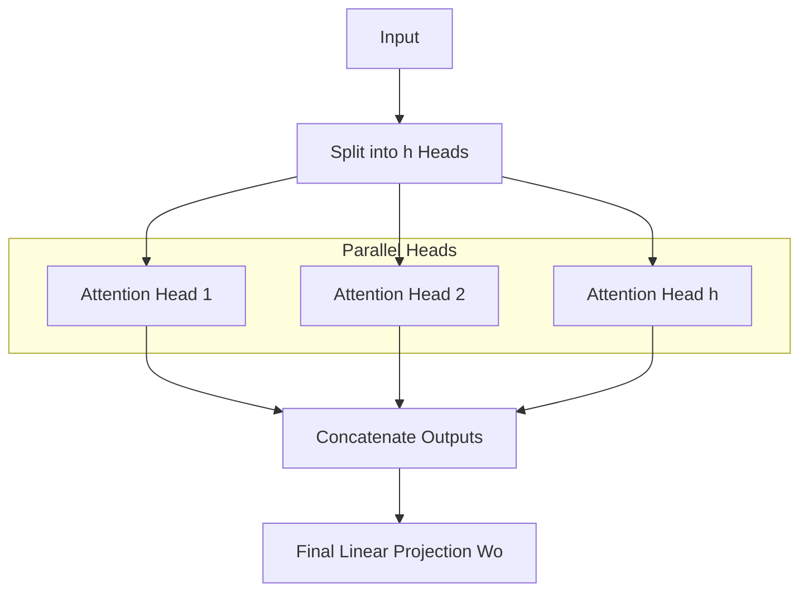

# Multi-Head Attention: Many Eyes on the Sequence

## 1. Beginner-friendly Hinglish Explanation 🇮🇳
Bhai, socho tumhe ek ghar kharidna hai. Tum akele sab kuch nahi dekh sakte. Tum ek dost ko bolte ho "Budget dekho", dusre ko bolte ho "Location dekho", teesre ko "Legal papers check karo". 

**Multi-Head Attention** wahi hai. Ek single "Attention" sirf ek tarah ka pattern dekh pati hai. Par agar hum sequence ko multiple "Heads" mein baant dein, toh har head alag cheez par focus karega. Ek head "Grammar" dekhega, ek "Subject-Verb relationship" dekhega, aur ek "Sarcasm" detect karega. Sabka output combine karke humein ek richer understanding milti hai.

---

## 2. Deep Technical Explanation
Multi-Head Attention (MHA) projects the Queries, Keys, and Values $h$ times into lower-dimensional spaces.
- **Why?**: It allows the model to jointly attend to information from different representation subspaces at different positions.
- **Mechanism**: Linear projections $\to$ Scaled Dot-Product Attention $\to$ Concatenation $\to$ Final Linear Projection.
- **Hyperparameters**: $h$ (number of heads), $d_{model}$ (total dimension), $d_k = d_{model}/h$ (dimension per head).

---

## 3. Mathematical Intuition
$$\text{MultiHead}(Q, K, V) = \text{Concat}(\text{head}_1, ..., \text{head}_h)W^O$$
where each head is:
$$\text{head}_i = \text{Attention}(QW_i^Q, KW_i^K, VW_i^V)$$
By splitting the dimension, we maintain the same total compute as a single large head but gain parallel "representation" power.

---

## 4. Architecture Diagrams


---

## 5. Production-ready Examples
Implementing MHA from scratch:

```python
import torch.nn as nn

class MultiHeadAttention(nn.Module):
    def __init__(self, d_model, num_heads):
        super().__init__()
        assert d_model % num_heads == 0
        self.d_k = d_model // num_heads
        self.h = num_heads
        
        self.w_q = nn.Linear(d_model, d_model)
        self.w_k = nn.Linear(d_model, d_model)
        self.w_v = nn.Linear(d_model, d_model)
        self.w_o = nn.Linear(d_model, d_model)

    def forward(self, q, k, v, mask=None):
        batch_size = q.size(0)
        
        # Linear projections and reshaped to [B, H, T, Dk]
        q = self.w_q(q).view(batch_size, -1, self.h, self.d_k).transpose(1, 2)
        k = self.w_k(k).view(batch_size, -1, self.h, self.d_k).transpose(1, 2)
        v = self.w_v(v).view(batch_size, -1, self.h, self.d_k).transpose(1, 2)
        
        # Scaled dot-product attention
        # (Implementation details in Self_Attention.md)
        x, _ = scaled_dot_product_attention(q, k, v, mask)
        
        # Concat and project
        x = x.transpose(1, 2).contiguous().view(batch_size, -1, self.h * self.d_k)
        return self.w_o(x)
```

---

## 6. Real-world Use Cases
- **Standard in Transformers**: Used in Llama, GPT, T5.
- **Multi-modal**: Using some heads for text and some for image features.

---

## 7. Failure Cases
- **Head Redundancy**: Sometimes many heads learn the same thing, wasting compute.
- **Overfitting**: Too many heads on small data can lead to noise memorization.

---

## 8. Debugging Guide
1. **Pruning**: Try zeroing out a head during inference; if performance doesn't drop, that head is useless.
2. **Diversity Check**: Ensure different heads have different attention patterns.

---

## 9. Tradeoffs
| Metric | 1 Head (Big) | 8 Heads (Small) |
|---|---|---|
| Richness | Low | High |
| Memory | Same | Same |
| Implementation | Simple | Complex |

---

## 10. Security Concerns
- **Head Hijacking**: Specialized adversarial prompts that force all heads to focus on a single malicious token.

---

## 11. Scaling Challenges
- **Memory Bandwidth**: MHA is often memory-bound rather than compute-bound.

---

## 12. Cost Considerations
- **GQA (Grouped Query Attention)**: A 2026 standard to reduce memory cost by sharing Keys/Values across multiple Query heads.

---

## 13. Best Practices
- Use **GQA** for models > 7B parameters.
- Keep the number of heads as a power of 2 for GPU optimization.

---

## 14. Interview Questions
1. If we have 8 heads and $d_{model}=512$, what is $d_k$?
2. What is the difference between Multi-Head Attention and Multi-Query Attention?

---

## 15. Latest 2026 Patterns
- **Grouped Query Attention (GQA)**: Sharing K and V across heads to speed up inference (used in Llama-3).
- **Sliding Window Attention**: Heads only look at a local neighborhood to handle 1M+ context.
