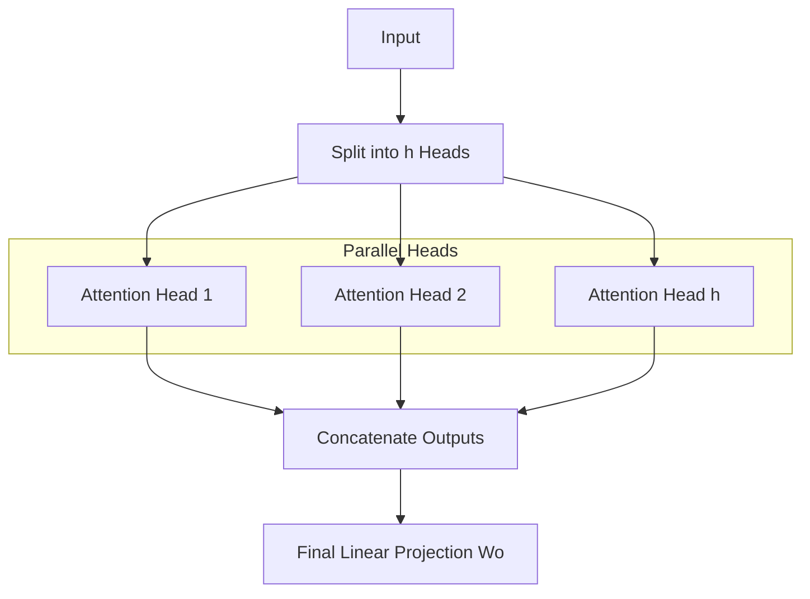

# Multi-Head Attention: Sequence par kai aankhen

## 1. Beginner-friendly Hinglish Explanation 🇮🇳
Bhai, socho tumhe ek ghar kharidna hai. Tum akele sab kuch nahi dekh sakte. Tum ek dost ko bolte ho "Budget dekho", dusre ko bolte ho "Location dekho", teesre ko "Legal papers check karo". 

**Multi-Head Attention** wahi hai. Ek single "Attention" sirf ek tarah ka pattern dekh pati hai. Par agar hum sequence ko multiple "Heads" mein baant dein, toh har head alag cheez par focus karega. Ek head "Grammar" dekhega, ek "Subject-Verb relationship" dekhega, aur ek "Sarcasm" detect karega. Sabka output combine karke humein ek richer understanding milti hai.

---

## 2. Deep Technical Explanation
Multi-Head Attention (MHA) Queries, Keys, aur Values ko $h$ baar lower-dimensional spaces mein project karta hai.
- **Kyun?**: Yeh model ko different representation subspaces se alag positions par jointly attend karne deta hai.
- **Mechanism**: Linear projections $\to$ Scaled Dot-Product Attention $\to$ Concatenation $\to$ Final Linear Projection.
- **Hyperparameters**: $h$ (heads ki sankhya), $d_{model}$ (total dimension), $d_k = d_{model}/h$ (dimension per head).

## 3. Mathematical Intuition
$$\text{MultiHead}(Q, K, V) = \text{Concat}(\text{head}_1, ..., \text{head}_h)W^O$$
jahan har head hai:
$$\text{head}_i = \text{Attention}(QW_i^Q, KW_i^K, VW_i^V)$$
Dimension split karke, hum same total compute maintain karte hain jaise ek single large head mein hota hai, lekin parallel "representation" power milti hai.

## 4. Architecture Diagrams

```mermaid
graph TD
    In[Input] --> Split[Split into h Heads]
    subgraph "Parallel Heads"
        H1[Attention Head 1]
        H2[Attention Head 2]
        H3[Attention Head h]
    end
    Split --> H1 & H2 & H3
    H1 & H2 & H3 --> Concat[Concatenate Outputs]
    Concat --> Out[Final Linear Projection Wo]
```

## 5. Production-ready Examples
MHA ko scratch se implement karte hain:

```python
import torch.nn as nn

class MultiHeadAttention(nn.Module):
    def __init__(self, d_model, num_heads):
        super().__init__()
        assert d_model % num_heads == 0
        self.d_k = d_model // num_heads
        self.h = num_heads
        
        self.w_q = nn.Linear(d_model, d_model)
        self.w_k = nn.Linear(d_model, d_model)
        self.w_v = nn.Linear(d_model, d_model)
        self.w_o = nn.Linear(d_model, d_model)

    def forward(self, q, k, v, mask=None):
        batch_size = q.size(0)
        
        # Linear projections and reshaped to [B, H, T, Dk]
        q = self.w_q(q).view(batch_size, -1, self.h, self.d_k).transpose(1, 2)
        k = self.w_k(k).view(batch_size, -1, self.h, self.d_k).transpose(1, 2)
        v = self.w_v(v).view(batch_size, -1, self.h, self.d_k).transpose(1, 2)
        
        # Scaled dot-product attention
        # (Implementation details in Self_Attention.md)
        x, _ = scaled_dot_product_attention(q, k, v, mask)
        
        # Concat and project
        x = x.transpose(1, 2).contiguous().view(batch_size, -1, self.h * self.d_k)
        return self.w_o(x)
```

## 6. Real-world Use Cases
- **Standard in Transformers**: Llama, GPT, T5 mein use hota hai.
- **Multi-modal**: Kuch heads text ke liye aur kuch image features ke liye use karna.

## 7. Failure Cases
- **Head Redundancy**: Kabhi kabhi bahut saare heads same cheez seekh lete hain, compute waste hota hai.
- **Overfitting**: Chhote data par bahut saare heads noise memorization ka cause ban sakte hain.

## 8. Debugging Guide
1. **Pruning**: Inference ke time ek head ko zero kar ke dekho; agar performance drop nahi hoti, to woh head bekaar hai.
2. **Diversity Check**: Dhyaan do ki different heads ke attention patterns alag hain.

## 9. Tradeoffs
| Metric | 1 Head (Bada) | 8 Heads (Chhota) |
|---|---|---|
| Richness | Low | High |
| Memory | Same | Same |
| Implementation | Simple | Complex |

## 10. Security Concerns
- **Head Hijacking**: Khaas adversarial prompts jo saare heads ko ek single malicious token par focus karne par majboor kar dete hain.

## 11. Scaling Challenges
- **Memory Bandwidth**: MHA aksar memory-bound hota hai, compute-bound nahi.

## 12. Cost Considerations
- **GQA (Grouped Query Attention)**: Ek 2026 standard jo memory cost kam karta hai Keys/Values ko multiple Query heads mein share karke.

## 13. Best Practices
- Models > 7B parameters ke liye **GQA** use karo.
- Number of heads ko power of 2 rakho GPU optimization ke liye.

## 14. Interview Questions
1. Agar humare paas 8 heads hain aur $d_{model}=512$, to $d_k$ kya hoga?
2. Multi-Head Attention aur Multi-Query Attention mein kya antar hai?

## 15. Latest 2026 Patterns
- **Grouped Query Attention (GQA)**: Inference speed up karne ke liye K aur V ko heads mein share karna (Llama-3 mein use hota hai).
- **Sliding Window Attention**: Heads sirf local neighborhood dekhte hain taaki 1M+ context handle kar sakein.