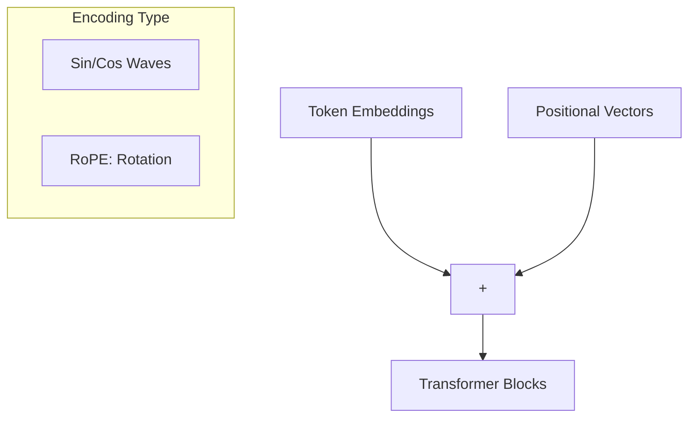

# Positional Encoding: Adding Order to Chaos

## 1. Beginner-friendly Hinglish Explanation 🇮🇳
Bhai, Self-Attention bohot smart hai, lekin usmein ek bohot badi kami hai: Use "Line" (Sequence) ka hosh nahi rehta. 

Socho ek sentence hai "Dog bites man" aur "Man bites dog". Self-Attention ke liye dono bilkul same hain kyunki words wahi hain. Use nahi pata ki kaunsa word pehle aaya. **Positional Encoding** wahi "GPS" ya "Page Number" hai jo hum har word ke vector mein add kar dete hain taaki model ko pata chale ki word #1 kaunsa hai aur word #2 kaunsa. Bina iske, transformer sirf ek "Bag of Words" ban kar reh jayega.

---

## 2. Deep Technical Explanation
Since Transformers process tokens in parallel, they lack an inherent sense of order (unlike RNNs).
- **Absolute Positional Encodings**: Sinusoidal functions (Original Transformer) or Learned Embeddings.
- **Relative Positional Encodings**: Focus on the distance between tokens rather than absolute position (e.g., T5, ALIBI).
- **Rotary Positional Embeddings (RoPE)**: The modern gold standard (used in Llama). It rotates the query and key vectors in a way that captures relative distance via trigonometry.

---

## 3. Mathematical Intuition
**Sinusoidal Encoding** (Original):
$$PE_{(pos, 2i)} = \sin(pos / 10000^{2i/d_{model}})$$
$$PE_{(pos, 2i+1)} = \cos(pos / 10000^{2i/d_{model}})$$
This allows the model to learn to attend by relative positions because for any fixed offset $k$, $PE_{pos+k}$ can be represented as a linear function of $PE_{pos}$.

---

## 4. Architecture Diagrams


---

## 5. Production-ready Examples
Implementing RoPE (Conceptual snippet):

```python
import torch

def apply_rotary_emb(x, cos, sin):
    # x: [batch, heads, seq_len, head_dim]
    # Split the head_dim into pairs and rotate
    x1 = x[..., 0::2]
    x2 = x[..., 1::2]
    
    # [x1, x2] rotated by theta
    # out1 = x1 * cos - x2 * sin
    # out2 = x1 * sin + x2 * cos
    return torch.stack([x1 * cos - x2 * sin, x1 * sin + x2 * cos], dim=-1).flatten(-2)

# RoPE allows the model to extrapolate to longer sequences than it was trained on.
```

---

## 6. Real-world Use Cases
- **Long Context Windows**: RoPE enables models to handle 128k+ tokens.
- **Coding**: Understanding the strict order of characters in syntax.

---

## 7. Failure Cases
- **Length Generalization**: Sinusoidal encodings often fail if the inference sequence is longer than training.
- **Catastrophic Forgetting of Order**: In very deep models, the positional signal can get "washed out" by noise.

---

## 8. Debugging Guide
1. **Shuffle Test**: If your model performs the same when you shuffle the words, your positional encoding is broken.
2. **Phase Analysis**: Check if the high-frequency components of the sinusoidal waves are being learned.

---

## 9. Tradeoffs
| Type | Complexity | Extrapolation |
|---|---|---|
| Sinusoidal | Low | Medium |
| Learned | Low | None |
| RoPE | Medium | Excellent |

---

## 10. Security Concerns
- **Position Hijacking**: Manipulating the positional signal to make the model ignore the beginning of a prompt.

---

## 11. Scaling Challenges
- **Memory**: Storing large positional tables for 1M+ contexts.

---

## 12. Cost Considerations
- **Compute**: RoPE adds a small trigonometric overhead to every attention layer.

---

## 13. Best Practices
- Always use **RoPE** for modern 2026 architectures.
- For extremely long sequences, consider **ALIBI** or **YaRN** (Yet another RoPE extension).

---

## 14. Interview Questions
1. Why is the Transformer "Permutation Invariant" without Positional Encoding?
2. What is the main advantage of RoPE over Sinusoidal encodings?

---

## 15. Latest 2026 Patterns
- **Position-Independent Transformers**: Research into architectures that don't need explicit encodings and learn order from data structure alone.
- **Dynamic RoPE Scaling**: Adjusting the frequency base during inference to support 10x longer contexts.
